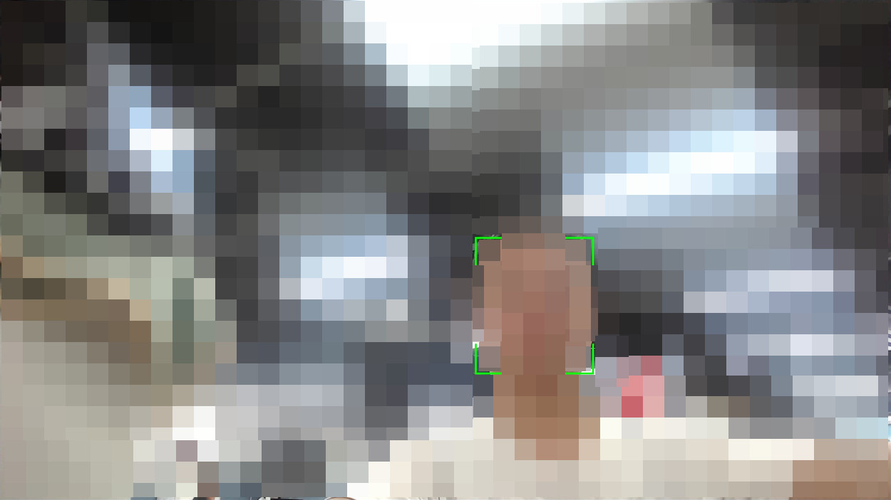
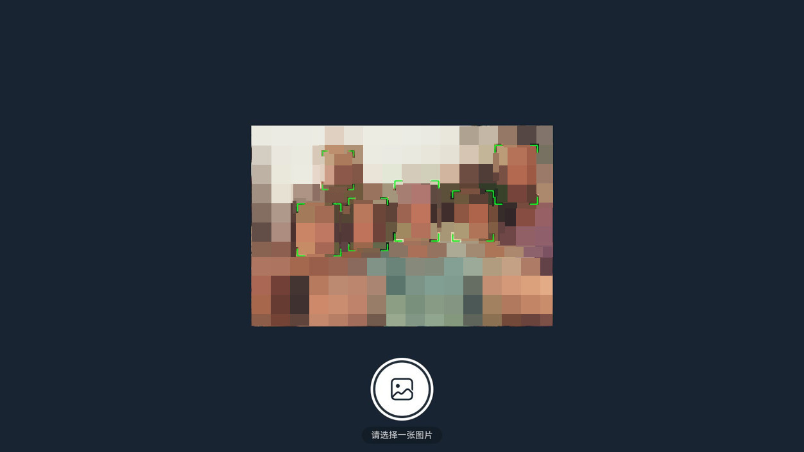

# TV人脸检测应用

### 介绍

本示例通过使用摄像头和AI人脸检测模型，展示OpenHarmony设备管理、相机API、图像处理和AI推理等相关API用法。实现了以下几点功能：

1. 打开本机摄像头实时识别人脸区域
2. 支持分布式摄像头接入和切换
3. 读取本地的图片库并进行人脸检测
4. 分布式设备验证和管理
5. 支持遥控器焦点导航

相关概念

1. 设备管理：使用DistributedServiceKit实现跨设备发现、验证和连接
2. 相机预览：使用CameraKit实现摄像头预览和帧捕获
3. AI推理：使用MindSpore Lite进行人脸检测模型推理
4. 图像处理：使用ImageKit进行图像格式转换和处理

### 效果预览

| 首页                            |
|-------------------------------|
|  |

| 摄像头人脸检测                                 | 多机位切换                                    |
|-----------------------------------------|------------------------------------------|
|  |  |

| 本地的图片选择                               | 人脸图片识别                            |
|---------------------------------------|-----------------------------------|
|  |  |

| 发现设备                                  | 在线设备                                  |
|---------------------------------------|---------------------------------------|
|  |  |

使用说明

1. 启动应用：应用启动后，会自动申请相机、媒体和分布式数据同步权限
2. 在主界面选择"摄像头人脸检测"，进入摄像头预览界面，系统会自动检测画面中的人脸并用方框标记，点击"
   多机位切换"可以切换不同的摄像头（支持本地和分布式摄像头）
3. 在主界面选择"人脸图像识别"，进入图片选择页面，选择本地的图片或内置示例图片，系统会自动进行人脸检测并用方框标记检测到的人脸。
4. 在主界面选择"设备验证"，查看已验证的可信设备列表。点击"发现设备"搜索周边设备，选择设备进行绑定或解绑操作。

### 工程目录

```
entry/src/main/ets/
|---common
|   |---CameraService.ts                  // 相机服务
|   |---EventUtil.ts                      // 事件工具
|   |---PointerUtil.ts                    // 指针工具
|---Components
|   |---CamerasListDialog.ets             // 摄像头列表框
|   |---DeviceConfirmDialog.ets           // 设备确认框
|---MainAbility
|   |---MainAbility.ts             
|---models
|   |---RemoteDeviceModel.ts              // 远程设备管理模型
|   |---ImageListDataSource.ts            // 图片列表数据源
|---pages
|   |---index.ets                         // 主页面
|   |---cameraPreview.ets                 // 摄像头预览页面
|   |---imageSelect.ets                   // 图片选择页面
|   |---imagePreview.ets                  // 图片预览和识别页面
|   |---distributedAttestation.ets        // 分布式验证页面
|---Types
|   |---ParamsType.ts                     // 参数类型定义
|---uitls
|   |---caffe.ts                          // Caffe模型处理工具
|   |---log.ts                            // 日志工具
|   |---utils.ts                          // 通用工具
|   |---permission.ts                     // 权限工具

```

### 具体实现

1. 相机预览和人脸检测：使用[@kit.CameraKit](https://docs.openharmony.cn/pages/v6.0/zh-cn/device-dev/guide/device-camera-control-demo-photoguide.md)
   实现摄像头管理、预览和帧捕获，通过[XComponent](https://docs.openharmony.cn/pages/v6.0/zh-cn/application-dev/reference/apis-arkui/arkui-ts/ts-basic-components-xcomponent.md)显示摄像头预览画面
2. 图像处理和AI推理：使用[@kit.ImageKit](https://docs.openharmony.cn/pages/v6.0/zh-cn/application-dev/media/image/image-overview.md)进行图像加载和格式转换，使用[@ohos.ai.mindSporeLite](https://docs.openharmony.cn/pages/v6.0/zh-cn/application-dev/reference/apis-mindspore-lite-kit/js-apis-mindSporeLite.md)加载和运行人脸检测模型
3. 分布式设备管理：使用[@ohos.distributedDeviceManager](https://docs.openharmony.cn/pages/v6.0/zh-cn/application-dev/reference/apis-distributedservice-kit/js-apis-distributedDeviceManager.md)实现设备发现和验证，实时监听设备状态变化。


### 相关权限

| 权限名                                  | 权限说明                  | 级别           |
|--------------------------------------|-----------------------|--------------|
| ohos.permission.CAMERA               | 允许应用使用相机。             | normal       |
| ohos.permission.WRITE_IMAGEVIDEO     | 允许修改用户公共目录的图片或视频文件。   | system_basic |
| ohos.permission.MEDIA_LOCATION       | 允许应用访问用户媒体文件中的地理位置信息。 | normal       |
| ohos.permission.READ_IMAGEVIDEO      | 允许读取用户公共目录的图片或视频文件。   | system_basic |
| ohos.permission.DISTRIBUTED_DATASYNC | 允许不同设备间的数据交换。         | normal       |
| ohos.permission.GET_BUNDLE_INFO      | 允许查询应用的基本信息。          | normal       |

### 依赖

本示例应用需要预置人脸检测模型文件mnet_caffemodel_480_720.ms。需要支持摄像头和AI推理的硬件设备。

### 约束与限制

1. 本示例仅支持标准系统上运行。
2. 本示例为Stage模型，从API version 10开始支持。SDK版本号：4.0.10.18。
3. 本示例需要使用DevEco Studio 6.0.0 Release (Build Version: 6.0.0.858, built on September 24, 2025)编译运行。
4. 本示例所配置的权限包含system_basic级别（相关权限级别可通过[权限定义列表]([OpenAtom OpenHarmony](https://gitee.com/openharmony/docs/blob/master/zh-cn/application-dev/security/AccessToken/permissions-for-all.md)
   查看），需要手动配置对应级别的权限签名或者使用ACL使能（具体操作可查看[自动化签名方案](https://gitcode.com/openharmony/docs/blob/master/zh-cn/application-dev/security/hapsigntool-overview.md)）。

### 下载

如需单独下载本工程，执行如下命令：

```
git init
git config core.sparsecheckout true
echo code/BasicFeature/TV/TVAIFace/ > .git/info/sparse-checkout
git remote add origin https://gitee.com/openharmony/applications_app_samples.git
git pull origin master
```