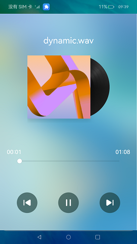
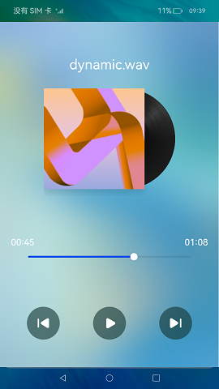

# 长时任务

### 介绍

本示例展示后台任务的长时任务。通过使用[@ohos.resourceschedule.backgroundTaskManager](https://gitee.com/openharmony/docs/blob/master/zh-cn/application-dev/reference/apis/js-apis-resourceschedule-backgroundTaskManager.md)实现后台播放音乐时避免进入挂起（Suspend）状态。

### 效果预览

|进入长时任务                                    |退出长时任务                                |
|---------------------------------------|-------------------------------------|
| ||

使用说明

场景一：后台播放音乐

1.进入应用，点击播放，退出音乐界面推送至后台执行，当任务在后台开始执行时下拉菜单栏会有通知提醒；

2.再次进入应用，音乐播放进度条显示正常；

3.点击暂停播放，取消长时任务。

### 相关权限

[ohos.permission.KEEP_BACKGROUND_RUNNING](https://gitee.com/openharmony/docs/blob/master/zh-cn/application-dev/security/permission-list.md)

### 依赖

不涉及。

### 约束与限制

1.本示例仅支持标准系统上运行,支持设备：RK3568；

2.本示例已适配API version 9版本SDK，版本号：3.2.11.9；

3.本示例需要使用DevEco Studio 3.1 Beta2 (Build Version: 3.1.0.400, built on April 7, 2023)及以上版本才可编译运行；

4.本示例需要使用系统权限的接口。使用Full SDK时需要手动从镜像站点获取，并在DevEco Studio中替换，具体操作可参考[替换指南](https://docs.openharmony.cn/pages/v3.2/zh-cn/application-dev/quick-start/full-sdk-switch-guide.md/)。

### 下载

如需单独下载本工程，执行如下命令：
```
git init
git config core.sparsecheckout true
echo code/BasicFeature/TaskManagement/ContinuousTask/ > .git/info/sparse-checkout
git remote add origin https://gitee.com/openharmony/applications_app_samples.git
git pull origin master

```