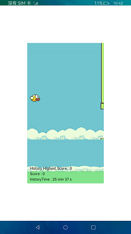

# 小鸟避障游戏

### 介绍

本示例用于验证OpenHarmony提供的Stage模型，Canvas组件做小游戏的能效是否符合预期，以及验证资源调度子系统的API接口是否符合后台规范运行的预期。

### 效果预览

|首页更新前                                   |首页更新后                                |
|---------------------------------------|-------------------------------------|
| ||

使用说明

1.点击**ConnectService**按钮，创建一个ServiceAbility并连接。

2.点击**DisconenctService**按钮，断开ServiceAbility。

3.点击**set game alarm**按钮，利用闹钟提醒代理API，验证游戏进程在收到闹铃通知时不被拉起。

4.点击**set game calendar**按钮，利用日历提醒代理API，验证游戏进程在收到日历通知时不被拉起。

5.点击**start game**按钮，选择对应的游戏难度1-5关玩游戏，游戏玩的过程中会利用后台信息统计API统计展示游戏在线时长。

6.点**home**按钮后，应用生命周期为onInactive, 在此回调中起一个短时任务，验证短时任务API能否正常执行。

### 工程目录
```
entry/src/main/ets/
|---component
|   |---OperateView.ets                          // 操作
|   |---TitleBar.ets                             // 标题
|---entryability
|   |---EntryAbility.ts                          
|---model
|   |---Logger.ts                                // 日志工具
|   |---ServiceModel.ets                         // 服务连接
|---pages
|   |---Index.ets                                // 首页
|   |---Game.ets                                 // 绘制游戏
|   |---Selects.ets                              // 选择关卡
|---ServiceAbility
|   |---service.ts                               // 日志工具
```
### 具体实现

* 该示例使用ServiceExtension接口验证提供的Stage模型，Canvas组件绘制小游戏，queryBundleStatsInfos接口通过指定起始和结束时间查询应用使用时长统计信息来统计展示游戏在线时长，requestSuspendDelay接口申请后台应用延迟挂起来验证短时任务API能否正常执行，rpc接口提供进程间通信能力，wantAgent接口验证系统能力。
* 源码链接：[service.ts](entry/src/main/ets/ServiceAbility/service.ts)，[EntryAbility.ts](entry/src/main/ets/entryability/EntryAbility.ts)，[ServiceModel.ets](entry/src/main/ets/model/ServiceModel.ets)，[Game.ets](entry/src/main/ets/pages/Game.ets)
* 接口参考[@ohos.resourceschedule.usageStatistics](https://gitee.com/openharmony/docs/blob/master/zh-cn/application-dev/reference/apis/js-apis-resourceschedule-deviceUsageStatistics.md)，[@ohos.backgroundTaskManager](https://gitee.com/openharmony/docs/blob/master/zh-cn/application-dev/reference/apis/js-apis-backgroundTaskManager.md)，[@ohos.wantAgent](https://gitee.com/openharmony/docs/blob/master/zh-cn/application-dev/reference/apis/js-apis-wantAgent.md)，[@ohos.app.ability.ServiceExtensionAbility](https://gitee.com/openharmony/docs/blob/master/zh-cn/application-dev/reference/apis/js-apis-app-ability-serviceExtensionAbility.md)，[@ohos.rpc](https://gitee.com/openharmony/docs/blob/master/zh-cn/application-dev/reference/apis/js-apis-rpc.md)

### 相关权限

后台持续运行: [ohos.permission.KEEP_BACKGROUND_RUNNING](https://gitee.com/openharmony/docs/blob/master/zh-cn/application-dev/security/permission-list.md#ohospermissionkeep_background_running)

查询其他应用的运行时间: [ohos.permission.BUNDLE_ACTIVE_INFO](https://gitee.com/openharmony/docs/blob/master/zh-cn/application-dev/security/permission-list.md#ohospermissionbundle_active_info)

后台代理提醒: [ohos.permission.PUBLISH_AGENT_REMINDER](https://gitee.com/openharmony/docs/blob/master/zh-cn/application-dev/security/permission-list.md#ohospermissionpublish_agent_reminder)

### 依赖

不涉及。

### 约束与限制

1.本示例仅支持在标准系统上运行。

2.本示例已适配API version 9版本SDK，版本号：3.2.11.9。

3.本示例需要使用DevEco Studio 3.1 Beta2 (Build Version: 3.1.0.400 构建 2023年4月7日)及以上版本才可编译运行。

4.本示例所配置的权限ohos.permission.BUNDLE_ACTIVE_INFO为system_basic级别(相关权限级别可通过[权限定义列表](https://gitee.com/openharmony/docs/blob/master/zh-cn/application-dev/security/permission-list.md)查看) ，需要手动配置对应级别的权限签名(具体操作可查看[自动化签名方案](https://docs.openharmony.cn/pages/v3.2/zh-cn/application-dev/security/hapsigntool-overview.md/) 。

5.本示例需要使用@ohos.resourceschedule.usageStatistics、@ohos.app.ability.ServiceExtensionAbility系统权限的系统接口。使用Full SDK时需要手动从镜像站点获取，并在DevEco Studio中替换，具体操作可参考[替换指南](https://docs.openharmony.cn/pages/v3.2/zh-cn/application-dev/quick-start/full-sdk-switch-guide.md/)。

### 下载

如需单独下载本工程，执行如下命令：
```
git init
git config core.sparsecheckout true
echo code/BasicFeature/TaskManagement/Flybird/ > .git/info/sparse-checkout
git remote add origin https://gitee.com/openharmony/applications_app_samples.git
git pull origin master

```