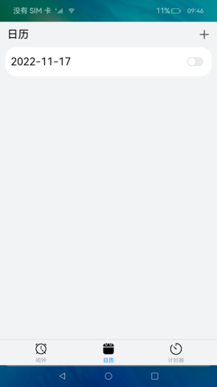
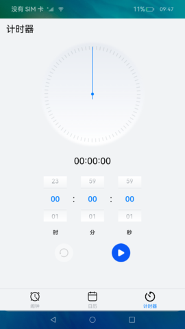

# 后台代理提醒

### 介绍

本示例通过使用后台代理提醒的能力，创建闹钟、日历、计时器三种类型的定时提醒，保证应用被冻结或退出时，计时和弹出提醒的功能可以被后台系统服务代理。

本示例使用 [Tabs组件](https://gitee.com/openharmony/docs/blob/master/zh-cn/application-dev/reference/arkui-ts/ts-container-tabs.md) 进行应用布局，使用 [Canvas组件](https://gitee.com/openharmony/docs/blob/master/zh-cn/application-dev/reference/arkui-ts/ts-components-canvas-canvas.md) 绘制时钟、倒计时，使用 [后台代理提醒](https://gitee.com/openharmony/docs/blob/master/zh-cn/application-dev/reference/apis/js-apis-reminderAgentManager.md) 发布后台代理提醒，使用 [振动](https://gitee.com/openharmony/docs/blob/master/zh-cn/application-dev/reference/apis/js-apis-vibrator.md) 设置振动效果。

### 效果预览

| 闹钟                                          | 日历                                       | 计时器                                   |
|---------------------------------------------|------------------------------------------|---------------------------------------|
|  |  |  |

使用说明：

1.点击**闹钟**、**日历**、**计时器**三个按钮切换不同视图。

2.1.点击闹钟页面右上角**+**按钮选择闹钟提醒时间添加闹钟提醒。

2.2.点击闹钟列表中可设置闹钟重复日期、延迟次数、延迟时长、是否震动、响铃音乐。

2.3.点击闹钟列表右侧开关按钮，可关闭或打开当前提醒。

2.4.右滑当前闹钟列表可选择删除当前提醒。

3.1.点击点击日历页面右上角**+**按钮选择日期提醒时间添加日期提醒。

3.2.点击日期列表中可设置日历提醒当天具体提醒时间、是否振动、是否响铃。

3.3.点击日历列表右侧开关按钮，可关闭或打开当前提醒。

3.4.右滑当前日历列表可选择删除当前提醒。

4.1.滑动计时器时间选项设置计时器时间。

4.2.点击**开始**按钮，开始当前计时器并设置倒计时后台提醒。

4.3.点击**重置**按钮，取消当前计时器提醒并重新设置计时器。

4.4.点击**暂停**按钮，暂停当前计时器提醒与倒计时；再次点击按钮恢复计时器提醒与计时器计时。

### 工程目录
```
entry/src/main/ets/
|---Application
|   |---MyAbilityStage.ts
|---common
|   |---Constant.ets                      // 数据初始化
|   |---Reminder.ets                      // 定义数据类型
|---MainAbility
|   |---MainAbility.ts
|---pages
|   |---Index.ets                         // 首页
|   |---alarmClock                         
|   |   |---AlarmClock.ets                // 闹钟页面
|   |   |---AlarmClockSetting.ets         // 设置闹钟
|   |   |---DrawClock.ets                 // 绘制闹钟
|   |---calendar
|   |   |---Calendar.ets                  // 日历页面
|   |   |---CalendarSetting.ets           // 设置日历
|   |---timer
|   |   |---SelectTime.ets                // 计时器页面
|   |   |---Timer.ets                     // 计时
|---util
|   |---AlarmClockReminder.ets            // 闹钟管理
|   |---AudioPlayer.ets                   // 音频播放
|   |---CalendarReminder.ets              // 日历管理
|   |---PreferencesDataManager.ets        // 数据管理
|   |---TimeConversion.ets                // 时间转换
|   |---Logger.ts                         // 日志打印
```
### 具体实现

* 该示例分为闹钟，日历，计时器三个模块 
  * 闹钟模块
    * 使用Canvas组件绘制一个闹钟，SlotType方法获取对应的系统能力内容类型，addNotificationSlot方法添加一个NotificationSlot，ReminderRequestAlarm方法获取闹钟实例对象，用于设置提醒的时间，ReminderType方法设置提醒的类型，ActionButtonType方法设置按钮的类型，VibratorStopMode方法停止的振动。
    * 源码链接：[AlarmClockReminder.ets](entry/src/main/ets/util/AlarmClockReminder.ets)，[Reminder.ets](entry/src/main/ets/common/Reminder.ets)，[AlarmClock.ets](entry/src/main/ets/pages/alarmClock/AlarmClock.ets)，[Constant.ets](entry/src/main/ets/common/Constant.ets)
    * 接口参考：[@ohos.notification](https://gitee.com/openharmony/docs/blob/master/zh-cn/application-dev/reference/apis/js-apis-notification.md)，[@ohos.reminderAgent](https://gitee.com/openharmony/docs/blob/master/zh-cn/application-dev/reference/apis/js-apis-reminderAgent.md)，[@ohos.vibrator](https://gitee.com/openharmony/docs/blob/master/zh-cn/application-dev/reference/apis/js-apis-vibrator.md)

  * 日历模块
    * 使用SlotType方法获取对应的系统能力内容类型，ReminderRequestCalendar方法获取日历实例对象，用于设置提醒的时间，ReminderType方法设置提醒的类型，ActionButtonType方法设置按钮的类型，VibratorStopMode方法停止的振动。
    * 源码链接：[CalendarReminder.ets](entry/src/main/ets/util/CalendarReminder.ets)，[Reminder.ets](entry/src/main/ets/common/Reminder.ets)，[Calendar.ets](entry/src/main/ets/pages/calendar/Calendar.ets)，[Constant.ets](entry/src/main/ets/common/Constant.ets)
    * 接口参考：[@ohos.notification](https://gitee.com/openharmony/docs/blob/master/zh-cn/application-dev/reference/apis/js-apis-notification.md)，[@ohos.reminderAgent](https://gitee.com/openharmony/docs/blob/master/zh-cn/application-dev/reference/apis/js-apis-reminderAgent.md)，[@ohos.vibrator](https://gitee.com/openharmony/docs/blob/master/zh-cn/application-dev/reference/apis/js-apis-vibrator.md)

  * 计时器模块
    * 使用SlotType方法获取对应的系统能力内容类型，addNotificationSlot方法添加一个NotificationSlot，ReminderRequestTimer方法获取倒计时实例对象，用于设置提醒的时间，ReminderType方法设置提醒的类型，ActionButtonType方法设置按钮的类型，VibratorStopMode方法停止的振动。
    * 源码链接：[Timer.ets](entry/src/main/ets/pages/timer/Timer.ets)，[Reminder.ets](entry/src/main/ets/common/Reminder.ets)，[Constant.ets](entry/src/main/ets/common/Constant.ets)
    * 接口参考：[@ohos.notification](https://gitee.com/openharmony/docs/blob/master/zh-cn/application-dev/reference/apis/js-apis-notification.md)，[@ohos.reminderAgent](https://gitee.com/openharmony/docs/blob/master/zh-cn/application-dev/reference/apis/js-apis-reminderAgent.md)，[@ohos.vibrator](https://gitee.com/openharmony/docs/blob/master/zh-cn/application-dev/reference/apis/js-apis-vibrator.md)

### 相关权限

1.允许该应用使用后台代理提醒 [ohos.permission.PUBLISH_AGENT_REMINDER](https://gitee.com/openharmony/docs/blob/master/zh-cn/application-dev/security/permission-list.md#ohospermissionpublish_agent_reminder)

2.允许应用控制马达振动 [ohos.permission.VIBRATE](https://gitee.com/openharmony/docs/blob/master/zh-cn/application-dev/security/permission-list.md#ohospermissionvibrate)

3.允许应用读取用户外部存储中的媒体文件信息 [ohos.permission.READ_MEDIA](https://gitee.com/openharmony/docs/blob/master/zh-cn/application-dev/security/permission-list.md#ohospermissionread_media)

### 依赖

不涉及。

### 约束与限制

1.本示例仅支持标准系统上运行，支持设备：RK3568。

2.本示例已适配API version 9版本SDK，版本号：3.2.11.9。

3.本示例需要使用DevEco Studio 3.1 Beta2 (Build Version: 3.1.0.400, built on April 7, 2023)及以上版本才可编译运行。

### 下载

如需单独下载本工程，执行如下命令：
```
git init
git config core.sparsecheckout true
echo code/BasicFeature/TaskManagement/ReminderAgentManager/ > .git/info/sparse-checkout
git remote add origin https://gitee.com/openharmony/applications_app_samples.git
git pull origin master

```