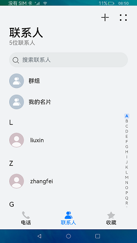
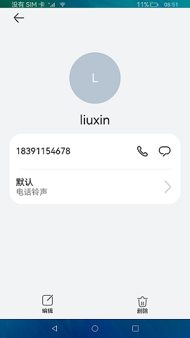

# 联系人

### 介绍

本示例使用[@ohos.contact](https://gitee.com/openharmony/docs/blob/master/zh-cn/application-dev/reference/apis/js-apis-contact.md)
接口，实现了对联系人的增删查改功能。

### 效果预览

|首页|详情页|新建联系人|
|-----|-----|-----|
| |||

使用说明

1.点击 **+** 按钮，跳转添加联系人界面，输入联系人信息，点击 **√**，确认添加联系人，并返回首页；

2.点击联系人列表跳转页面查看详细信息，并且可以编辑或删除联系人信息；

3.在搜索栏输入号码或邮箱可查询对应的联系人。

### 工程目录
```
entry/src/main/ets/
|---component
|   |---Contact.ets                       // 联系人页面
|   |---ContactInfo.ets                   // 联系人详情页主体内容
|   |---Home.ets                          // 主页主体内容
|   |---ItemContainer.ets                 // 联系人列表
|   |---NewContact.ets                    // 新建联系人页面主体内容
|   |---UpdateContact.ets
|---data                                  // 日志文件
|---entryability                          
|   |---EntryAbility.ets                  // 应用入口，在这里请求相关权限
|---pages
|   |---AddContact.ets                    // 新建联系人页面
|   |---EditContact.ets                   // 编辑联系人
|   |---Index.ets                         // 主页
|   |---NameCard.ets                      // 联系人详情页
|   |---Setting.ets                       // 设置页面
```

### 具体实现
* 本示例的主要逻辑功能和源码在下列相关类中：
  * 查询所有联系人：在[Contact.ets](https://gitee.com/openharmony/applications_app_samples/blob/master/code/BasicFeature/Telephony/Contact/entry/src/main/ets/component/Contact.ets)
    页面调用contact.queryContacts()查询所有的联系人；
  * 新建联系人：在[AddContact.ets](https://gitee.com/openharmony/applications_app_samples/blob/master/code/BasicFeature/Telephony/Contact/entry/src/main/ets/pages/AddContact.ets)
    页面检验数据格式后通过contact.addContact()创建新的联系人；
  * 搜索联系人：在[Contact.ets](https://gitee.com/openharmony/applications_app_samples/blob/master/code/BasicFeature/Telephony/Contact/entry/src/main/ets/component/Contact.ets)
    页面调用contact.queryContactsByPhoneNumber()通过电话号码查询联系人或者调用contact.queryContactsByEmail()通过邮箱查询联系人；
  * 删除联系人：在[ContactInfo.ets](https://gitee.com/openharmony/applications_app_samples/blob/master/code/BasicFeature/Telephony/Contact/entry/src/main/ets/component/ContactInfo.ets)
    调用contact.deleteContact()删除指定的联系人；
  * 修改联系人：在[EditContact.ets](https://gitee.com/openharmony/applications_app_samples/blob/master/code/BasicFeature/Telephony/Contact/entry/src/main/ets/pages/EditContact.ets)
    页面调用contact.updateContact()。

### 相关权限

[ohos.permission.READ_CONTACTS](https://gitee.com/openharmony/docs/blob/master/zh-cn/application-dev/security/permission-list.md)

[ohos.permission.WRITE_CONTACTS](https://gitee.com/openharmony/docs/blob/master/zh-cn/application-dev/security/permission-list.md)

### 依赖

不涉及。

### 约束与限制

1. 本示例仅支持标准系统上运行，支持设备：RK3568。

2. 本示例需要使用DevEco Studio 3.1 Canary1 (Build Version: 3.1.0.100)及以上版本才可编译运行。

3. 本示例已适配API10版本SDK，版本号：4.0.5.1。

4. 本示例涉及[ohos.permission.READ_CONTACTS](https://gitee.com/openharmony/docs/blob/master/zh-cn/application-dev/security/permission-list.md)、[ohos.permission.WRITE_CONTACTS](https://gitee.com/openharmony/docs/blob/master/zh-cn/application-dev/security/permission-list.md) 为system_basic级别（相关权限级别可通过[权限定义列表](https://gitee.com/openharmony/docs/blob/master/zh-cn/application-dev/security/permission-list.md))查看），需要手动配置对应级别的权限签名(具体操作可查看[自动化签名方案](https://docs.openharmony.cn/pages/v3.2Beta/zh-cn/application-dev/security/hapsigntool-overview.md/))。

### 下载

如需单独下载本工程，执行如下命令：

```
git init
git config core.sparsecheckout true
echo code/BasicFeature/Telephony/Contact/ > .git/info/sparse-checkout
git remote add origin https://gitee.com/openharmony/applications_app_samples.git
git pull origin master
```