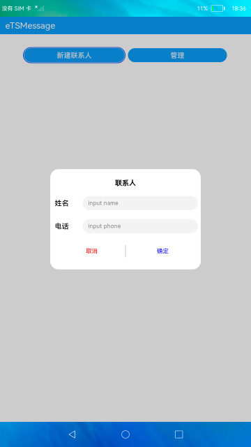
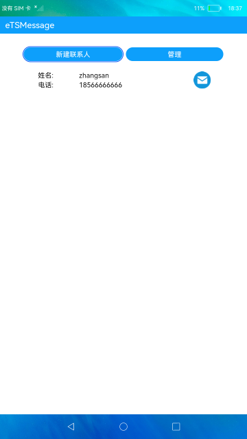

# 短信服务

### 介绍

本示例使用[@ohos.telephony.sms](https://gitee.com/openharmony/docs/blob/OpenHarmony-3.2-Beta5/zh-cn/application-dev/reference/apis/js-apis-sms.md)接口展示了电话服务中发送短信的功能。

### 效果预览
|新建联系人|首页|短信页|
|-------------|-----------|------------|
|| | |

使用说明：

1. 首页点击**创建联系人**，弹框输入联系人姓名和电话，点击确定按钮后，联系人列表中添加该联系人;
2. 点击**管理**，该按钮变成**取消**，联系人列表出现删除x按钮，点击x按钮可删除联系人，点击**取消**，按钮变成**管理**;
3. 联系人列表中每个联系人右侧有**发送短信**图标按钮，点击该图标按钮跳转到发送短信页面;
4. 发送短信页面，输入短信点击向上箭头的**发送**按钮，可以发送短信;
5. 需授予短信发送权限且插入SIM卡才可成功发送短信，有预置短信内容，每次退出应用数据会清空，未添加存储功能，发送短信为默认卡发送。

### 工程目录
```
entry/src/main/ets/
|---pages
|   |---Index.ets                           // 首页
|   |---SendMessage.ets                     / 发送短信页
|---common
|   |---AddDialog.ets                       // 添加联系人
|   |---TitleBar.ets                        // title
|---model
|   |---Contact.ets                         // 联系人数据结构
|   |---DataSources.ets                     // 懒加载数据
|   |---DataTimeUtil.ets                    // 日期工具
|   |---Logger.ts                           // 日志工具
|   |---Message.ets                         // 短信数据结构
|   |---PermissionUtils.ets                 // 权限信息
|   |---SmsModel.ets                        // 封装短信类
```

### 具体实现
+ 发送短信功能在SmsModel中，源码参考[SmsModel.ets](/entry/src/main/ets/model/SmsModel.ets):
    + 发送短信：发送短信首先需要使用createMessage方法创建短信实例，然后获取基本参数，getDefaultSmsSlotId可以获取发短信默认卡槽id，getSmscAddr获取短信发送地址，然后调用sms.sendMessage方法发送短信。

### 相关权限

[ohos.permission.SEND_MESSAGES](https://gitee.com/openharmony/docs/blob/master/zh-cn/application-dev/security/permission-list.md#ohospermissionsend_messages)

[ohos.permission.SET_TELEPHONY_STATE](https://gitee.com/openharmony/docs/blob/master/zh-cn/application-dev/security/permission-list.md#ohospermissionset_telephony_state)

### 依赖

不涉及。

### 约束与限制

1. 本示例仅支持在标准系统上运行;
2. 本示例需要插入SIM卡，目前该功能仅支持部分机型;
3. 本示例已适配API10版本SDK，版本号：4.0.5.1;
4. 本示例涉及使用系统接口：getSmscAddr()，需要手动替换[Full SDK](https://docs.openharmony.cn/pages/v3.2Beta/zh-cn/release-notes/OpenHarmony-v3.2-beta4.md/)才能编译通过，具体操作可参考[替换指南](https://docs.openharmony.cn/pages/v3.2Beta/zh-cn/application-dev/quick-start/full-sdk-switch-guide.md/);
5. 本示例需要使用DevEco Studio 3.1 Canary1 (Build Version: 3.1.0.100)及以上版本才可编译运行;
6. 本示例所配置的权限ohos.permission.SEND_MESSAGES、ohos.permission.SET_TELEPHONY_STATE、ohos.permission.GET_TELEPHONY_STATE为system_basic级别(相关权限级别可通过[权限定义列表](https://gitee.com/openharmony/docs/blob/master/zh-cn/application-dev/security/permission-list.md)查看)，需要手动配置对应级别的权限签名(具体操作可查看[自动化签名方案](https://docs.openharmony.cn/pages/v3.2Beta/zh-cn/application-dev/security/hapsigntool-overview.md/))。

### 下载
如需单独下载本工程，执行如下命令：
```
git init
git config core.sparsecheckout true
echo code/BasicFeature/Telephony/Message/ > .git/info/sparse-checkout
git remote add origin https://gitee.com/openharmony/applications_app_samples.git
git pull origin master
```