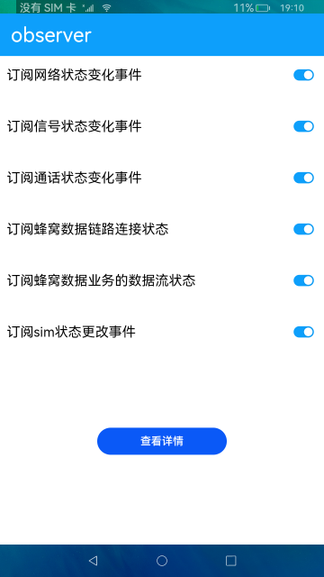

 # 事件订阅

### 介绍

本示例通过observer接口订阅网络状态、信号状态、通话状态、蜂窝数据、sim状态等事件，并获取状态变化返回的结果。

### 效果预览

|主页|
|--------------------------------|
||

使用说明

1.打开应用，开启所有订阅事件开关。

2.开关一次网络，触发网络状态变化。

3.拨打一次电话，触发通话状态变化。

4.插拔一次sim卡，触发sim卡状态变化和信号状态变化。

5.点击**查看详情**按钮，跳转详情页，显示监听到的数据结果。

### 工程目录
```
entry/src/main/ets/
|---Application
|   |---AbilityStage.ts
|---MainAbility
|   |---MainAbility.ts
|---model
|   |---DetailData.ts                  // 详情数据
|   |---Logger.ts                      // 日志工具
|---pages
|   |---Index.ets                      // 首页
|   |---Deatil.ets                     // 详情页面
```
### 具体实现

* 该示例使用NetworkState方法获取网络注册状态，SignalInformation方法获取网络信号强度信息，RadioTechnology方法获取无线接入技术，CallState方法获取通话状态码，DataConnectState方法描述蜂窝数据链路连接状态，DataFlowType方法描述蜂窝数据流类型，SimStateData方法获取SIM卡类型和状态等方法提供订阅管理功能。
* 源码链接：[DetailData.ts](entry/src/main/ets/modle/DetailData.ts)，[Index.ets](entry/src/main/ets/pages/Index.ets)
* 接口参考：[@ohos.telephony.radio](https://gitee.com/openharmony/docs/blob/master/zh-cn/application-dev/reference/apis/js-apis-radio.md)，[@ohos.telephony.call](https://gitee.com/openharmony/docs/blob/master/zh-cn/application-dev/reference/apis/js-apis-call.md)，[@ohos.telephony.data](https://gitee.com/openharmony/docs/blob/master/zh-cn/application-dev/reference/apis/js-apis-telephony-data.md)，[@ohos.telephony.observer](https://gitee.com/openharmony/docs/blob/master/zh-cn/application-dev/reference/apis/js-apis-observer.md)

#### 相关概念

observer: 通过注册相关监听事件，来监听手机网络、信号、通话、sim卡等状态，并返回相应的结果。

### 相关权限

1.获取网络状态权限：[ohos.permission.GET_NETWORK_INFO](https://gitee.com/openharmony/docs/blob/master/zh-cn/application-dev/security/permission-list.md#ohospermissionget_network_info)

2.获取通话状态权限：[ohos.permission.READ_CALL_LOG](https://gitee.com/openharmony/docs/blob/master/zh-cn/application-dev/security/permission-list.md#ohospermissionread_call_log)

### 依赖

不涉及。

### 约束与限制

1.本示例仅支持标准系统上运行。

2.本示例需要插入SIM卡，目前该功能仅支持部分机型。

3.本示例已适配API version 9版本SDK，版本号：3.2.11.9。

4.本示例需要使用DevEco Studio 3.1 Beta2 (Build Version: 3.1.0.400, built on April 7, 2023)及以上版本才可编译运行。

5.本示例所配置的权限ohos.permission.READ_CALL_LOG为system_basic级别(相关权限级别可通过[权限定义列表](https://gitee.com/openharmony/docs/blob/master/zh-cn/application-dev/security/permission-list.md)查看)，需要手动配置对应级别的权限签名(具体操作可查看[自动化签名方案](https://docs.openharmony.cn/pages/v3.2/zh-cn/application-dev/security/hapsigntool-overview.md/)。

### 下载

如需单独下载本工程，执行如下命令：
```
git init
git config core.sparsecheckout true
echo code/BasicFeature/Telephony/Observer/ > .git/info/sparse-checkout
git remote add origin https://gitee.com/openharmony/applications_app_samples.git
git pull origin master

```