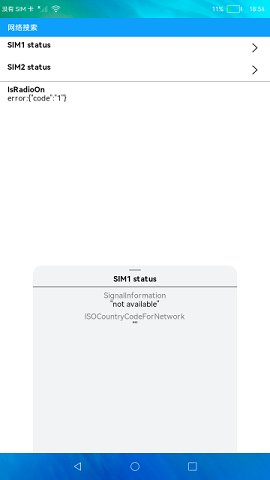

# 网络搜索

### 介绍

本示例通过[@ohos.telephony.sim](https://gitee.com/openharmony/docs/blob/master/zh-cn/application-dev/reference/apis/js-apis-sim.md) 、[@ohos.telephony.radio](https://gitee.com/openharmony/docs/blob/master/zh-cn/application-dev/reference/apis/js-apis-radio.md) 等接口来展示电话服务中网络搜索功能，包含无线接入技术、网络状态、选网模式、ISO国家码、信号强度信息列表及Radio是否打开

### 效果预览
|主页|
|-----------------------------|
||

使用说明

1.点击**SIM1 status**，弹出面板显示卡1的无线接入技术、注册网络信号强度信息列表、选网模式、ISO国家码，
再次点击面板消失， 点击**SIM2 status**显示同理；

2.**NetworkState**显示网络状态相关信息；

3.**IsRadioOn**显示Radio是否打开，true为打开，false为关闭。

### 工程目录

```
entry/src/main/ets/
|---common
|   |---InfoView.ets                   // sim卡信息组件
|   |---PanelView.ets                  // 网络信息组件
|---entryAbility
|---model
|   |---Logger.ts                      // 日志工具
|   |---RadioStatus.ts                 // 封装网络状态方法
|   |---ResultModel.ts                 // 声明数据类型
|---pages
|   |---Index.ets                      // 首页
```
### 具体实现

* 网络搜索功能的实现主要封装在RadioStatus，源码参考:[RadioStatus.ts](https://gitee.com/openharmony/applications_app_samples/blob/master/code/BasicFeature/Telephony/RadioTech/entry/src/main/ets/model/RadioStatus.ts) ，[PinDialog.ets](https://gitee.com/openharmony/applications_app_samples/blob/master/code/SystemFeature/Connectivity/Bluetooth/entry/src/main/ets/Commom/PinDialog.ets)
    * 获取网络状态以及服务商名称：打开应用触发RadioStatus中的getNetworkState()函数调用radio.getNetworkState()方法来获取网络状态，getRadioOn()函数调用radio.isRadioOn()方法判断指定卡槽位的Radio是否打开，RadioStatus中的getSimSpn()函数调用sim.getSimSpn(slotId)方法来获取指定卡槽SIM卡的服务提供商名称（Service Provider Name，SPN）。
    * 显示SIM卡信息：点击SIM status，弹出面板显示卡1的无线接入技术、注册网络信号强度信息列表、选网模式、ISO国家码。
    * 获取无线接入技术：RadioStatus中的getRadioTech(this.slotId)函数来调用radio.getRadioTech(slotId)方法来获取当前接入的CS域和PS域无线接入技术，
    * 获取指定SIM卡网络强度信息：getSignalInformation(this.slotId)函数来调用radio.getSignalInformation(slotId)方法来获取指定SIM卡槽对应的注册网络信号强度信息列表。
    * 获取选网模式：getNetworkSelectionMode(this.slotId)函数来调用radio.getNetworkSelectionMode(slotId)方法来获取当前选网模式。
    * 获取ISO国家码：getISOCountryCodeForNetwork(this.slotId)函数来调用radio.getISOCountryCodeForNetwork(slotId)方法来获取注册网络所在国家的ISO国家码。

### 相关权限

[ohos.permission.GET_NETWORK_INFO](https://gitee.com/openharmony/docs/blob/master/zh-cn/application-dev/security/permission-list.md)

### 依赖

不涉及。

### 约束与限制

1.本示例仅支持在标准系统上运行。

2.本示例需要插入SIM卡，目前该功能仅支持部分机型。

3.本示例已适配API10版本SDK，版本号：4.0.5.1。

4.本示例需要使用DevEco Studio 3.1 Canary1 (Build Version: 3.1.0.100)及以上版本才可编译运行。

### 下载

如需单独下载本工程，执行如下命令：
```
git init
git config core.sparsecheckout true
echo code/BasicFeature/Telephony/RadioTech/ > .git/info/sparse-checkout
git remote add origin https://gitee.com/openharmony/applications_app_samples.git
git pull origin master

```