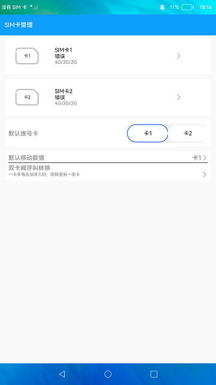

# SIM卡管理

### 介绍

本示例使用[sim](https://gitee.com/openharmony/docs/blob/master/zh-cn/application-dev/reference/apis/js-apis-sim.md)相关接口，展示了电话服务中SIM卡相关功能，包含SIM卡的服务提供商、ISO国家码、归属PLMN号信息，以及默认语音卡功能。

### 效果预览

|主页|
|--------------------------------|
||

使用说明：

1.若SIM卡槽1插入SIM卡则SIM卡1区域显示为蓝色，否则默认为白色。

2.点击SIM卡1区域，弹窗显示SIM卡1的相关信息，再次点击面板消失。

3.默认拨号的SIM卡其按钮背景色为蓝色，目前只展示默认拨号的SIM卡，更改默认拨号卡功能暂不支持。

4.呼叫转移界面功能暂不支持，故点击按钮无实际操作。

### 工程目录
```
entry/src/main/ets/
|---common
|   |---CallView.ets                    // 呼叫
|   |---InfoView.ets                    // 信息
|   |---Show.ets                        // 展示
|   |---ShowView.ets                    // 展示页面
|   |---SimView.ets                     // sim页面
|---entryability
|   |---EntryAbility.ts
|---model
|   |---AbilityContextController.ts     // 弹窗
|   |---Logger.ts                       // 日志工具
|---pages
|   |---Index.ets                       // 首页
```
### 具体实现

* 该示例主要通过hasSimCard方法获取指定卡槽SIM卡是否插卡，getSimState方法获取指定卡槽的SIM卡状态，SimState方法判断SIM卡状态，isSimActive方法获取指定卡槽SIM卡是否激活，getSimSpn方法获取指定卡槽SIM卡的服务提供商名称，getISOCountryCodeForSim方法获取指定卡槽SIM卡的ISO国家码，getSimOperatorNumeric方法获取指定卡槽SIM卡的归属PLMN号，getDefaultVoiceSlotId方法获取默认语音业务的卡槽ID等开发电话服务的相关功能。
* 源码链接：[InfoView.ets](entry/src/main/ets/common/InfoView.ets)，[ShowView.ets](entry/src/main/ets/common/ShowView.ets)，[SimView.ets](entry/src/main/ets/common/SimView.ets)
* 接口参考：[@ohos.telephony.sim](https://gitee.com/openharmony/docs/blob/master/zh-cn/application-dev/reference/apis/js-apis-sim.md)

### 相关权限

电话权限：[ohos.permission.GET_TELEPHONY_STATE](https://gitee.com/openharmony/docs/blob/master/zh-cn/application-dev/security/permission-list.md#ohospermissionget_telephony_state)

### 依赖

不涉及。

### 约束与限制

1.本示例暂不支持双卡功能，且需要插入SIM卡，目前该功能仅支持部分机型。

2.本示例仅支持在标准系统上运行。

3.本示例已适配API version 9版本SDK，版本号：3.2.11.9。

4.本示例需要使用DevEco Studio 3.1 Beta2 (Build Version: 3.1.0.400, built on April 7, 2023)及以上版本才可编译运行。

5.本示例所配置的权限ohos.permission.GET_TELEPHONY_STATE为system_basic级别(相关权限级别可通过[权限定义列表](https://gitee.com/openharmony/docs/blob/master/zh-cn/application-dev/security/permission-list.md)查看)，需要手动配置对应级别的权限签名(具体操作可查看[自动化签名方案](https://docs.openharmony.cn/pages/v3.2/zh-cn/application-dev/security/hapsigntool-overview.md/)。

### 下载

如需单独下载本工程，执行如下命令：
```
git init
git config core.sparsecheckout true
echo code/BasicFeature/Telephony/SimManager/ > .git/info/sparse-checkout
git remote add origin https://gitee.com/openharmony/applications_app_samples.git
git pull origin master

```