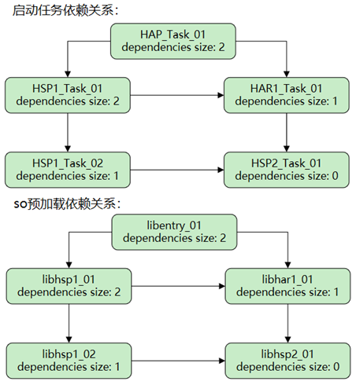

# 应用启动框架AppStartup

### 介绍

应用启动时通常需要执行一系列初始化启动任务，如果将启动任务都放在HAP的UIAbility组件的onCreate生命周期中，那么只能在主线程中依次执行，不但影响应用的启动速度，而且当启动任务过多时，任务之间复杂的依赖关系还会使得代码难以维护。

AppStartup提供了一种简单高效的应用启动方式，可以支持任务的异步启动，加快应用启动速度。同时，通过在一个配置文件中统一设置多个启动任务的执行顺序以及依赖关系，让执行启动任务的代码变得更加简洁清晰、容易维护。

### 运行机制
启动框架支持以自动模式或手动模式执行启动任务，默认采用自动模式。在构造AbilityStage过程中开始加载开发者配置的启动任务，并执行自动模式的启动任务。开发者也可以在AbilityStage创建完后调用startupManager.run方法，执行手动模式的启动任务。

### 工程目录
```
项目根目录
├─ entry/                     # 主模块（应用入口）
│  └─ src/                    # 核心源码目录
│     └─ main/                # 主代码目录
│        ├─ module.json5      # 模块核心配置（设备、权限、系统能力等）
│        ├─ cpp/              # Native层源码（C++）
│        │  └─ types/         # 类型定义（供ArkTS调用）
│        ├─ ets/              # ArkTS业务代码
│        │  ├─ pages/         # 页面组件
│        │  └─ startup/       # 启动任务配置
│        └─ resources/        # 模块资源（界面、配置等）
│          └─ base/          # 基础资源
│             └─ profile/    # 页面路由、启动配置等
│                └─ startup_config.json # 启动任务配置
├─ har/                       # HAR模块（可复用组件库）
│  └─ src/
│     └─ main/
│        ├─ module.json5
│        ├─ cpp/              # HAR的Native源码
│        ├─ ets/              # HAR的ArkTS组件
│        │  ├─ components/    # 可复用组件
│        │  └─ startup/       # HAR启动任务
│        └─ resources/        # HAR资源
├─ hsp1/                      # HSP模块（共享包，多模块复用）
│  └─ src/
│     └─ main/
│        ├─ module.json5
│        ├─ cpp/              # HSP的Native源码
│        └─ ets/              # HSP的ArkTS代码
│           ├─ pages/
│           │  └─ Index.ets
│           └─ startup/
├─ hsp2/                      # 第二个HSP模块（结构同hsp1）
│   └─[同hsp1目录结构，省略重复内容]
└─ README_zh.md               # 项目说明文档

```

### 关系图
**图** 启动任务与so预加载依赖关系图


### 使用说明
通常大型应用会有多个HSP和HAR，本节将提供一个应用示例，以展示如何在HSP包和HAR包中使用启动框架。该示例应用包括两个HSP包（hsp1、hsp2）和一个HAR包（har1），并且包含启动任务和so预加载任务。
注意:so和任务需自己进行相关配置，代码只做展示

### 相关权限

不涉及。

### 依赖

不涉及。

### 约束与限制

1.本示例仅支持标准系统上运行，支持设备：RK3568。

2.本示例已适配API version 10版本SDK，版本号：4.0.10.13。

3.本示例需要使用DevEco Studio 4.0 (Build Version: 4.0.0.600 构建 2023年10月17日)及以上版本才可编译运行。

### 下载

如需单独下载本工程，执行如下命令：

```
git init
git config core.sparsecheckout true
echo code/DocsSample/Ability/Performance/MetaCompetence1/ > .git/info/sparse-checkout
git remote add origin https://gitee.com/openharmony/applications_app_samples.git
git pull origin master
```