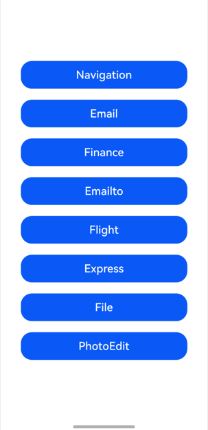

# 拉起指定类型的应用概述

- 通过startAbilityByType接口拉起垂类面板：调用startAbilityByType接口拉起对应的垂域面板（目前支持拉起导航、金融、邮件、航班、快递类应用面板），该面板将展示目标方接入的垂域应用，由用户选择打开指定应用以实现相应的垂类意图。
- 通过mailto方式跳转电子邮件应用：通过mailto电子邮件协议，可以创建指向电子邮件地址的超链接，方便用户通过网页或应用中的超链接直接跳转电子邮件应用。
- 通过startAbility接口打开文件：开发者可以通过调用startAbility接口，由系统从已安装的应用中寻找符合要求的应用，打开特定类型的文件。

### 通过startAbilityByType接口拉起垂类面板
开发者可通过特定的业务类型如导航、金融、邮件等，调用startAbilityByType接口拉起对应的垂域面板，该面板将展示目标方接入的垂域应用，由用户选择打开指定应用以实现相应的垂类意图。

### 匹配规则
UIAbilityContext.startAbilityByType和UIExtensionContentSession.startAbilityByType接口支持基于业务类型拉起垂域面板。调用方通过指定业务类型即可拉起对应的垂域面板，在垂域面板上将展示目标方接入的垂域应用。


系统会根据调用方在startAbilityByType接口传入的type与wantParams.sceneType取值，按照如下映射关系，匹配到在module.json5配置文件中声明了对应的目标应用。

| 支持的功能 | 调用方（startAbilityByType接口入参）  |  目标方（配置文件linkFeature取值） | 
| ------------ | ------------ |   ------------ |
| 路线规划功能 |- type：navigation <br/> - wantParams.sceneType：1 | RoutePlan |
|导航功能 |- type：navigation <br/> - wantParams.sceneType：2 | Navigation|
|位置搜索功能 |- type：navigation <br/> - wantParams.sceneType：3 | PlaceSearch|
|转账汇款功能 |- type：finance <br/> - wantParams.sceneType：1 |Transfer|
|信用卡还款功能 |- type：finance <br/> - wantParams.sceneType：2 |CreditCardRepayment|
|撰写邮件功能|- type：mail <br/> - wantParams.sceneType：1|ComposeMail|
|按航班号查询航班功能|- type：flight<br/> - wantParams.sceneType：1|QueryByFlightNo|
|按起降地查询航班功能|- type：flight<br/> - wantParams.sceneType：2|QueryByLocation|
|快递查询功能|- type：express<br/> - wantParams.sceneType：1|QueryExpress|


### 效果预览


|主页|
|--------------------------------|
||

使用说明

1. 在主界面，点击Navigation按钮，会弹出一个hideAbility界面，点击"hideAbility"文本,会弹出导航类应用的面板。
2. 在主界面，点击按钮Email，会弹出一个hideAbility界面，点击"hideAbility"文本,会弹出邮件类应用的面板。
3. 在主界面，点击Finance按钮，会弹出一个hideAbility界面，点击"hideAbility"文本,会弹出金融类应用的面板。
4. 在主界面，点击Express按钮，会弹出一个hideAbility界面，点击"hideAbility"文本,会弹出快递类应用的面板。
5. 在主界面，点击Emailto按钮，会弹出一个hideAbility界面，点击"feedback"按钮,会弹出邮件发送类应用的面板。
6. 在主界面，点击Flight按钮，会弹出一个hideAbility界面，点击"hideAbility"文本,会弹出航班类应用的面板。
7. 在主界面，点击File按钮，会弹出一个文件预览(如果手机只有一个对应的应用)，点击"hideAbility"文本,会弹出打开文件类应用的面板。
8. 在主界面，点击PhotoEdit按钮，会弹出一个selectImg界面，点击相应的按钮会弹出选择图片或者第三方应用面板。

### 工程目录
```
entry/src/main/
│  module.json5
│
├─ets
│  ├─entryability
│  │      ExpressAbility.ets                     // 快递 Ability  
│  │      FileCallerAbility.ets                  // 文件发起方 Ability
│  │      FileHandlerAbility.ets                 // 文件调用方 Ability
│  │      FinanceAbility.ets                     // 金融 Ability
│  │      FlightAbility.ets                      // 航班 Ability
│  │      MailAbility.ets                        // 邮件 Ability
│  │      MailtoAbility.ets                      // 邮件to Ability
│  │      NavigationAbility.ets                  // 导航 Ability
│  │      PhotoEditorAbility.ets                 // 图像编辑 Ability
│  │      StartAbilityEntry.ets                  // Main Ability
│  │
│  ├─entrybackupability
│  │      EntryBackupAbility.ets
│  │
│  └─pages
│          ComposeMailPage.ets                  //Compose操作页面
│          CreditCardRepaymentPage.ets          //金融还款页面
│          ExpressIndex.ets                     //快递操作页面
│          FileIndex.ets                        //文件操作页面
│          FinanceIndex.ets                     //金融入口页面
│          FlightIndex.ets                      //航班入口页面
│          Index.ets                            //路由选择
│          MailIndex.ets                        //邮件页面
│          MailtoIndex.ets                      
│          NavigationIndex.ets                  //导航页面
│          PhotoEditorIndex.ets                 //图片编辑
│          PhotoIndex.ets                       //图片编辑入口
│          PlaceSearchPage.ets
│          QueryByFlightNoPage.ets
│          QueryByLocationPage.ets
│          QueryExpressPage.ets
│          RoutePlanPage.ets
│          TransferPage.ets
│
└─resources
    ├─base
    │  ├─element
    │  │      color.json
    │  │      float.json
    │  │      string.json
    │  │
    │  ├─media
    │  │      background.png
    │  │      foreground.png
    │  │      layered_image.json
    │  │      startIcon.png
    │  │
    │  └─profile
    │          backup_config.json
    │          main_pages.json
    │
    └─dark
        └─element
                color.json
```

### 具体实现

#### 1. 导航功能
**核心Ability**：NavigationAbility.ets  
**功能页面**：
- 导航入口：NavigationIndex.ets →
- 路径规划：RoutePlanPage.ets
- 地点搜索：PlaceSearchPage.ets  
  **实现原理**：通过Want动作启动导航应用，支持目的地坐标和路径规划参数传递

#### 2. 快递功能
**核心Ability**：ExpressAbility.ets  
**功能页面**：
- 快递入口：ExpressIndex.ets →
- 快递查询：QueryExpressPage.ets
- 物流中转：TransferPage.ets  
  **实现原理**：通过快递查询协议启动快递应用，支持运单号查询和物流跟踪

#### 3. 航班功能
**核心Ability**：FlightAbility.ets  
**功能页面**：
- 航班入口：FlightIndex.ets →
- 航班号查询：QueryByFlightNoPage.ets
- 地点查询：QueryByLocationPage.ets  
  **实现原理**：支持按航班号或起降地两种方式查询航班信息

#### 4. 邮件功能
**核心Ability**：
- 标准邮件：MailAbility.ets
- 协议邮件：MailtoAbility.ets  
  **功能页面**：
- 邮件入口：MailIndex.ets →
- 邮件撰写：ComposeMailPage.ets
- 协议入口：MailtoIndex.ets  
  **实现原理**：分别通过邮件意图和mailto协议两种方式启动邮件应用

#### 5. 金融功能
**核心Ability**：FinanceAbility.ets  
**功能页面**：
- 金融入口：FinanceIndex.ets →
- 信用卡还款：CreditCardRepaymentPage.ets  
  **实现原理**：通过金融支付协议调用支付应用，支持安全的支付和还款流程

#### 6. 文件功能
**核心Ability**：
- 文件发起：FileCallerAbility.ets
- 文件处理：FileHandlerAbility.ets  
  **功能页面**：文件操作入口：FileIndex.ets  
  **实现原理**：通过文件操作Want实现文件的选择、分享和处理功能

#### 7. 图像编辑功能
**核心Ability**：PhotoEditorAbility.ets  
**功能页面**：
- 图片入口：PhotoIndex.ets →
- 图片编辑：PhotoEditorIndex.ets  
  **实现原理**：通过图片编辑意图启动编辑应用，支持图片处理和编辑功能

#### 8. 主入口管理
**核心Ability**：StartAbilityEntry.ets  
**路由页面**：Index.ets  
**功能描述**：作为应用主入口，管理各功能模块的路由跳转和Ability生命周期


### 相关权限

不涉及。

### 依赖

不涉及。

### 约束与限制

    1.本示例仅支持标准系统上运行，不支持设备：RK3568。
    2.本示例为Stage模型，支持API20版本SDK，版本号：6.0.0.40，镜像版本号：OpenHarmony_6.0.0.40。
    2.本示例需要使用(Build Version: 6.0.0.858, built on September 24, 2025)及以上版本才可编译。

### 下载

如需单独下载本工程，执行如下命令：

```
git init
git config core.sparsecheckout true
echo code/DocsSample/Ability/StartAbility > .git/info/sparse-checkout
git remote add origin https://gitcode.com/openharmony/applications_app_samples.git
git pull origin master
```