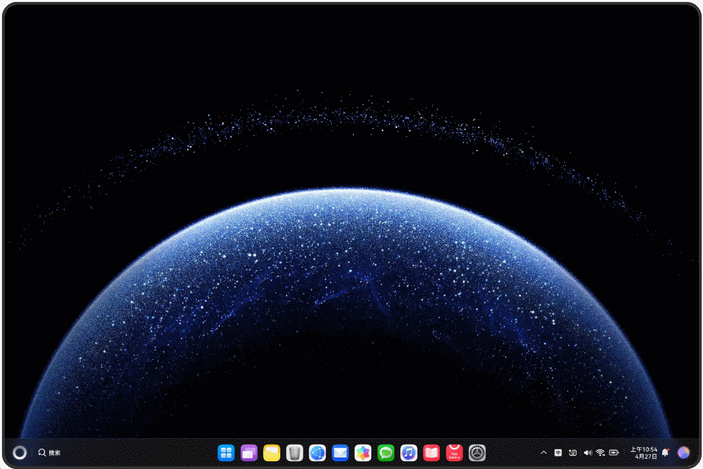
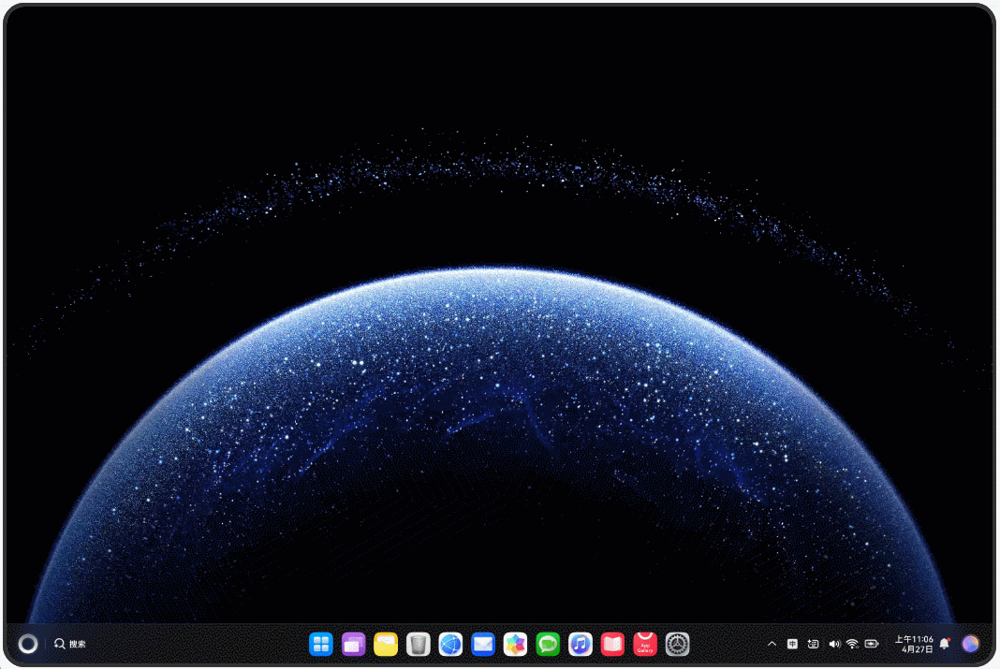
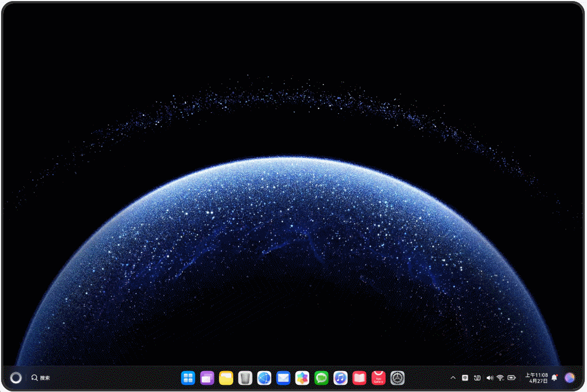
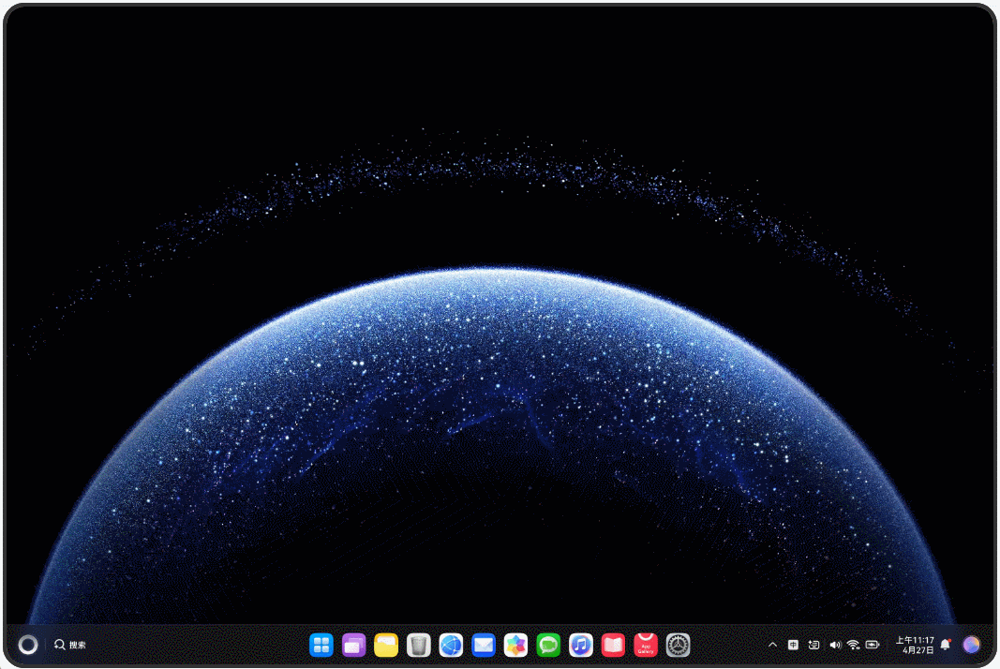

# 启动选项配置

### 介绍
本示例展示了启动Ability时可配置的各种选项，包含[Ability启动方式](https://gitcode.com/openharmony/docs/blob/master/zh-cn/application-dev/application-models/uiability-start.md)、[StartOptions配置](https://gitcode.com/openharmony/docs/blob/master/zh-cn/application-dev/application-models/start-options.md)等内容。通过配置启动选项，开发者可以控制Ability的启动模式、窗口显示方式、启动结果回调等行为。

本示例包含以下子模块：
- **ControlStartupAnimation**：演示如何控制启动动画
- **GetLaunchResult**：演示如何获取Ability启动结果
- **HideSplashScreen**：演示如何隐藏启动画面
- **HideStartedUIAbility**：演示如何隐藏已启动的UIAbility
- **SetBackgroundColor**：演示如何设置窗口背景色
- **SetWindowPosition**：演示如何设置窗口位置
- **SetWindowSizeConstraints**：演示如何设置窗口大小约束
- **SpecifyDisplayScreen**：演示如何指定显示屏幕
- **StartWithSpecifiedWindowMode**：演示如何以指定窗口模式启动

### 效果预览
- ControlStartupAnimation：控制启动动画的显示
- GetLaunchResult：获取Ability启动成功/失败的结果

- HideSplashScreen：隐藏应用的启动画面

- HideStartedUIAbility：启动后隐藏UIAbility界面

- SetBackgroundColor：设置窗口背景颜色

- SetWindowPosition：设置窗口在屏幕上的位置

- SetWindowSizeConstraints：限制窗口的大小范围

- SpecifyDisplayScreen：指定Ability显示在特定屏幕

- StartWithSpecifiedWindowMode：以全屏、分屏或浮窗模式启动


### 使用说明

#### StartWithSpecifiedWindowMode
演示如何以指定窗口模式启动Ability：

```typescript
let options: StartOptions = {
  windowMode: AbilityConstant.WindowMode.WINDOW_MODE_SPLIT_SECONDARY // 以分屏模式拉起
};

context.startAbility(want, options).then(() => {
  hilog.info(DOMAIN_NUMBER, TAG, 'Succeeded in starting ability.');
}).catch((err: BusinessError) => {
  hilog.error(DOMAIN_NUMBER, TAG, `Failed to start ability. Code is ${err.code}, message is ${err.message}`);
});
```

#### GetLaunchResult
演示如何获取Ability启动结果：

```typescript
let completionHandler: CompletionHandler = {
  onRequestSuccess: (elementName: bundleManager.ElementName, message: string): void => {
    console.info(`${elementName.bundleName} start succeeded: ${message}`);
  },
  onRequestFailure: (elementName: bundleManager.ElementName, message: string): void => {
    console.error(`${elementName.bundleName} start failed: ${message}`);
  }
};

let options: StartOptions = {
  completionHandler: completionHandler
};
```

#### SetWindowPosition
演示如何设置窗口位置：

```typescript
let options: StartOptions = {
  windowMode: AbilityConstant.WindowMode.WINDOW_MODE_FLOATING,
  displayId: 0,
  left: 100,
  top: 200,
  width: 500,
  height: 800
};
```

### 工程目录
```
StartOptions/
├── AppScope
│   ├── resources
│   ├── app.json5                        // 应用级配置文件
├── ControlStartupAnimation              // 控制启动动画
│   ├── src/main/ets
│   │   ├── controlstartupanimationability
│   │   │   └── ControlStartupAnimationAbility.ets
│   │   └── pages/Index.ets
│   └── src/ohosTest/ets/test
│       ├── Ability.test.ets
│       └── List.test.ets
├── GetLaunchResult                      // 获取启动结果
│   ├── src/main/ets
│   │   ├── getlaunchresultability
│   │   │   └── GetLaunchResultAbility.ets
│   │   └── pages/Index.ets
│   └── src/ohosTest/ets/test
│       ├── Ability.test.ets
│       └── List.test.ets
├── HideSplashScreen                     // 隐藏启动画面
│   ├── src/main/ets
│   │   ├── hidesplashscreenability
│   │   │   └── HideSplashScreenAbility.ets
│   │   └── pages/Index.ets
│   └── src/ohosTest/ets/test
│       ├── Ability.test.ets
│       └── List.test.ets
├── HideStartedUIAbility                 // 隐藏已启动UIAbility
│   ├── src/main/ets
│   │   ├── hidestarteduiabilityability
│   │   │   └── HideStartedUIAbilityAbility.ets
│   │   └── pages/Index.ets
│   └── src/ohosTest/ets/test
│       ├── Ability.test.ets
│       └── List.test.ets
├── SetBackgroundColor                   // 设置背景色
│   ├── src/main/ets
│   │   ├── setbackgroundcolorability
│   │   │   └── SetBackgroundColorAbility.ets
│   │   └── pages/Index.ets
│   └── src/ohosTest/ets/test
│       ├── Ability.test.ets
│       └── List.test.ets
├── SetWindowPosition                    // 设置窗口位置
│   ├── src/main/ets
│   │   ├── setwindowpositionability
│   │   │   └── SetWindowPositionAbility.ets
│   │   └── pages/Index.ets
│   └── src/ohosTest/ets/test
│       ├── Ability.test.ets
│       └── List.test.ets
├── SetWindowSizeConstraints             // 设置窗口大小约束
│   ├── src/main/ets
│   │   ├── setwindowsizeconstraintsability
│   │   │   └── SetWindowSizeConstraintsAbility.ets
│   │   └── pages/Index.ets
│   └── src/ohosTest/ets/test
│       ├── Ability.test.ets
│       └── List.test.ets
├── SpecifyDisplayScreen                 // 指定显示屏幕
│   ├── src/main/ets
│   │   ├── specifydisplayscreenability
│   │   │   └── SpecifyDisplayScreenAbility.ets
│   │   └── pages/Index.ets
│   └── src/ohosTest/ets/test
│       ├── Ability.test.ets
│       └── List.test.ets
├── StartWithSpecifiedWindowMode         // 指定窗口模式启动
│   ├── src/main/ets
│   │   ├── startwithspecifiedwindowmodeability
│   │   │   └── StartWithSpecifiedWindowModeAbility.ets
│   │   └── pages/Index.ets
│   └── src/ohosTest/ets/test
│       ├── Ability.test.ets
│       └── List.test.ets
├── entry                                // 主模块
│   ├── src/main/ets
│   │   ├── entryability
│   │   │   └── EntryAbility.ets
│   │   └── pages/Index.ets
│   └── src/ohosTest/ets/test
│       ├── Ability.test.ets
│       └── List.test.ets
└── oh-package.json5                      // 依赖配置文件
```

### 具体实现

#### 窗口模式启动
演示如何以不同窗口模式启动Ability，源码参考：[StartWithSpecifiedWindowModeAbility.ets](StartWithSpecifiedWindowMode/src/main/ets/startwithspecifiedwindowmodeability/StartWithSpecifiedWindowModeAbility.ets)
- WINDOW_MODE_FULLSCREEN：全屏模式
- WINDOW_MODE_SPLIT_PRIMARY：分屏主模式
- WINDOW_MODE_SPLIT_SECONDARY：分屏副模式
- WINDOW_MODE_FLOATING：浮窗模式

#### 启动结果处理
演示如何处理Ability启动结果，源码参考：[GetLaunchResultAbility.ets](GetLaunchResult/src/main/ets/getlaunchresultability/GetLaunchResultAbility.ets)
- 使用CompletionHandler处理启动成功/失败回调
- 获取ElementName和结果消息
- 支持异步结果处理

#### 窗口属性配置
演示如何配置窗口属性，包括：
- 位置：设置窗口的left和top属性
- 大小：设置窗口的width和height属性
- 背景色：设置窗口的背景颜色
- 大小约束：限制窗口的最小和最大尺寸

#### 启动动画控制
演示如何控制Ability启动时的动画效果，包括隐藏启动画面、控制动画时长等。

### 相关权限
不涉及

### 依赖
不涉及

### 约束与限制
1. 本示例仅支持标准系统上运行，支持设备：RK3568。
2. 本示例为Stage模型，支持API20版本SDK，版本号：6.0.0.47。
3. 本示例需要使用DevEco Studio 6.0.0及以上版本才可编译运行。
4. 部分启动选项（如多屏显示）需要设备支持相应功能。
5. 浮窗模式需要在支持多窗口的设备上才能正常显示。
6. 窗口位置和大小的设置受到屏幕尺寸和系统限制的约束。