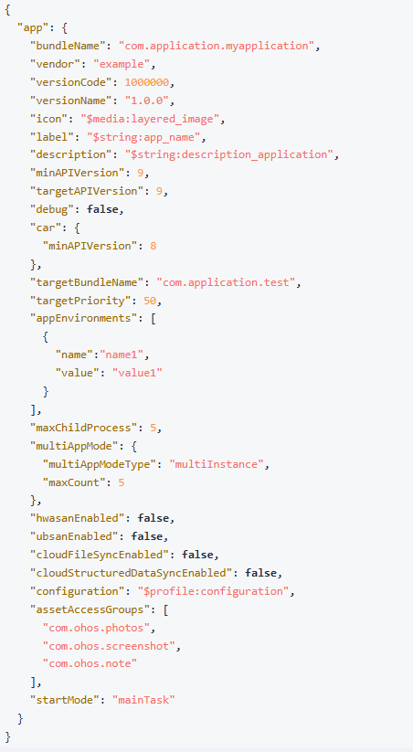

# 应用/组件级配置
### 介绍
  本示例展示了Stage模型应用开发时的应用配置信息。在开发应用时，需要配置应用的一些标签，例如应用的包名、图标、版本、名称、权限、启动模式等标识特征的属性。本文描述了在开发应用需要配置的一些关键标签。

### 效果预览


### 使用说明
1. 打开工程
2. 进入AppScope目录，查看app.json5文件 
3. 进入entry/src/main目录，查看module.json5文件
### 工程目录
```
UIAbilityDemo/
├── AppScope
│   ├── resources
│   ├── app.json5                       // 应用级配置文件
├── entry/src/main
│   ├── ets
│   │   ├── entryability
│   │   ├── entrybackupability
│   │   ├── pages
│   │   │   ├── Index.ets               // 首页
│   ├── module.json5                    // 模块级配置文件
│   └── resources
├── entry/src/ohosTest
│   ├── ets
│   │   └── test
│   │       ├── Ability.test.ets
│   │       └── List.test.ets
```

### 相关权限
不涉及
### 依赖
不涉及
### 约束与限制
1. 本示例仅支持标准系统上运行, 支持设备：RK3568。
2. 本示例为Stage模型，支持API20版本SDK，版本号：6.0.0.47。
3. 本示例需要使用DevEco Studio 6.0.0及以上版本才可编译运行。
### 下载
如需单独下载本工程，执行如下命令：
```
git init
git config core.sparsecheckout true
echo code/DocsSample/Ability/ > .git/info/sparse-checkout
git remote add origin https://gitcode.com/openharmony/applications_app_samples.git
git pull origin master
```
