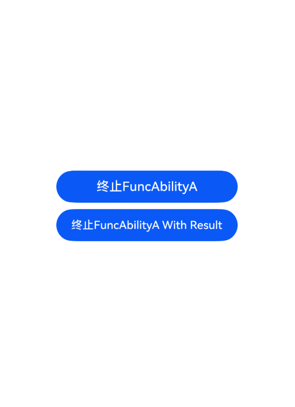

# 启动应用内的UIAbility组件

### 介绍
本示例主要介绍启动应用内的UIAbility组件的方式，UIAbility是系统调度的最小单元。在设备内的功能模块之间跳转时，会涉及到启动特定的UIAbility。

### 效果预览
首页


子页面



### 使用说明

1）启动应用，进入应用首页；

2）点击”拉起FuncAbilityA“按钮，启动FuncAbilityA，点击”终止FuncAbilityA“返回首页；

3）点击”拉起FuncAbilityA With Result“按钮，启动FuncAbilityA；

4）点击”终止FuncAbilityA WithResult“返回首页，弹出toast提示：来自FuncAbility Index页面；

5）点击”冷启动指定页面“，启动ColdAbility，页面显示ColdPage；

6）点击”热启动指定页面“，启动HotAbility，页面显示HotPage；

7）返回首页，再次点击”热启动指定页面“，启动HotAbility，页面显示PageOne;

8）点击”StartWindowMode“按钮，HotAbility显示为悬浮窗模式。
### 工程目录
```
UIAbilityLaunchType/
├── AppScope
│   ├── resources
│   ├── app.json5                       // 应用级配置文件
├── entry/src/main
│   ├── ets
│   │   ├── calleeability
│   │   │   ├── CalleeAbility.ets      // 被调用端CalleeAbility
│   │   ├── entryability
│   │   │   ├── EntryAbility.ets 
│   │   ├── entrybackupability
│   │   │   ├── EntryBackupAbility.ets
│   │   ├── innerability
│   │   │   ├── FuncAbilityA.ets
│   │   │   ├── FuncAbilityAPage.ets
│   │   ├── pages
│   │   │   ├── Index.ets               // HotAbility首页
│   │   │   ├── ColdPage.ets            // ColdAbility首页
│   │   │   ├── MainPage.ets            // 应用首页
│   │   │   ├── PageOne.ets             // HotAbility子页面
│   │   ├── specifiedability
│   │   │   ├── ColdAbility.ets
│   │   │   ├── HotAbility.ets
│   ├── module.json5                    // 模块级配置文件
│   └── resources
├── entry/src/ohosTest
│   ├── ets
│   │   └── test
│   │       ├── Ability.test.ets
│   │       └── List.test.ets
```
### 具体实现
Call调用是UIAbility能力的扩展，它为UIAbility提供一种能够被外部调用并与外部进行通信的能力。Call调用支持前台与后台两种启动方式，使UIAbility既能被拉起到前台展示UI，也可以在后台被创建并运行。Call调用在调用方与被调用方间建立了IPC通信，因此应用开发者可通过Call调用实现不同UIAbility之间的数据共享。
1. 启动应用内的UIAbility
    * 在EntryAbility中，通过调用startAbility()方法启动UIAbility，want为UIAbility实例启动的入口参数。源码参考[MainPage](/entry/src/main/ets/pages/MainPage.ets)。
    * 在FuncAbilityA的onCreate()或者onNewWant()生命周期回调文件中接收EntryAbility传递过来的参数。。源码参考[FuncAbilityA](/entry/src/main/ets/innerability/FuncAbilityA.ets)。
    * 在FuncAbilityA业务完成之后，如需要停止当前UIAbility实例，在FuncAbility中通过调用terminateSelf()方法实现。源码参考[FuncAbilityAPage](/entry/src/main/ets/innerability/FuncAbilityAPage.ets)。
2. UIAbility指定启动页面
    * 调用方UIAbility启动另外一个UIAbility时，在传入的want参数中配置指定的页面路径信息。源码参考[冷启动指定页面](entry/src/main/ets/pages/MainPage.ets)。
    * 在目标UIAbility的onCreate()生命周期回调中，接收调用方传过来的参数。然后在onWindowStageCreate()生命周期回调中，解析调用方传递过来的want参数。源码参考[ColdStartAbility](/entry/src/main/ets/specifiedability/ColdStartAbility.ets)。

### 相关权限
1. ohos.permission.DISTRIBUTED_DATASYNC
2. ohos.permission.ABILITY_BACKGROUND_COMMUNICATION
3. ohos.permission.START_ABILITIES_FROM_BACKGROUND
4. ohos.permission.SYSTEM_FLOAT_WINDOW
### 依赖
不涉及
### 约束与限制
1. 本示例仅支持标准系统上运行, 支持设备：RK3568。
2. 本示例为Stage模型，支持API20版本SDK，版本号：6.0.0.47。
3. 本示例需要使用DevEco Studio 6.0.0及以上版本才可编译运行。
### 下载
如需单独下载本工程，执行如下命令：
```
git init
git config core.sparsecheckout true
echo code/DocsSample/Ability/ > .git/info/sparse-checkout
git remote add origin https://gitcode.com/openharmony/applications_app_samples.git
git pull origin master
```