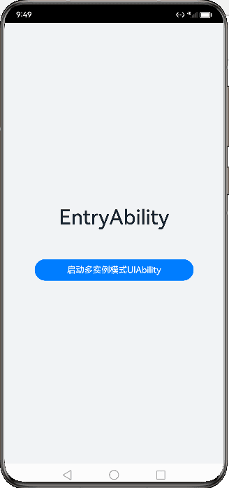

# UIAbility组件启动模式

### 介绍
本示例展示了UIAbility不同的启动模式。UIAbility的启动模式是指UIAbility实例在启动时的不同呈现状态。针对不同的业务场景，系统提供了三种启动模式：

1.[UIAbility组件启动模式](https://gitcode.com/tianlongdevcode/docs_zh/blob/master/zh-cn/application-dev/application-models/uiability-launch-type.md)

### 效果预览

| 单实例模式演示效果                 | 多实例模式演示效果                 | 指定实例模式演示效果                  |
|----------------------------|----------------------------|----------------------------|
|  |  |  |

### 使用说明

1、singleton模式：

1）进入首页，点击启动单实例模式UIAbility；

2）返回首页，再次点击启动单实例模式UIAbility；

3）从手机底部上滑，查看最近任务列表，可以看到单实例模式UIAbility只启动了一个UIAbility；

2、multiton模式：

1）进入首页，点击启动指定实例模式UIAbility；

2）返回首页，多次点击启动多实例模式UIAbility；

3）从手机底部上滑，查看最近任务列表，可以看到多实例模式UIAbility启动了多个UIAbility；

3、specified模式：

1）进入首页，点击启动多实例模式UIAbility；

2）进入指定实例UIAbility页面，多次点击新建一个文档；

3）从手机底部上滑，查看最近任务列表，可以看到指定实例模式UIAbility启动了多个UIAbility；

3）进入指定实例UIAbility页面，多次点击打开已保存文档；

4）从手机底部上滑，查看最近任务列表，可以看到指定实例模式UIAbility只启动了1个UIAbility；

### 工程目录
```
UIAbilityLaunchType/
├── AppScope
│   ├── resources
│   ├── app.json5                       // 应用级配置文件
├── entry/src/main
│   ├── ets
│   │   ├── abilitystage
│   │   │   ├── MyAbilityStage.ets      
│   │   ├── entryability
│   │   │   ├── EntryAbility.ets 
│   │   ├── entrybackupability
│   │   │   ├── EntryBackupAbility.ets
│   │   ├── multitonability
│   │   │   ├── MultitonAbility.ets
│   │   ├── pages
│   │   │   ├── Index.ets               // 首页
│   │   │   ├── MultitonPage.ets
│   │   │   ├── SingletonPage.ets
│   │   │   ├── SpecifiedPage.ets
│   │   │   ├── SpecifiedFirstPage.ets
│   │   │   ├── SpecifiedSecondPage.ets
│   │   ├── singletonability
│   │   │   ├── SingletonAbility.ets
│   │   ├── specifiedability
│   │   │   ├── SpecifiedAbility.ets
│   │   │   ├── SpecifiedFirstAbility.ets
│   │   │   ├── SpecifiedSecondAbility.ets
│   ├── module.json5                    // 模块级配置文件
│   └── resources
├── entry/src/ohosTest
│   ├── ets
│   │   └── test
│   │       ├── Ability.test.ets
│   │       └── List.test.ets
```
### 具体实现

* 本示例展示了启动UIAbility的三种启动模式：singleton、multiton、specified。
    * singleton：创建SingletonAbility，源码参考[SingletonAbility](/entry/src/main/ets/singletonability)
    * multiton：创建MultitonAbility，源码参考[MultitonAbility](/entry/src/main/ets/multitonability)
    * specified：创建SpecifiedAbility，源码参考[SpecifiedAbility](/entry/src/main/ets/specifiedability)
    * 在module.json5文件中配置各个Ability的信息，源码参考[module.json5](/entry/src/main/module.json5)。
    * 调用startAbility()方法启动指定Ability，源码参考[Index](/entry/src/main/ets/pages/Index.ets)。

### 相关权限
不涉及
### 依赖
不涉及
### 约束与限制
1. 本示例仅支持标准系统上运行, 支持设备：RK3568。
2. 本示例为Stage模型，支持API20版本SDK，版本号：6.0.0.47。
3. 本示例需要使用DevEco Studio 6.0.0及以上版本才可编译运行。
### 下载
如需单独下载本工程，执行如下命令：
```
git init
git config core.sparsecheckout true
echo code/DocsSample/Ability/UIAbilityLaunchType > .git/info/sparse-checkout
git remote add origin https://gitcode.com/openharmony/applications_app_samples.git
git pull origin master
```