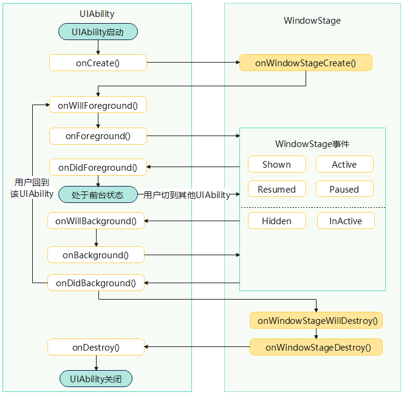

# UIAbility组件生命周期

### 介绍
本示例展示了UIAbility的生命周期函数。当用户在执行应用启动、应用前后台切换、应用退出等操作时，系统会触发相关应用组件的生命周期回调。其中，UIAbility组件的核心生命周期回调包括[onCreate](../reference/apis-ability-kit/js-apis-app-ability-uiAbility.md#oncreate)、[onForeground](../reference/apis-ability-kit/js-apis-app-ability-uiAbility.md#onforeground)、[onBackground](../reference/apis-ability-kit/js-apis-app-ability-uiAbility.md#onbackground)、[onDestroy](../reference/apis-ability-kit/js-apis-app-ability-uiAbility.md#ondestroy)。作为一种包含UI的应用组件，UIAbility的生命周期不可避免地与[WindowStage](../../application-dev/windowmanager/application-window-stage.md)的生命周期存在关联关系。

### 效果预览


### 使用说明
1. 打开工程
2. 进入entry/src/main/ets/entryability目录，查看EntryAbility文件
3. onCreate()：创建UIAbility实例时，系统触发onCreate()回调。开发者可以在该回调中执行UIAbility整个生命周期中仅发生一次的启动逻辑。
4. onWindowStageCreate()：UIAbility实例创建完成之后，在进入前台之前，系统会创建一个WindowStage。WindowStage创建完成后会进入onWindowStageCreate()回调，开发者可以在该回调中进行UI加载、WindowStage的事件订阅。
5. onForeground()：在UIAbility切换至前台时且UIAbility的UI可见之前，系统触发onForeground回调。开发者可以在该回调中申请系统需要的资源，或者重新申请在onBackground()中释放的资源。
6. onBackground()：在UIAbility的UI完全不可见之后，系统触发onBackground回调，将UIAbility实例切换至后台状态。开发者可以在该回调中释放UI不可见时的无用资源，例如停止定位功能，以节省系统的资源消耗。
7. onWindowStageWillDestroy()：在UIAbility实例销毁之前，系统触发onWindowStageWillDestroy()回调。该回调在WindowStage销毁前执行，此时WindowStage可以使用。开发者可以在该回调中释放通过WindowStage获取的资源、注销WindowStage事件订阅等。
8. onWindowStageDestroy()：在UIAbility实例销毁之前，系统触发onWindowStageDestroy()回调，开发者可以在该回调中释放UI资源。该回调在WindowStage销毁后执行，此时WindowStage不可以使用。
9. onDestroy()：在UIAbility实例销毁之前，系统触发onDestroy回调。该回调是UIAbility接收到的最后一个生命周期回调，开发者可以在onDestroy()回调中进行系统资源的释放、数据的保存等操作。
10. onNewWant()：当应用的UIAbility实例已创建，再次调用方法启动该UIAbility实例时，系统触发该UIAbility的onNewWant()回调。开发者可以在该回调中更新要加载的资源和数据等，用于后续的UI展示。
### 工程目录
```
UIAbilityDemo/
├── AppScope
│   ├── resources
│   ├── app.json5                        // 应用级配置文件
├── entry/src/main
│   ├── ets
│   │   ├── entryability
│   │   │   ├── EntryAbility.ets        // UIAbility生命周期函数所在文件
│   │   ├── entrybackupability
│   │   ├── pages
│   │   │   ├── Index.ets               // 首页
│   ├── module.json5                    // 模块级配置文件
│   └── resources
├── entry/src/ohosTest
│   ├── ets
│   │   └── test
│   │       ├── Ability.test.ets
│   │       └── List.test.ets
```
### 具体实现

* 本示例主要介绍UIAbility的生命周期方法，源码参考:[EntryAbility.ets](entry/src/main/ets/entryability/EntryAbility.ets)。
    * onCreate()：创建UIAbility实例时，系统触发onCreate()回调。
    * onWindowStageCreate()：UIAbility实例创建完成之后，在进入前台之前，系统会创建一个WindowStage。
    * onForeground()：在UIAbility切换至前台时且UIAbility的UI可见之前，系统触发onForeground回调。
    * onBackground()：在UIAbility的UI完全不可见之后，系统触发onBackground回调，将UIAbility实例切换至后台状态。
    * onWindowStageWillDestroy()：在UIAbility实例销毁之前，系统触发onWindowStageWillDestroy()回调。
    * onWindowStageDestroy()：在UIAbility实例销毁之前，系统触发onWindowStageDestroy()回调。
    * onDestroy()：在UIAbility实例销毁之前，系统触发onDestroy回调。
    * onNewWant()：当应用的UIAbility实例已创建，再次调用方法启动该UIAbility实例时，系统触发该UIAbility的onNewWant()回调。

### 相关权限
不涉及
### 依赖
不涉及
### 约束与限制
1. 本示例仅支持标准系统上运行, 支持设备：RK3568。
2. 本示例为Stage模型，支持API20版本SDK，版本号：6.0.0.47。
3. 本示例需要使用DevEco Studio 6.0.0及以上版本才可编译运行。
### 下载
如需单独下载本工程，执行如下命令：
```
git init
git config core.sparsecheckout true
echo code/DocsSample/Ability/ > .git/info/sparse-checkout
git remote add origin https://gitcode.com/openharmony/applications_app_samples.git
git pull origin master
```