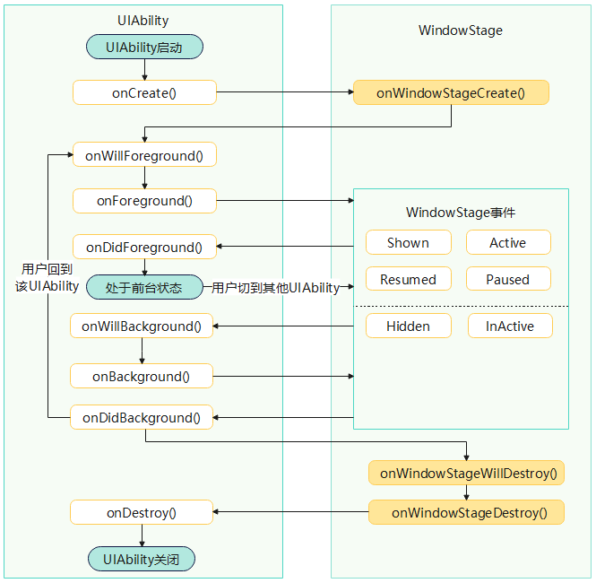

# UIAbility组件生命周期

### 介绍
本示例展示了UIAbility的生命周期函数。当用户在执行应用启动、应用前后台切换、应用退出等操作时，系统会触发相关应用组件的生命周期回调。其中，UIAbility组件的核心生命周期回调包括[onCreate](../reference/apis-ability-kit/js-apis-app-ability-uiAbility.md#oncreate)、[onForeground](../reference/apis-ability-kit/js-apis-app-ability-uiAbility.md#onforeground)、[onBackground](../reference/apis-ability-kit/js-apis-app-ability-uiAbility.md#onbackground)、[onDestroy](../reference/apis-ability-kit/js-apis-app-ability-uiAbility.md#ondestroy)。作为一种包含UI的应用组件，UIAbility的生命周期不可避免地与[WindowStage](../../application-dev/windowmanager/application-window-stage.md)的生命周期存在关联关系。

### 效果预览


### 使用说明
1. 打开工程
2. 进入entry/src/main/ets/entryability目录，查看EntryAbility文件
### 工程目录
```
UIAbilityDemo/
├── AppScope
│   ├── resources
│   ├── app.json5                        // 应用级配置文件
├── entry/src/main
│   ├── ets
│   │   ├── entryability
│   │   │   ├── EntryAbility.ets        // UIAbility生命周期函数所在文件
│   │   ├── entrybackupability
│   │   ├── pages
│   │   │   ├── Index.ets               // 首页
│   ├── module.json5                    // 模块级配置文件
│   └── resources
├── entry/src/ohosTest
│   ├── ets
│   │   └── test
│   │       ├── Ability.test.ets
│   │       └── List.test.ets
```

### 相关权限
不涉及
### 依赖
不涉及
### 约束与限制
1. 本示例仅支持标准系统上运行, 支持设备：RK3568。
2. 本示例为Stage模型，支持API20版本SDK，版本号：6.0.0.47。
3. 本示例需要使用DevEco Studio 6.0.0及以上版本才可编译运行。
### 下载
如需单独下载本工程，执行如下命令：
```
git init
git config core.sparsecheckout true
echo code/DocsSample/Ability/ > .git/info/sparse-checkout
git remote add origin https://gitcode.com/openharmony/applications_app_samples.git
git pull origin master
```