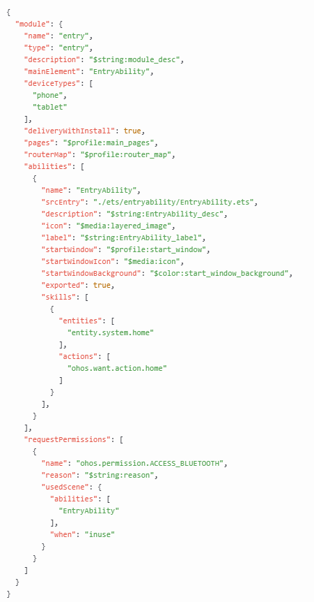

# UIAbility组件概述
### 介绍
UIAbility组件是一种包含UI的应用组件，主要用于和用户交互。 UIAbility组件是系统调度的基本单元，为应用提供绘制界面的窗口。一个应用可以包含一个或多个UIAbility组件。例如，在支付应用中，可以将入口功能和收付款功能分别配置为独立的UIAbility。
每一个UIAbility组件实例都会在最近任务列表中显示一个对应的任务。 

本示例主要展示了UIAbility组件的配置信息。对于开发者而言，可以根据具体场景选择单个还是多个UIAbility，划分建议如下：

- 如果开发者希望在任务视图中看到一个任务，建议使用“一个UIAbility+多个页面”的方式，可以避免不必要的资源加载。

- 如果开发者希望在任务视图中看到多个任务，或者需要同时开启多个窗口，建议使用多个UIAbility实现不同的功能。

  例如，即时通讯类应用中的消息列表与音视频通话采用不同的UIAbility进行开发，既可以方便地切换任务窗口，又可以实现应用的两个任务窗口在一个屏幕上分屏显示。

### 效果预览


### 使用说明
1. 打开工程 
2. 进入entry/src/main目录，查看module.json5文件
### 工程目录
```
UIAbilityOverview/
├── AppScope
│   ├── resources
│   ├── app.json5                       // 应用级配置文件
├── entry/src/main
│   ├── ets
│   │   ├── entryability
│   │   ├── entrybackupability
│   │   ├── pages
│   │   │   ├── Index.ets               // 首页
│   ├── module.json5                    // 模块级配置文件
│   └── resources
├── entry/src/ohosTest
│   ├── ets
│   │   └── test
│   │       ├── Ability.test.ets
│   │       └── List.test.ets
```

### 相关权限
不涉及
### 依赖
不涉及
### 约束与限制
1. 本示例仅支持标准系统上运行, 支持设备：RK3568。
2. 本示例为Stage模型，支持API20版本SDK，版本号：6.0.0.47。
3. 本示例需要使用DevEco Studio 6.0.0及以上版本才可编译运行。
### 下载
如需单独下载本工程，执行如下命令：
```
git init
git config core.sparsecheckout true
echo code/BasicFeature/Ability/ > .git/info/sparse-checkout
git remote add origin https://gitcode.com/openharmony/applications_app_samples.git
git pull origin master
```