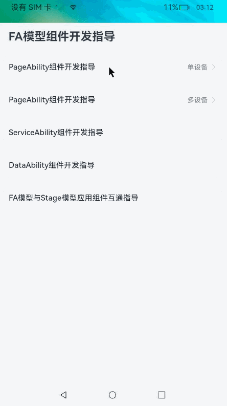
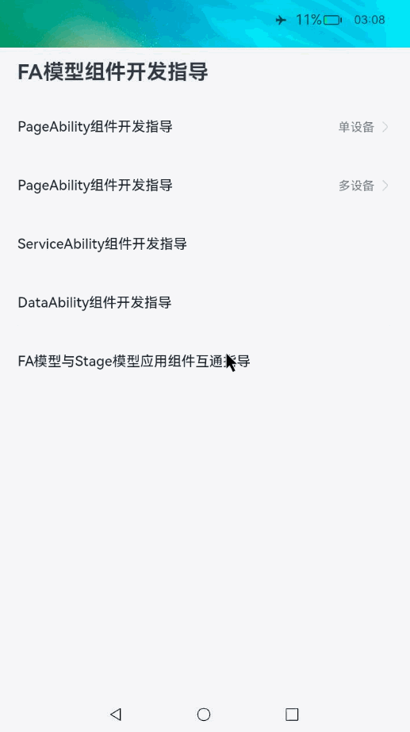

# FA模型开发指导

### 介绍

本示例展示了在一个FA模型中，PageAbility组件/ServiceAbility组件/DataAbility组件/服务卡片以及Context相关的示例。

本示例参考[应用模型](https://gitee.com/openharmony/docs/tree/master/zh-cn/application-dev/application-models)。

### 效果预览

|PageAbility组件开发指导|ServiceAbility&DataAbility组件开发指导|FA模型与Stage模型应用组件互通指导|FA模型服务卡片开发指导|
|--------------------------------|--------------------------------|--------------------------------|--------------------------------|
|||  |  |

#### 使用说明

##### 1.PgaeAbility组件开发指导

1）进入主页，点击[PageAbility组件开发指导-单设备]，进入’PageAbility组件开发指导-单设备‘界面；

2）点击[获取分布式目录]，弹出toast[/data/***]；

3）点击[启动单例PageAbility]，跳转至Title为’PageAbilitySingleton页面一‘的页面，再点击Home键回到桌面，再点击应用图标回到’PageAbility组件开发指导-单设备‘界面，点击[再启动单例PageAbility]，跳转至Title为’PageAbilitySingleton页面二‘的页面；

4）回到’PageAbility组件开发指导-单设备‘界面，点击[启动多例PageAbility页面一]，跳转至Title为’PageAbilityStandard页面一‘的页面，再点击Home键回到桌面，再点击应用图标回到’PageAbility组件开发指导-单设备‘界面，点击[启动多例PageAbility页面二]，跳转至Title为’PageAbilityStandard页面二‘的页面；

5）点击[使用Worker进行线程间通信]，弹出toast[{"data":"message from worker thread."}]；

6）点击[停止PageAbility]，退出当前应用返回桌面；

7）回到主页，点击[PageAbility组件开发指导-多设备]，进入’PageAbility组件开发指导-多设备’界面；

8）点击[获取分布式数据同步权限]，并在弹出的申请权限对话框中点击’允许‘；

9）点击[获取设备id]，弹出对端设备的deviceId；

10）点击[启动远程设备PageAbility]，弹出toast[启动远程Ability成功]，同时打开对端设备音乐应用。

##### 2.ServiceAbility组件开发指导

1）回到主页，点击[ServiceAbility组件开发指导]，进入’ServiceAbility组件开发指导’界面；

2）点击[启动ServiceAbility]，弹出toast[启动serviceAbility成功]；

3）点击[连接ServiceAbility]，弹出toast[连接serviceAbility成功]；

4）点击[连接错误的ServiceAbility]，  弹出toast[连接serviceAbility失败]。

##### 3.DataAbility组件开发指导

1）回到主页，点击[DataAbility组件开发指导]，进入’DataAbility组件开发指导‘界面；

2）在弹出的对话框中点击’允许‘；

3）点击[插入数据-callback方式]，再点击[插入数据-promise方式]，点击后均弹出toast[插入数据成功]；	

4）点击[删除数据-callback方式]，再点击[删除数据-promise方式]，点击后均弹出toast[删除数据成功]；

5）点击[更新数据-callback方式]，再点击[更新数据-promise方式]，点击后均弹出toast[更新数据成功]；

6）点击[查找数据-callback方式]，再点击[查找数据-promise方式]，点击后均弹出toast[查找数据成功]；

7）点击[批量插入数据-callback方式]，再点击[批量插入数据-promise方式，点击后均弹出toast[批量插入数据成功]；

8）点击[批量处理数据-callback方式]，再点击[批量处理数据-promise方式]，点击后均弹出toast[批量处理数据成功]。

##### 4.FA模型与Stage模型应用组件互通指导

1）回到主页，点击[FA模型与Stage模型应用组件互通指导]，进入’FA模型与Stage模型应用组件互通指导’界面；

2）点击[通过PageAbility与Stage模型互通-无需返回结果]，成功启动时钟应用；

3）回到’FA模型与Stage模型应用组件互通指导’界面，点击[通过PageAbility与Stage模型互通-返回执行结果]，成功启动时钟应用；

4）回到’FA模型与Stage模型应用组件互通指导’界面，点击[通过ServiceAbility与Stage模型互通]，成功启动时钟应用(仅生效一次)。

##### 5. FA模型服务卡片开发指导

1）回到桌面，长按应用图标，在弹出框中点击服务卡片，进入服务卡片添加界面；

2）点击添加至桌面，会跳转会桌面，并桌面上新增FAModel服务卡片；

3）点击卡片内‘titleOnCreate'，会跳转至应用界面；

4）回到桌面，点击卡片内‘detailOnCreate'，卡片内容会更新。

### 工程目录
```
entry/src/main/ets/       
├── DataAbility
│   └── data.ts								//测试DataAbility基本功能
├── FormAbility
│   └── form.ts								//测试FormAbility基本功能
├── MainAbility
│   ├── app.ets
│   └── pages
│       ├── index.ets						//应用主界面
│       ├── pageDataAbility.ets				//DataAbility组件开发指导界面
│       ├── pageInterflowFaAndStage.ets		//FA模型与Stage模型应用组件互通指导界面
│       ├── pagePageAbilityFirst.ets		//PageAbility组件开发指导-单设备界面
│       ├── pagePageAbilitySecond.ets		//PageAbility组件开发指导-多设备界面
│       └── pageServiceAbility.ets			//ServiceAbility组件开发指导界面
├── PageAbilitySingleton
│   ├── app.ets
│   └── pages
│       ├── first.ets						//单例PageAbility页面一
│       └── second.ets						//单例PageAbility页面二
├── PageAbilityStandard
│   ├── app.ets
│   └── pages
│       ├── default.ets						//多例PageAbility默认页面
│       ├── first.ets						//多例PageAbility页面一
│       └── second.ets						//多例PageAbility页面二
├── ServiceAbility
│   └── service.ts							//测试ServiceAbility基本功能
├── ServiceAbilityStartUIAbility
│   └── service.ts							//FA模型与Stage模型应用组件互通用ServiceAbility
├── utils
│   └── GlobalContext.ts					        //object存储工具类
└── workers
    └── worker.ts							//使用worker进行线程间通信
```
### 具体实现

* 本示例分为PageAbility组件开发指导,ServiceAbility组件开发指导,DataAbility组件开发指导和FA模型与Stage模型应用组件互通指导四个模块。
  * PageAbility组件开发指导：

    * 调用相关接口函数来实现FA模型中单例PageAbility/多例PageAbility的启动停止以及启动远程PageAbility等功能，以及还实现了使用worker进行线程间通信的功能。

    * 源码链接：[pagePageAbilityFirst.ets](entry\src\main\ets\MainAbility\pages\pagePageAbilityFirst.ets) [pagePageAbilitySecond.ets](entry\src\main\ets\MainAbility\pages\pagePageAbilitySecond.ets) [first.ets](entry\src\main\ets\PageAbilitySingleton\pages\first.ets)  [second.ets](entry\src\main\ets\PageAbilitySingleton\pages\second.ets)   [first.ets](entry\src\main\ets\PageAbilityStandard\pages\first.ets)  [second.ets](entry\src\main\ets\PageAbilityStandard\pages\second.ets)  [worker.ts](entry\src\main\ets\workers\worker.ts)  

    * 参考接口：[@ohos.ability.featureAbility](https://docs.openharmony.cn/pages/v4.0/zh-cn/application-dev/reference/apis/js-apis-ability-featureAbility.md/)  [@ohos.worker](https://gitee.com/openharmony/docs/blob/master/zh-cn/application-dev/reference/apis/js-apis-worker.md)
  * ServiceAbility组件开发指导：

    * 调用相关接口函数来实现FA模型中ServiceAbility的启动和连接等功能。
    * 源码链接：[pageServiceAbility.ets](entry\src\main\ets\MainAbility\pages\pageServiceAbility.ets)  [service.ts](entry\src\main\ets\ServiceAbility\service.ts) 

    * 参考接口：[@ohos.ability.featureAbility](https://docs.openharmony.cn/pages/v4.0/zh-cn/application-dev/reference/apis/js-apis-ability-featureAbility.md/)
  * DataAbility组件开发指导：
    * 调用相关接口函数来实现FA模型中DataAbility的增删改查等功能。
    * 源码链接：[pageDataAbility.ets](entry\src\main\ets\MainAbility\pages\pageDataAbility.ets)  [data.ts](entry\src\main\ets\DataAbility\data.ts) 
    * 参考接口：[@ohos.data.dataAbility](https://docs.openharmony.cn/pages/v4.0/zh-cn/application-dev/reference/apis/js-apis-data-ability.md/)
  * FA模型与Stage模型应用组件互通指导：
    * 调用相关接口函数来实现FA模型中调用相关接口函数来启动Stage模型中UIAbility的功能。
    * 源码链接：[pageInterflowFaAndStage.ets](entry\src\main\ets\MainAbility\pages\pageInterflowFaAndStage.ets)  [service.ts](entry\src\main\ets\ServiceAbilityStartUIAbility\service.ts) 
    * 参考接口：[@ohos.ability.featureAbility](https://docs.openharmony.cn/pages/v4.0/zh-cn/application-dev/reference/apis/js-apis-ability-featureAbility.md/)
  * FA模型服务卡片开发指导：
    * 调用相关接口函数来实现FA模型中服务卡片的创建，更新及事件等功能。
    * 源码链接：[form.ts](entry\src\main\ets\FormAbility\form.ts)  [index.css](entry\src\main\js\widget\pages\index\index.css)  [index.hml](entry\src\main\js\widget\pages\index\index.hml)  [index.json](entry\src\main\js\widget\pages\index\index.json) 
    * 参考接口：[@ohos.app.form.formBindingData](https://docs.openharmony.cn/pages/v4.0/zh-cn/application-dev/reference/apis/js-apis-app-form-formBindingData.md/) [@ohos.app.form.formInfo](https://docs.openharmony.cn/pages/v4.0/zh-cn/application-dev/reference/apis/js-apis-app-form-formInfo.md/) [@ohos.app.form.formProvider](https://docs.openharmony.cn/pages/v4.0/zh-cn/application-dev/reference/apis/js-apis-app-form-formProvider.md/)

### 相关权限

[ohos.permission.READ_CONTACTS](https://gitee.com/openharmony/docs/blob/master/zh-cn/application-dev/security/AccessToken/permissions-for-system-apps.md#ohospermissionread_contacts)

[ohos.permission.WRITE_CONTACTS](https://gitee.com/openharmony/docs/blob/master/zh-cn/application-dev/security/AccessToken/permissions-for-system-apps.md#ohospermissionwrite_contacts)

[ohos.permission.DISTRIBUTED_DATASYNC](https://gitee.com/openharmony/docs/blob/master/zh-cn/application-dev/security/AccessToken/permissions-for-all.md#ohospermissiondistributed_datasync)

[ohos.permission.ACCESS_SERVICE_DM](https://gitee.com/openharmony/docs/blob/master/zh-cn/application-dev/security/AccessToken/permissions-for-system-apps.md#ohospermissionaccess_service_dm)

### 依赖

本示例依赖系统默认自带的[时钟](https://gitee.com/openharmony/applications_app_samples/tree/master/code/Solutions/Tools/ArkTSClock)应用和[音乐](https://gitee.com/openharmony/applications_app_samples/tree/master/code/SuperFeature/DistributedAppDev/JsDistributedMusicPlayer)应用。

本示例依赖带有ServiceExtensionAbility的Stage模型应用:[StageModelAbilityInteraction](https://gitee.com/openharmony/applications_app_samples/tree/master/code/DocsSample/ApplicationModels/StageModelAbilityInteraction)。

在测试PgaeAbility组件开发指导相关功能前，需要准备两台RK3568设备，并将设备组网，步骤如下：
```
1.使两台设备处于同一网络下。
2.打开A，B两设备的音乐。
3.点击A设备音乐应用左下角箭头选择B设备。
4.在B设备选择信任设备，弹出PIN码。
5.在A设备输入PIN码。
6.已组网成功，验证方法：在A设备播放音乐，B设备同步播放则证明组网成功。
```
### 约束与限制

1.本示例仅支持标准系统上运行,支持设备:RK3568。

2.本示例为Stage模型，已适配API version 11版本SDK，版本号：4.1.3.1

3.本示例需要使用DevEco Studio 3.1.1 Release (Build Version: 3.1.0.501, built on June 20, 2023)及以上版本才可编译运行。

4.本示例涉及相关权限为system_basic级别(相关权限级别可通过[权限定义列表](https://gitee.com/openharmony/docs/blob/master/zh-cn/application-dev/security/permission-list.md)查看)，需要手动配置对应级别的权限签名(具体操作可查看[自动化签名方案](https://gitee.com/link?target=https%3A%2F%2Fdocs.openharmony.cn%2Fpages%2Fv3.2%2Fzh-cn%2Fapplication-dev%2Fsecurity%2Fhapsigntool-overview.md%2F))。

6.本示例类型为系统应用，需要手动配置对应级别的应用类型("app-feature": "hos_system_app")。具体可参考profile配置文件[bundle-info对象内部结构]( https://gitee.com/openharmony/docs/blob/eb73c9e9dcdd421131f33bb8ed6ddc030881d06f/zh-cn/application-dev/security/app-provision-structure.md#bundle-info%E5%AF%B9%E8%B1%A1%E5%86%85%E9%83%A8%E7%BB%93%E6%9E%84 )

### 下载

如需单独下载本工程，执行如下命令：

```
git init
git config core.sparsecheckout true
echo code/DocsSample/ApplicationModels/FAModelAbilityDevelop/ > .git/info/sparse-checkout
git remote add origin https://gitee.com/openharmony/applications_app_samples.git
git pull origin master
```
