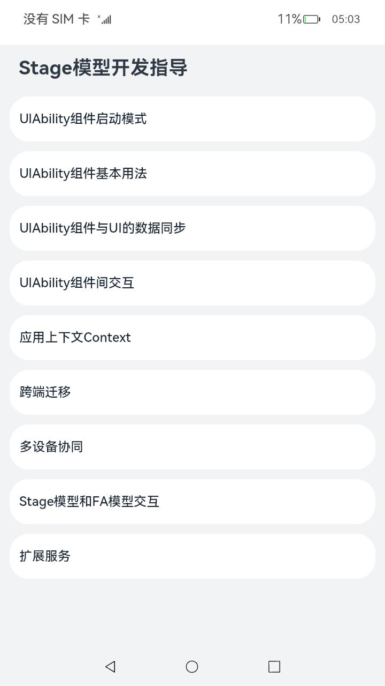
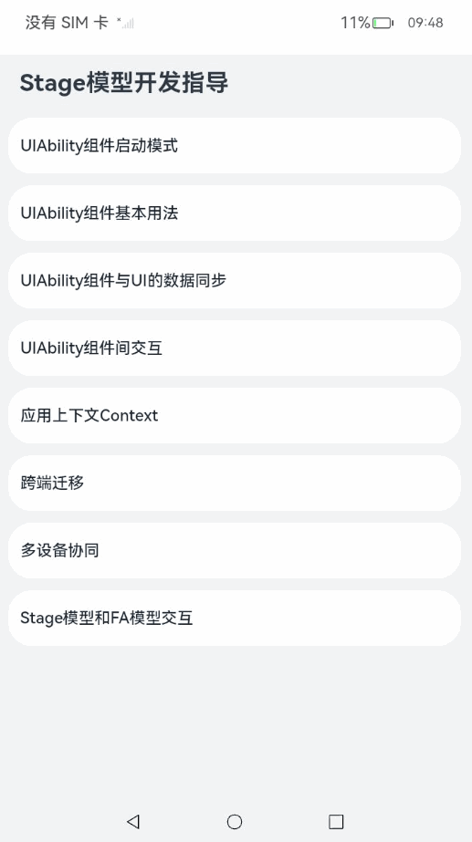

# Stage模型开发指导

### 介绍

本示例展示了在一个Stage模型中，UIAbility组件内交互，设备内UIAbility组件交互，设备内UIAbility组件与FA模型组件交互，设备间UIAbility组件跨端迁移，多端协同等内容的相关的示例。

本示例参考[应用模型](https://gitee.com/openharmony/docs/tree/master/zh-cn/application-dev/application-models)。 

### 效果预览

|主页|UIAbility组件|应用组件跨设备交互（流转）|Stage模型启动FA模型|
|--------------------------------|--------------------------------|--------------------------------|--------------------------------|
|||  |  |

使用说明

1. UIAbility组件

1）进入APP主页，点击list[UIAbility组件启动模式]，进入’UIAbility组件启动模式页面‘界面；

2）点击list[单实例模式]，进入单实例模式页面，根据坐标点击屏幕上的返回按钮，多次点击list[单实例模式]后点击屏幕上的返回按钮，点击进程button，只启动一个页面，返回’UIAbility组件启动模式页面‘界面；

3）点击list[多实例模式]，进入多实例模式页面，根据坐标点击屏幕上的返回按钮，多次点击list[多实例模式]后点击屏幕上的返回按钮，点击进程button，启动多个页面，返回’UIAbility组件启动模式页面‘界面；

4）点击list[指定实例模式A]，进入指定实例模式A页面，根据坐标点击屏幕上的返回按钮，多次点击list[指定实例模式A]后点击屏幕上的返回按钮，点击进程button，启动多个页面，返回’UIAbility组件启动模式页面‘界面；

5）点击list[指定实例模式B]，进入指定实例模式B页面，根据坐标点击屏幕上的返回按钮，多次点击list[指定实例模式B]后点击屏幕上的返回按钮，点击进程button，只启动一个页面，返回’UIAbility组件启动模式页面‘界面；

6）返回APP主页，点击list[UIAbility组件基本用法]，进入'UIAbility组件基本用法'界面；

7）返回APP主页，点击list[UIAbility组件与UI的数据同步]，进入'UIAbility组件与UI的数据同步‘界面，点击list[订阅事件]，弹出toast[[{"订阅事件"}]，再点击list[取消订阅]，弹出toast[[{"取消订阅"}]；

8）返回APP主页，点击list[UIAbility组件间交互]，进入’UIAbility组件间交互‘界面；

9）点击list[启动应用内的UIAbility]，进入’指定界面A‘界面，根据坐标点击屏幕上的返回按钮，返回’UIAbility组件间交互‘界面；

10）点击list[启动应用内的UIAbility并获取返回结果]，进入’指定界面A‘界面，点击list[关闭指定界面A]，返回’UIAbility组件间交互‘界面；

11）安装对应工程：StageModelAbilityInteraction  

12）点击list[启动其他应用的UIAbility]，进入’被启动的应用‘界面，点击button[关闭此界面且无返回数据]，返回’UIAbility组件间交互‘界面；

13）点击list[启动UIAbility的指定界面]，进入’被启动的应用‘界面，根据坐标点击屏幕上的返回按钮，返回’UIAbility组件间交互‘界面；

14）点击list[启动UIAbility的指定应用]，进入‘被启动的应用’界面，根据坐标点击屏幕上的返回按钮，返回’UIAbility组件间交互‘界面；

15）点击list[启动UIAbility的指定类型应用]，进入‘被启动的应用’界面，根据坐标点击屏幕上的返回按钮，返回’UIAbility组件间交互‘界面；

16）点击list[冷启动]，进入’冷启动‘界面，根据坐标点击屏幕上的返回按钮，返回’UIAbility组件间交互‘界面；

17）返回桌面，启动交互协同应用（对应工程：StageModelAbilityInteraction ），再返回’UIAbility组件间交互‘界面，点击list[热启动]，进入’热启动‘界面，根据坐标点击屏幕上的返回按钮，返回’UIAbility组件间交互‘界面；

18）点击list[Caller交互]，弹出toast[[{"Caller交互成功"}]；

19）返回APP主页，点击list[应用上下文Context]，进入’Context的典型使用场景‘界面；

20）点击list[获取应用文件路径方式一]，弹出toast[[{"/data/storage/el2/base/temptest.txt"}]，点击list[获取应用文件路径方式二]，弹出toast[[{"/data/storage/el2/base/haps/entry/temptest.txt"}]；

21）点击list[切换到EL1设备级加密]，弹出toast[[{"切换到EL1设备级加密"}]，点击list[切换到EL2设备级加密]，弹出toast[[{"切换到EL2设备级加密"}]；

22）安装交互协同应用（对应工程：StageModelAbilityInteraction ），点击list[创建其他应用或其他Module的Context]，进入’创建其他应用或其他Module的Context‘界面，点击list[创建Context方式一]，弹出toast[[{"成功获取Context"}]，点击list[创建Context方式二]，弹出toast[[{"成功获取Context"}]，点击list[创建Context方式三]，弹出toast[[{"成功获取Context"}]，根据坐标点击屏幕上的返回按钮，返回’Context的典型使用场景‘界面；

23）点击list[订阅进程内UIAbility生命周期变化]，进入’指定界面A‘界面，根据坐标点击屏幕上的返回按钮，返回’Context的典型使用场景‘界面；

24）根据坐标点击屏幕上的返回按钮，返回APP主界面；


2. 应用组件跨设备交互（流转）

1）进入APP主页，点击list[跨端迁移]，弹出’申请DISTRIBUTED_DATASYNC权限‘，点击button[同意]进入’跨端迁移‘界面；

2）点击list[将应用设置为可迁移状态]，弹出toast[[{"成功！"}]；

3）返回主界面，安装并打开全局任务中心，进行验证，具体请参考[验证指导](https://docs.openharmony.cn/pages/v4.0/zh-cn/application-dev/application-models/hop-cross-device-migration.md/#验证指导)

4）两台设备，A设备安装此应用，另一设备安装交互协同应用（对应工程：StageModelAbilityInteraction ），并保证两个HAP为同一局域网并能进行

5）本设备进入App主页，点击list[多设备协同]，进入’多设备协同‘页面，点击list[多设备协同初始化]，弹出toast[[{"成功！"}]；

6）点击list[多设备协同无返回数据]，另一设备打开’多设备协同页面‘，根据坐标点击屏幕上的返回按钮，返回’多设备协同‘页面；

7）点击list[多设备协同有返回数据]，另一设备打开’多设备协同页面‘，点击button[关闭多设备协同界面并返回数据]，返回’多设备协同‘页面；

8）点击list[启动ServiceExtensionAbility]，弹出toast[[{"启动成功"}]；

9）点击list[退出ServiceExtensionAbility]，弹出toast[[{"退出成功"}]；

10)  点击list[Caller交互]，弹出toast[[{"Caller交互成功"}]；

11）点击list[连接后台服务]，弹出toast[[{"sendRequest msg:100"}]；

12) 点击list[断连后台服务]，弹出toast[[{"成功断连后台服务"}]；

13) 根据坐标点击屏幕上的返回按钮，返回APP主页面。


3. Stage模型与FA模型交互

1）在本设备安装[FA模型](https://gitee.com/openharmony/applications_app_samples/tree/master/code/DocsSample/ApplicationModels/FAModelAbilityDevelop)所包含工程；

2）进入APP主页，点击list进入Stage模型和FA模型交互页面；

3）进入Stage模型和FA模型交互页面，点击list[打开FA模型文件无返回值]，进入’FA模型组件开发指导界面‘，根据坐标点击屏幕上的返回按钮，返回Stage模型和FA模型交互页面；

4）点击list[打开FA模型文件有返回值]，进入’FA模型组件开发指导界面‘，根据坐标点击屏幕上的返回按钮并返回数据，返回Stage模型和FA模型交互页面；

5）点击list[Stage模型绑定FA模型ServiceAbility]，弹出toast[[{"已连接ServiceAbility"}]；

6）点击list[Stage模型启动FA模型PageAbility]，FAModel应用被拉起；

7）点击返回按钮，返回APP主页；

4. 扩展服务

1）安装交互协同应用（对应工程：StageModelAbilityInteraction ）；

2）点击list[扩展服务]，进入扩展服务页面；

3）点击list[启动后台服务]，弹出toast[[{"成功启动后台服务"}]；

4）点击list[停止已启动的后台服务]，弹出toast[[{"成功停止已启动的后台服务"}]；

5）点击list[连接后台服务]，弹出toast[[{"成功连接后台服务"}]；

6）点击list[断连后台服务]，弹出toast[[{"成功断连后台服务"}]；

7）点击list[停止当前后台服务]，返回系统桌面。

### 工程目录
```
entry/src/main/ets/       
├── collaborateability
│   └── CollaborateAbility.ts											// 跨端迁移
├── componentstartupability												// 启动模式
│   ├── MultitonAbility.ts												// 多实例模式
│   ├── SingletonAbility.ts												// 单实例模式
│   ├── SpecifiedFirstAbility.ts										// 指定实例模式
│   └── SpecifiedSecondAbility.ts										// 指定实例模式
├── contextability
│   └── ContextAbility.ts												// 应用上下文Context
├── entryability
│   └── EntryAbility.ts													// 主Ability
├── eventability
│   └── EventAbility.ts													// 数据同步
├── funcability
│   ├── FuncAbilityA.ts												    // UIAbility内交互
│   └── FuncAbilityB.ts												    // 指定启动模式
├── IdlServiceExt
│   ├── i_idl_service_ext.ts											// 生成文件
│   ├── idl_service_ext_proxy.ts										// 生成文件
│   ├── idl_service_ext_stub.ts											// 生成文件
│   └── idl_service_ext_impl.ts											// 开发者自定义文件，对idl接口的具体实现
├── lifecycleability
│   └── LifecycleAbility.ts												// 生命周期
├── migrationability
│   └── MigrationAbility.ts												// 多设备协同
├── myabilitystage
│   └── MyAbilityStage.ts										       	// AbilityStage
├── serviceextability
│   └── ServiceExtAbility.ts										   	// ServiceExtAbility
└── pages
    ├── Index.ets														// 应用主界面
    ├── page_collaborateability	
    │   └── Page_CollaborateAbilityFirst.ets							// 多设备协同界面
    ├── page_contextability
    │   └── Page_ContextAbility.ets										// 应用Context界面
    ├── Page_Context.ets
    ├── page_funcability
    │   ├── Page_FuncAbilityA.ets										// UIAbility内交互界面
    │   └── Page_FuncAbilityB.ets										// 指定启动模式界面
    ├── page_lifecycleability
    │   └── Page_LifecycleAbility.ets									// 生命周期界面
    ├── page_migrationability
    │   ├── Page_MigrationAbilityFirst.ets								// 跨设备协同界面
    │   ├── Page_MigrationAbilitySecond.ets								// 跨设备协同界面
    │   └── Page_MigrationAbilityThird.ets								// 跨设备协同界面
    ├── page_startupability
    │   ├── Page_Multiton.ets											// 多实例模式界面
    │   ├── Page_Singleton.ets											// 单实例模式界面
    │   ├── Page_Specified_First.ets									// 指定实例模式界面
    │   └── Page_Specified_Second.ets									// 指定实例模式界面
    ├── Page_Context.ets												// 应用Context界面
    ├── Page_EventHub.ets												// 数据同步界面
    ├── Page_ServiceExtensionAbility.ets								// ServiceExtension界面
    ├── Page_StartFAModel.ets											// Stage模型与FA模型交互
    ├── Page_StartModel.ets												// 启动模式界面
    ├── Page_UIAbilityComponentsBasicUsage.ets							// UIAbility基本用法界面
    └── Page_UIAbilityComponentsInteractive.ets							// UIAbility组件交互界面

```
### 具体实现

* 本示例分为UIAbility组件、应用组件跨设备交互（流转）和Stage模型启动FA模型和扩展服务四个模块。
  * UIAbility组件内交互：

    * 调用相关方法来实现UIAbility组件内启动，UIAbility组件间启动，获取对应的界面及返回值等。
  * 源码链接： [SingletonAbility.ts](entry/src/main/ets/componentstartupability/SingletonAbility.ts)  [SpecifiedFirstAbility.ts](entry/src/main/ets/componentstartupability/SpecifiedFirstAbility.ts)  [SpecifiedSecondAbility.ts](entry/src/main/ets/componentstartupability/SpecifiedSecondAbility.ts)  [MultitonAbility.ts](entry/src/main/ets/componentstartupability/MultitonAbility.ts)  [ContextAbility.ts](entry/src/main/ets/contextability/ContextAbility.ts)  [EntryAbility.ts](entry/src/main/ets/entryability/EntryAbility.ts)  [EventAbility.ts](entry/src/main/ets/eventability/EventAbility.ts)  [FuncAbilityA.ts](entry/src/main/ets/funcability/FuncAbilityA.ts)  [FuncAbilityB.ts](entry/src/main/ets/funcability/FuncAbilityB.ts)  [LifecycleAbility.ts](entry/src/main/ets/lifecycleability/LifecycleAbility.ts)  [MyAbilityStage.ts](entry/src/main/ets/myabilitystage/MyAbilityStage.ts)  [Index.ets](entry/src/main/ets/pages/Index.ets)  [Page_Context.ets](entry/src/main/ets/pages/Page_Context.ets)  [Page_EventHub.ets](entry/src/main/ets/pages/Page_EventHub.ets)  [Page_StartModel.ets](entry/src/main/ets/pages/Page_StartModel.ets)  [Page_UIAbilitySecond.ets](entry/src/main/ets/pages/Page_UIAbilitySecond.ets)  [Page_UIAbilityThird.ets](entry/src/main/ets/pages/Page_UIAbilityThird.ets)  [Page_ContextAbility.ets](entry/src/main/ets/pages/page_contextability/Page_ContextAbility.ets)  [Page_FuncAbilityA.ets](entry/src/main/ets/pages/page_funcability/Page_FuncAbilityA.ets)  [Page_FuncAbilityB.ets](entry/src/main/ets/pages/page_funcability/Page_FuncAbilityB.ets)  [Page_LifecycleAbility.ets](entry/src/main/ets/pages/page_lifecycleability/Page_LifecycleAbility.ets)  [Page_Singleton.ets](entry/src/main/ets/pages/page_startupability/Page_Singleton.ets)  [Page_Specified_First.ets](entry/src/main/ets/pages/page_startupability/Page_Specified_First.ets)  [Page_Specified_Second.ets](entry/src/main/ets/pages/page_startupability/Page_Specified_Second.ets)  [Page_Multiton.ets](entry/src/main/ets/pages/page_startupability/Page_Multiton.ets) 
  
* 应用组件跨设备交互（流转）：
  
  两个设备之间进行跨端迁移以及多端协同
  
* 源码链接： [Page_MigrationAbilitySecond.ets](entry/src/main/ets/pages/page_migrationability/Page_MigrationAbilitySecond.ets)  [Page_MigrationAbilityThird.ets](entry/src/main/ets/pages/page_migrationability/Page_MigrationAbilityThird.ets)  [Page_MigrationAbilityFirst.ets](entry/src/main/ets/pages/page_migrationability/Page_MigrationAbilityFirst.ets)  [Page_CollaborateAbility.ets](entry/src/main/ets/pages/page_collaborateability/Page_CollaborateAbility.ets)  [MigrationAbility.ts](entry/src/main/ets/migrationability/MigrationAbility.ts)  [CollaborateAbility.ts](entry/src/main/ets/collaborateability/CollaborateAbility.ts)  [Index.ets](entry/src/main/ets/pages/Index.ets) 
  
* Stage模型与FA模型交互：

  * Stage模型启动FA模型

    源码链接： [Index.ets](entry/src/main/ets/pages/Index.ets)   [Page_StartFAModel.ets](entry/src/main/ets/pages/Page_StartFAModel.ets) 

  * Stage模型启动FA模型并获取返回值

    源码链接： [Index.ets](entry/src/main/ets/pages/Index.ets)   [Page_StartFAModel.ets](entry/src/main/ets/pages/Page_StartFAModel.ets) 
    
    Stage模型绑定FA模型ServiceAbility
    
    源码链接： [Index.ets](entry/src/main/ets/pages/Index.ets)   [Page_StartFAModel.ets](entry/src/main/ets/pages/Page_StartFAModel.ets) 

### 相关权限

[ohos.permission.GET_BUNDLE_INFO_PRIVILEGED](https://gitee.com/openharmony/docs/blob/master/zh-cn/application-dev/security/AccessToken/permissions-for-system-apps.md#ohospermissionget_bundle_info_privileged)

[ohos.permission.DISTRIBUTED_DATASYNC](https://gitee.com/openharmony/docs/blob/master/zh-cn/application-dev/security/AccessToken/permissions-for-all.md#ohospermissiondistributed_datasync)

[ohos.permission.START_INVISIBLE_ABILITY](https://gitee.com/openharmony/docs/blob/master/zh-cn/application-dev/security/AccessToken/permissions-for-system-apps.md#ohospermissionstart_invisible_ability)

[ohos.permission.START_ABILITIES_FROM_BACKGROUND](https://gitee.com/openharmony/docs/blob/master/zh-cn/application-dev/security/AccessToken/permissions-for-system-apps.md#ohospermissionstart_abilities_from_background)

[ohos.permission.ABILITY_BACKGROUND_COMMUNICATION](https://gitee.com/openharmony/docs/blob/master/zh-cn/application-dev/security/AccessToken/permissions-for-system-apps.md#ohospermissionability_background_communication)

### 依赖
执行该工程前，需要安装StageModelAbilityInteraction工程以及FAModelAbilityDevelop工程hap包

Stage模型绑定FA模型ServiceAbility功能和扩展服务功能需要修改设备的[预置配置文件](https://gitee.com/openharmony/vendor_hihope/blob/master/rk3568/preinstall-config/install_list_capability.json)，该配置文件在设备上的路为`/system/etc/app/install_list_capability.json`。

设备开机启动时会读取该配置文件，在应用安装会对在文件中配置的associatedWakeUp和allowAppUsePrivilegeExtension公共事件类型进行授权。

预授权配置文件字段内容包括`bundleName`，`app_signature`和`allowCommonEvent`。

- `bundleName`字段配置为本应用涉及的bundleName。

- `app_signature`字段配置为应用的指纹信息，指纹信息的配置请参见[应用特权配置指南](https://gitee.com/openharmony/docs/blob/master/zh-cn/device-dev/subsystems/subsys-app-privilege-config-guide.md#install_list_capabilityjson中配置)。

- `allowCommonEvent`字段配置为允许静态广播拉起的公共事件项。

  ```
  [
    ...
    {
      "bundleName": "com.samples.stagemodelabilitydevelop",
      "app_signature": ["****"], // 指纹信息
      "allowAppUsePrivilegeExtension": true
    },
    {
      "bundleName": "com.samples.stagemodelabilityinteraction",
      "app_signature": ["****"], // 指纹信息
      "allowAppUsePrivilegeExtension": true
    },
    {
      "bundleName": "com.samples.famodelabilitydevelop",
      "app_signature": ["****"], // 指纹信息
      "associatedWakeUp": true
    }
  ]
  ```


### 约束与限制

1.本示例仅支持标准系统上运行,支持设备:RK3568。

2.本示例为Stage模型，已适配API version 11版本SDK，版本号：4.1.3.1

3.本示例需要使用DevEco Studio 3.1.1 Release (Build Version: 3.1.0.501, built on June 20, 2023)及以上版本才可编译运行。

4.本示例涉及实现ServiceExtensionAbility功能，需要手动替换Full SDK才能编译通过，具体操作可参考[替换指南](https://gitee.com/link?target=https%3A%2F%2Fdocs.openharmony.cn%2Fpages%2Fv3.2%2Fzh-cn%2Fapplication-dev%2Fquick-start%2Ffull-sdk-switch-guide.md%2F)。

5.本示例涉及申请AllowAppUsePrivilegeExtension特权和AssociatedWakeUp特权，只有具有AllowAppUsePrivilegeExtension特权的应用才允许开发ServiceExtensionAbility，只有具有AssociatedWakeUp特权的FA模型应用才可被关联唤醒，具体申请方式可参考[应用特权配置指南](https://gitee.com/openharmony/docs/blob/master/zh-cn/device-dev/subsystems/subsys-app-privilege-config-guide.md)。

6.本示例涉及相关权限为system_core级别(相关权限级别可通过[权限定义列表](https://gitee.com/openharmony/docs/blob/master/zh-cn/application-dev/security/permission-list.md)查看)，需要手动配置对应级别的权限签名(具体操作可查看[自动化签名方案](https://gitee.com/link?target=https%3A%2F%2Fdocs.openharmony.cn%2Fpages%2Fv3.2%2Fzh-cn%2Fapplication-dev%2Fsecurity%2Fhapsigntool-overview.md%2F))。

7.本示例类型为系统应用，需要手动配置对应级别的应用类型("app-feature": "hos_system_app")。具体可参考profile配置文件[bundle-info对象内部结构]( https://gitee.com/openharmony/docs/blob/eb73c9e9dcdd421131f33bb8ed6ddc030881d06f/zh-cn/application-dev/security/app-provision-structure.md#bundle-info%E5%AF%B9%E8%B1%A1%E5%86%85%E9%83%A8%E7%BB%93%E6%9E%84 )

### 下载

如需单独下载本工程，执行如下命令：

```
git init
git config core.sparsecheckout true
echo code/BasicFeature/ApplicationModels/StageModelAbilityDevelop/ > .git/info/sparse-checkout
git remote add origin https://gitee.com/openharmony/applications_app_samples.git
git pull origin master
```
