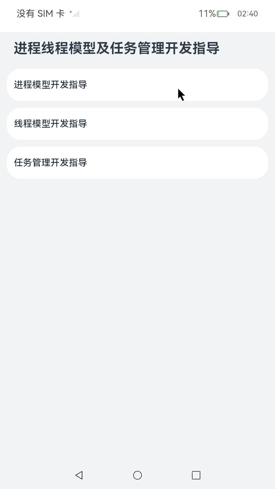
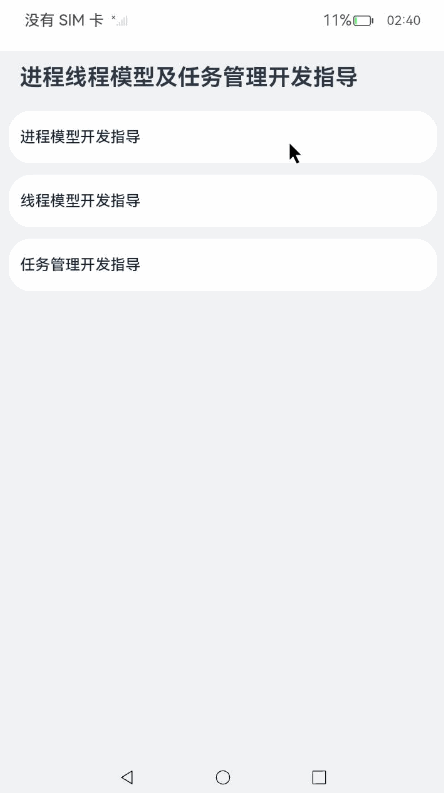
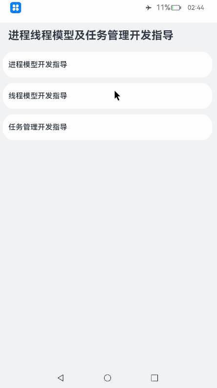
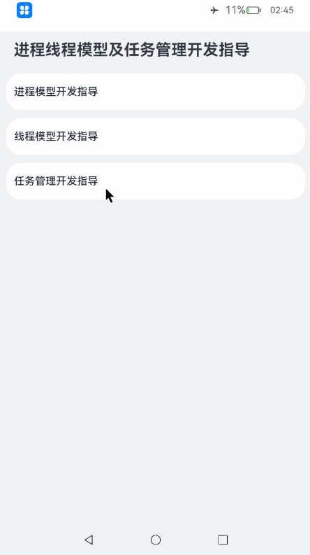

# 进程线程模型及任务管理开发指导

### 介绍

本示例展示了在一个Stage模型中，进程模型和线程模型以及任务管理相关的示例。

本示例参考[应用模型](https://gitee.com/openharmony/docs/tree/master/zh-cn/application-dev/application-models)。 

### 效果预览

|主页|进程模型开发指导|线程模型开发指导|任务管理开发指导|
|--------------------------------|--------------------------------|--------------------------------|--------------------------------|
|||  |  |

使用说明

1.进程模型开发指导

1）进入主页，点击[进程模型开发指导]，进入’进程模型开发指导‘界面；

2）点击[订阅灭屏公共事件]，弹出toast[成功订阅灭屏公共事件]；

3）点击[发布灭屏公共事件-不携带信息]，弹出toast[{"event":***}],其中data为空；

4）点击[发布灭屏公共事件-携带信息]，弹出toast[[{"event":***}],其中data‘为initial data’；

5）点击[取消订阅灭屏公共事件]，弹出toast[成功取消订阅灭屏公共事件]；

6）点击[发布灭屏粘性公共事件]，弹出toast[成功发布灭屏粘性公共事件]，

再点击[订阅灭屏公共事件]，弹出toast[[{"event":***}],其中data为‘initial Sticky data’；

7）点击[移除灭屏粘性公共事件]，弹出toast[成功移除灭屏粘性公共事件]，再点击[取消订阅灭屏公共事件]，再点击[订阅灭屏公共事件]，此时弹出[成功订阅灭屏公共事件]；

8）切换设备飞行模式，状态栏会出现通知[usual.event.AIRPLANE_MODE]。

2.线程模型开发指导

1）回到主页，点击[线程模型开发指导]，进入’线程模型开发指导’界面；

2）点击[使用Emitter进行线程间通信-订阅事件]，弹出toast[成功使用Emitter订阅事件]；

3）点击[使用Emitter进行线程间通信-发送事件]，弹出toast[{"data":{"content":"c","id":1,"isEmpty":false}}]；

4）点击[使用worker进行线程间通信]，弹出toast[{"data":"message from worker thread."}]。

3.任务管理开发指导

1）回到主页，点击[任务管理开发指导]，进入’任务管理开发指导‘界面；

2）点击[注册任务变化通知]，弹出toast[成功注册任务变化通知]；

3）点击屏幕下侧中间’主页‘按钮返回到桌面，打开’时钟‘应用，再点击应用图标回到’任务管理开发指导‘界面，再点击[获取系统最近20个任务]，弹出toast[成功获取系统最近任务]；	

4）点击[获取单个任务的详细信息]，弹出toast["ohos.samples.etsclock"]；

5）点击[获取单个任务的任务快照]，弹出toast[获取任务快照成功]；

6）点击[获取单个任务的低分辨任务快照]，弹出toast[获取低分辨任务快照成功]；

7）点击[单个任务加锁]，弹出toast[加锁成功]，再点击屏幕下侧最右边’任务管理‘按钮查看当前任务状态，后台’时钟‘任务显示被加锁，然后回到’任务管理开发指导‘界面；

8）点击[单个任务解锁]，弹出toast[解锁成功]，再点击屏幕下侧最右边’任务管理‘按钮查看当前任务状态，后台’时钟‘任务显示未被加锁，然后回到’任务管理开发指导‘界面；

9）点击[把单个任务切到前台]，’时钟‘任务会被切换到前台，再点击屏幕下侧最右边’任务管理‘按钮回到’任务管理开发指导‘界面；

10）点击[删除单个任务]，弹出toast[删除单个任务成功]，再点击屏幕下侧最右边’任务管理‘按钮查看当前任务状态，后台’时钟‘任务被删除，然后回到’任务管理开发指导‘界面；

11）点击[解注册任务变化通知]，弹出toast[解注册任务变化通知成功]，再点击[删除全部任务]，点击后会退出当前应用且后台无任何应用。

### 工程目录
```
entry/src/main/ets/           
├── entryability
│   └── EntryAbility.ts						//UIAbility
├── pages
│   ├── Index.ets							//应用主界面
│   ├── PageProcessModel.ets				//进程模型开发指导界面
│   ├── PageTaskManager.ets					//任务管理开发指导界面
│   └── PageThreadModel.ets					//线程模型开发指导界面
├── staticsubscriber
│   └── StaticSubscriber.ts					//静态订阅公共事件
└── workers
    └── Worker.ts							//使用worker进行线程间通信

```
### 具体实现

* 本示例分为了解进程模型、了解线程模型和任务管理三个模块。
  * 了解进程模型：

    * 调用相关接口函数来实现动态订阅公共事件、静态订阅公共事件、取消订阅公共事件和发布公共事件的功能。

    * 源码链接：[pageProcessModel.ets](entry\src\main\ets\pages\pageProcessModel.ets)  [StaticSubscriber.ts](entry\src\main\ets\staticsubscriber\StaticSubscriber.ts)  [staticsubscriber.json](entry\src\main\resources\base\profile\staticsubscriber.json) 

    * 参考接口：[@ohos.commonEventManager](https://gitee.com/openharmony/docs/blob/master/zh-cn/application-dev/reference/apis/js-apis-commonEventManager.md)

  * 了解线程模型：

    * 调用相关接口函数来实现使用Emitter和Worker进行线程间通信的功能。
    * 源码链接： [pageThreadModel.ets](entry\src\main\ets\pages\pageThreadModel.ets)   [Worker.ts](entry\src\main\ets\workers\Worker.ts) 

    * 参考接口：[@ohos.events.emitter](https://gitee.com/openharmony/docs/blob/master/zh-cn/application-dev/reference/apis/js-apis-emitter.md)   [@ohos.worker](https://gitee.com/openharmony/docs/blob/master/zh-cn/application-dev/reference/apis/js-apis-worker.md)

  * 任务管理：

    * 调用相关接口函数来实现注册/解注册任务变化通知、获取系统最近任务等管理系统任务的功能。
    * 源码链接： [pageTaskManager.ets](entry\src\main\ets\pages\pageTaskManager.ets) 

    * 参考接口：[@ohos.application.missionManager](https://gitee.com/openharmony/docs/blob/master/zh-cn/application-dev/reference/apis/js-apis-application-missionManager.md)

### 相关权限

[ohos.permission.COMMONEVENT_STICKY](https://gitee.com/openharmony/docs/blob/master/zh-cn/application-dev/security/AccessToken/permissions-for-all.md#ohospermissioncommonevent_sticky)

[ohos.permission.MANAGE_MISSIONS](https://gitee.com/openharmony/docs/blob/master/zh-cn/application-dev/security/AccessToken/permissions-for-system-apps.md#ohospermissionmanage_missions)

[ohos.permission.NOTIFICATION_CONTROLLER](https://gitee.com/openharmony/docs/blob/master/zh-cn/application-dev/security/AccessToken/permissions-for-system-apps.md#ohospermissionnotification_controller)

### 依赖

本示例依赖系统默认自带的[时钟](https://gitee.com/openharmony/applications_app_samples/tree/master/code/Solutions/Tools/ArkTSClock)应用。

静态订阅公共事件需要修改设备的[预置配置文件](https://gitee.com/openharmony/vendor_hihope/blob/master/rk3568/preinstall-config/install_list_capability.json)，该配置文件在设备上的路为`/system/etc/app/install_list_capability.json`。

设备开机启动时会读取该配置文件，在应用安装会对在文件中配置的`allowCommonEvent`公共事件类型进行授权。

预授权配置文件字段内容包括`bundleName`，`app_signature`和`allowCommonEvent`。

- `bundleName`字段配置为本应用的bundleName："com.samples.stageprocessthread"。

- `app_signature`字段配置为应用的指纹信息，指纹信息的配置请参见[应用特权配置指南](https://gitee.com/openharmony/docs/blob/master/zh-cn/device-dev/subsystems/subsys-app-privilege-config-guide.md#install_list_capabilityjson中配置)。

- `allowCommonEvent`字段配置为允许静态广播拉起的公共事件项。

  ```
  [
    ...
    {
      "bundleName": "com.samples.stageprocessthread",
      "app_signature": ["****"], // 指纹信息
      "allowCommonEvent": ["usual.event.AIRPLANE_MODE"]
    }
  ]
  ```

### 约束与限制

1.本示例仅支持标准系统上运行,支持设备:RK3568。

2.本示例为Stage模型，已适配API version 11版本SDK，版本号：4.1.3.1

3.本示例需要使用DevEco Studio 3.1.1 Release (Build Version: 3.1.0.501, built on June 20, 2023)及以上版本才可编译运行。

4.本示例涉及使用系统接口：@ohos.application.missionManager，需要手动替换Full SDK才能编译通过，具体操作可参考[替换指南](https://gitee.com/link?target=https%3A%2F%2Fdocs.openharmony.cn%2Fpages%2Fv3.2%2Fzh-cn%2Fapplication-dev%2Fquick-start%2Ffull-sdk-switch-guide.md%2F)。

5.本示例涉及相关权限为system_core级别(相关权限级别可通过[权限定义列表](https://gitee.com/openharmony/docs/blob/master/zh-cn/application-dev/security/permission-list.md)查看)，需要手动配置对应级别的权限签名(具体操作可查看[自动化签名方案](https://gitee.com/link?target=https%3A%2F%2Fdocs.openharmony.cn%2Fpages%2Fv3.2%2Fzh-cn%2Fapplication-dev%2Fsecurity%2Fhapsigntool-overview.md%2F))。

6.本示例类型为系统应用，需要手动配置对应级别的应用类型("app-feature": "hos_system_app")。具体可参考profile配置文件[bundle-info对象内部结构]( https://gitee.com/openharmony/docs/blob/eb73c9e9dcdd421131f33bb8ed6ddc030881d06f/zh-cn/application-dev/security/app-provision-structure.md#bundle-info%E5%AF%B9%E8%B1%A1%E5%86%85%E9%83%A8%E7%BB%93%E6%9E%84 )

### 下载

如需单独下载本工程，执行如下命令：

```
git init
git config core.sparsecheckout true
echo code/DocsSample/ApplicationModels/StageProcessThread/ > .git/info/sparse-checkout
git remote add origin https://gitee.com/openharmony/applications_app_samples.git
git pull origin master
```
