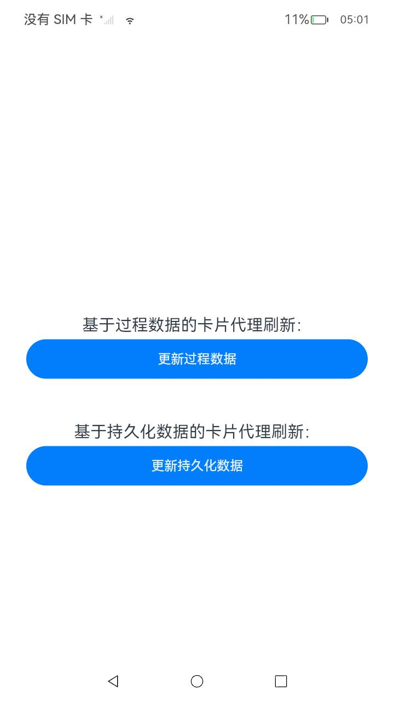

# 服务卡片开发指导（共享数据应用）

### 介绍

本示例对应 [卡片代理刷新](https://gitee.com/openharmony/docs/blob/master/zh-cn/application-dev/application-models/arkts-ui-widget-update-by-proxy.md)中数据提供方的共享数据更新功能。

本示例参考[应用模型](https://gitee.com/openharmony/docs/tree/master/zh-cn/application-dev/application-models)。 

### 效果预览

|开发卡片页面|
|--------------------------------|
|  |

#### 使用说明

1）回到主页，安装<共享数据>应用并点击打开，页面显示有“更新过程数据”按钮；

2）点击<更新过程数据>，弹出toast标识过程数据是否发布成功。

3）回到主页，安装<共享数据>应用并点击打开，页面显示有“更新持久化数据”按钮；

4）点击<更新持久化数据>，弹出toast标识持久化数据是否发布成功。

5）回到主页，安装<共享数据>应用并点击打开，页面显示有“刷新卡片内容”按钮；

6）点击<刷新卡片内容>，观察页面上的卡片显示，卡片内容刷新，标题从‘Title default’更新为'Title Update.'文字从‘requestForm’更新为'Description update success.'

### 工程目录
```
entry/src/main/ets/
├── DataShareExtAbility
│   └── DataShareExtAbility.ts				//DataShare共享数据模块
├── entryability
│   └── EntryAbility.ts						//共享数据应用默认页面
└── pages
    └── Index.ets							//更新过程数据，持久化数据及刷新卡片内容页面示例
```
### 具体实现

* 本示例作为数据提供方（仅支持系统应用），开启数据共享能力。同时自定义key + subscriberId作为共享数据的标识，用于为卡片代理更新示例提供数据库功能支持。

### 相关权限

[ohos.permission.KEEP_BACKGROUND_RUNNING](https://gitee.com/openharmony/docs/blob/master/zh-cn/application-dev/security/AccessToken/permissions-for-all.md#ohospermissionkeep_background_running)

[ohos.permission.GET_BUNDLE_INFO](https://gitee.com/openharmony/docs/blob/master/zh-cn/application-dev/security/AccessToken/permissions-for-all.md#ohospermissionget_bundle_info)

[ohos.permission.START_ABILITIES_FROM_BACKGROUND](https://gitee.com/openharmony/docs/blob/master/zh-cn/application-dev/security/AccessToken/permissions-for-system-apps.md#ohospermissionstart_abilities_from_background)

[ohos.permission.REQUIRE_FORM](https://gitee.com/openharmony/docs/blob/master/zh-cn/application-dev/security/AccessToken/permissions-for-system-apps.md#ohospermissionrequire_form)

[ohos.permission.GET_BUNDLE_INFO_PRIVILEGED](https://gitee.com/openharmony/docs/blob/master/zh-cn/application-dev/security/AccessToken/permissions-for-system-apps.md#ohospermissionget_bundle_info_privileged)

### 依赖

1.`app_signature`字段配置为应用的指纹信息，指纹信息的配置请参见[应用特权配置指南](https://gitee.com/openharmony/docs/blob/master/zh-cn/device-dev/subsystems/subsys-app-privilege-config-guide.md#install_list_capabilityjson中配置)。

```
[
  ...
  {
    "signingConfigs": ["****"], // 指纹信息
  }
]
```


### 约束与限制

1.本示例仅支持标准系统上运行,支持设备:RK3568。

2.本示例为Stage模型，已适配API version 11版本SDK，版本号：4.1.3.1

3.本示例需要使用DevEco Studio 3.1.1 Release (Build Version: 3.1.0.501, built on June 20, 2023)及以上版本才可编译运行。

4.本示例涉及相关权限为system_core级别(相关权限级别可通过[权限定义列表](https://gitee.com/openharmony/docs/blob/master/zh-cn/application-dev/security/permission-list.md)查看)，需要手动配置对应级别的权限签名(具体操作可查看[自动化签名方案](https://gitee.com/link?target=https%3A%2F%2Fdocs.openharmony.cn%2Fpages%2Fv3.2%2Fzh-cn%2Fapplication-dev%2Fsecurity%2Fhapsigntool-overview.md%2F))。

5.本示例类型为系统应用，需要手动配置对应级别的应用类型("app-feature": "hos_system_app")。具体可参考profile配置文件[bundle-info对象内部结构]( https://gitee.com/openharmony/docs/blob/eb73c9e9dcdd421131f33bb8ed6ddc030881d06f/zh-cn/application-dev/security/app-provision-structure.md#bundle-info%E5%AF%B9%E8%B1%A1%E5%86%85%E9%83%A8%E7%BB%93%E6%9E%84 )

### 下载

如需单独下载本工程，执行如下命令：

```
git init
git config core.sparsecheckout true
echo code/BasicFeature/ApplicationModels/WidgetUpdateByProxy/ > .git/info/sparse-checkout
git remote add origin https://gitee.com/openharmony/applications_app_samples.git
git pull origin master
```
