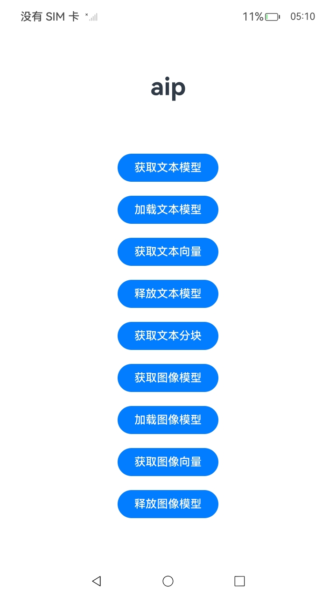

#  Aip服务

### 介绍

1.系统提供ArkData智慧数据平台（ArkData Intelligence Platform，AIP），提供端侧数据智慧化构建，使应用数据向量化，通过嵌入模型将非结构化的文本、图像等多模态数据，转换成具有语义的向量。

### 效果预览

| 首页                                                     |
| -------------------------------------------------------- |
|  | 

使用说明：

1. 在主页面中通过点击相应的按钮。

### 工程目录

```
\entry\src
        │
        │
        └─main
            │  module.json5					// 配置文件，用于配置权限等信息
            ├─ets
            │  ├─entryability
            │  └─pages
            │      └─Index.ets			    // 主页面，开发指南实际代码
            └─resources
                ├─base						// 资源文件,内容为英文
                │  ├─element
                │  ├─media
                │  └─profile
                └─dark
                   └─element                // 资源文件,内容为中文

```

### 具体实现

* 调用端调用getTextEmbeddingModel接口获取文本模型：
    
    * 调用loadModel接口加载文本模型。

    * 调用getEmbedding接口获取文本的向量化结果。

    * 调用releaseModel接口释放文本模型。

* 调用端调用splitText接口获取文本分块的结果：
    
* 调用端调用getImageEmbeddingModel接口获取图像模型：
    
    * 调用loadModel接口加载图像模型。

    * 调用getEmbedding接口获取图像的向量化结果。

    * 调用releaseModel接口释放图像模型。

### 相关权限

不涉及。

### 依赖

不涉及。

### 约束与限制

1.本示例仅支持标准系统上运行。

2.本示例为Stage模型，支持API23版本SDK。

3.本示例需要使用DevEco Studio 6.1.0 Release及以上版本才可编译运行。

4.考虑到数据向量化处理的计算量和资源占用较大，当前仅支持在2in1设备上使用。

5.嵌入模型的推理过程可使用NPU加速。与NPU计算相比，纯CPU的计算在时延和功耗上都有较大差距，建议采用NPU加速。

6.模型推理单次可处理的文本长度上限为512个字符，支持中英文。

7.模型推理单次可处理的图像大小小于20MB。

### 下载

如需单独下载本工程，执行如下命令：

```
git init
git config core.sparsecheckout true
echo code/DocsSample/ArkData_sta/Aip > .git/info/sparse-checkout
git remote add origin https://gitcode.com/openharmony/applications_app_samples.git
git pull origin master
```
