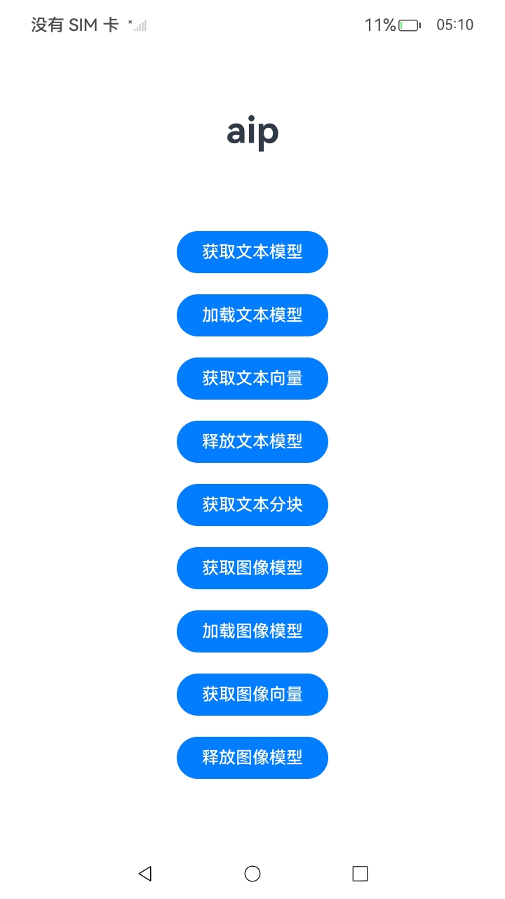
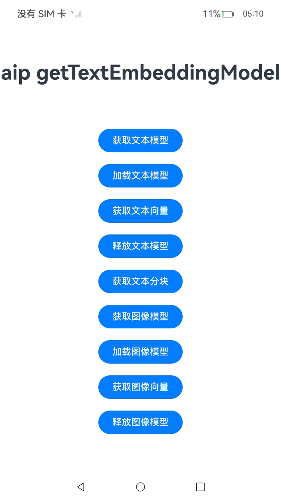
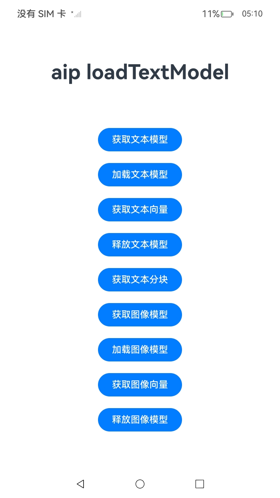
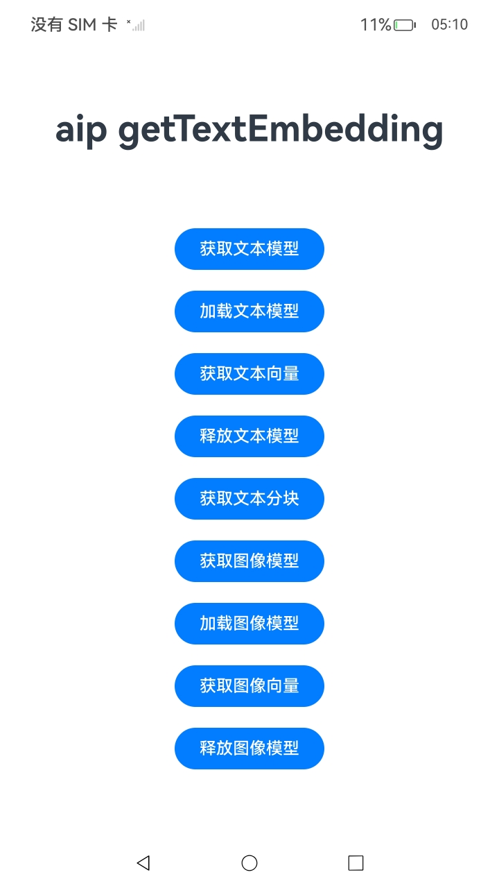
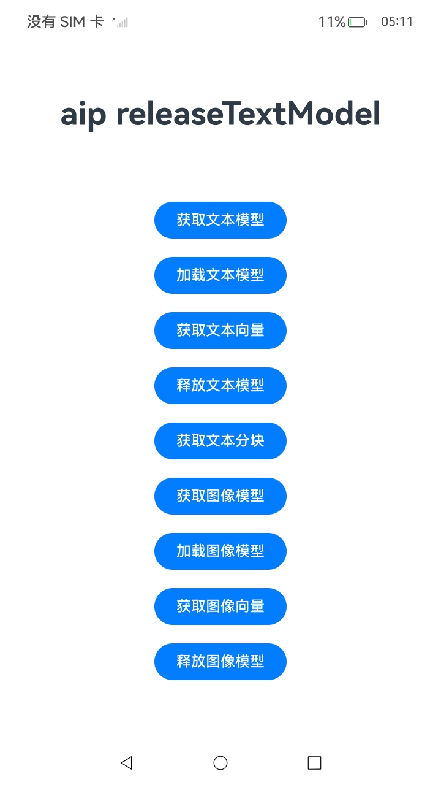
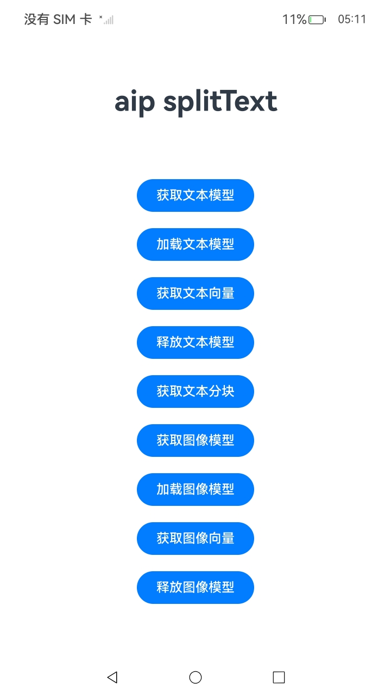
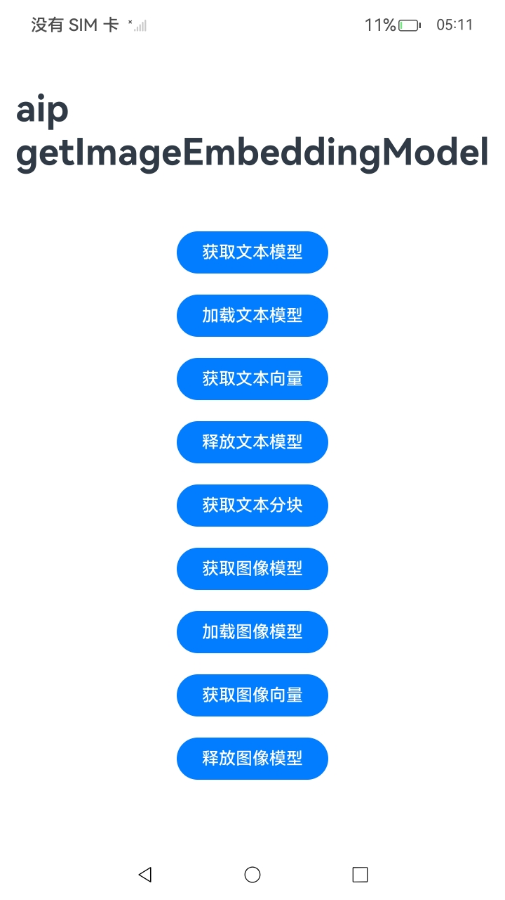
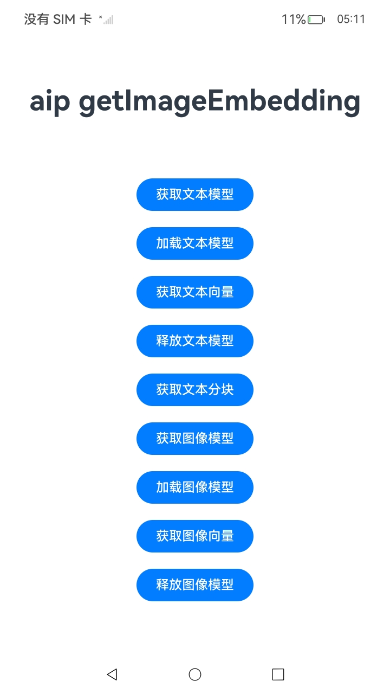
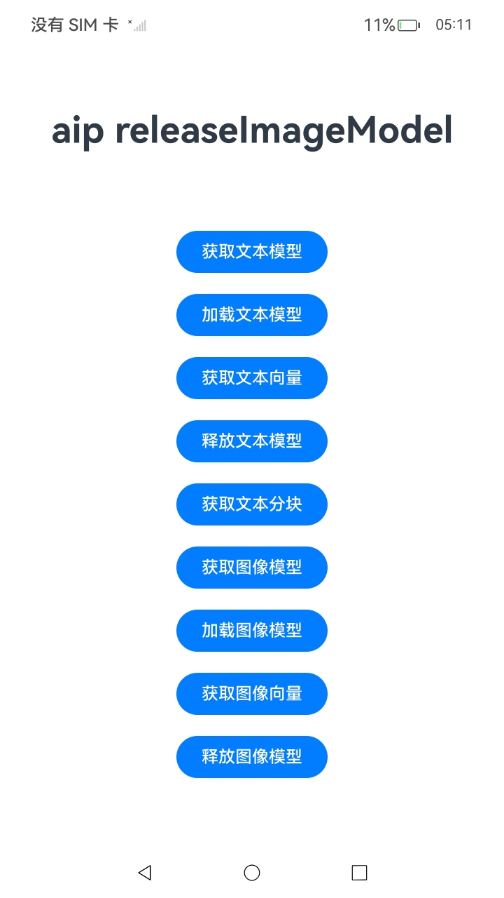

#  Aip服务

### 介绍

1.系统提供ArkData智慧数据平台（ArkData Intelligence Platform，AIP），提供端侧数据智慧化构建，使应用数据向量化，通过嵌入模型将非结构化的文本、图像等多模态数据，转换成具有语义的向量。

详细的接口介绍请参考[智慧数据平台](https://gitcode.com/openharmony/docs/blob/master/zh-cn/application-dev/reference/apis-arkdata/js-apis-data-intelligence.md)。

从API version 15开始，支持应用数据向量化。

2.实现对以下指南文件中 [应用数据向量化 (ArkTS)](https://gitcode.com/openharmony/docs/blob/master/zh-cn/application-dev/database/aip-data-intelligence-embedding.md)示例代码片段的工程化。保证指南中示例代码与sample工程文件同源。

### 效果预览

|         页面说明          |                                  截图                                  |
|:---------------------:|:--------------------------------------------------------------------:|
|      **index页面**      |  |
|      **获取文本模型**      |  |
|      **加载文本模型**      |  |
|      **获取文本向量**      |  |
|      **释放文本模型**      |  |
|      **获取文本分块**      |  |
|      **获取图像模型**      |  |
|      **加载图像模型**      |  |
|      **获取图像向量**      |  |
|      **释放图像模型**      |  |


### 使用说明

1. 在主界面，点击获取文本模型按钮来获取对应文本模型，点击加载文本模型按钮去加载文本模型，点击获取文本向量按钮获取输入文本的向量化结果，点击释放文本模型按钮来释放文本模型，点击获取文本分块按钮获取输入文本的分块结果；
   点击获取图像模型按钮来获取对应图像模型，点击加载图像模型按钮去加载图像模型，点击获取图像向量按钮输入图像的向量化结果，点击释放图像模型按钮来释放图像模型。

### 工程目录

```
entry/src/
 ├── main
 │   ├── ets
 │   │   ├── entryability
 │   │   ├── entrybackupability
 │   │   └── pages
 │   │       └── Index.ets                   // Aip调用
 │   ├── module.json5
 │   └── resources
 └── ohosTest
     └── ets
         └── test
             └── Ability.test.ets        // 自动化测试代码
```

### 相关权限

不涉及。

### 依赖

不涉及。

### 约束与限制

1.考虑到数据向量化处理的计算量和资源占用较大，当前仅支持在2in1设备上使用。

2.嵌入模型的推理过程可使用NPU加速。与NPU计算相比，纯CPU的计算在时延和功耗上都有较大差距，建议采用NPU加速。

3.模型推理单次可处理的文本长度上限为512个字符，支持中英文。

4.模型推理单次可处理的图像大小小于20MB。

5.本示例为Stage模型，支持API14版本full-SDK，版本号：5.0.2.57，镜像版本号：OpenHarmony_5.0.2.58。

6.本示例需要使用DevEco Studio 5.0.1 Release (Build Version: 5.0.5.306, built on December 6, 2024)及以上版本才可编译运行。


### 下载

如需单独下载本工程，执行如下命令：

````
git init
git config core.sparsecheckout true
echo code/DocsSample/ArkData/Aip > .git/info/sparse-checkout
git remote add origin https://gitcode.com/openharmony/applications_app_samples.git
git pull origin master
````