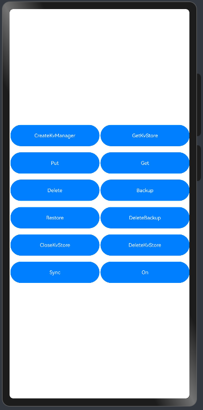

# 键值型数据库Sample

### 介绍

本示例主要展示了[通过键值型数据库实现数据持久化指南](https://gitcode.com/openharmony/docs/blob/master/zh-cn/application-dev/database/data-persistence-by-kv-store.md)和[键值型数据库跨设备数据同步指南](https://gitcode.com/openharmony/docs/blob/master/zh-cn/application-dev/database/data-sync-of-kv-store.md)中ArkTS场景的开发示例，通过[createKVManager](https://gitcode.com/openharmony/docs/blob/master/zh-cn/application-dev/reference/apis-arkdata/js-apis-distributedKVStore.md#distributedkvstorecreatekvmanager)和[getKVStore](https://gitcode.com/openharmony/docs/blob/master/zh-cn/application-dev/reference/apis-arkdata/js-apis-distributedKVStore.md#getkvstore)创建键值型数据库，调用Put，Get，Delete等接口实现对数据库的增删改查等功能。

### 效果预览

| 主UI界面 |
|------|
|  |

使用说明

1. 启动应用，同步权限申请点击同意。
2. 按照顺序点击CreateKvManager，GetKvStore按钮创建键值型数据库。
3. 成功创建数据库后可根据需要点击Put，Get，Delete，Backup，Restore，DeleteBackup，Sync，On等按钮，执行相应的功能。
4. 使用完毕后可以点击CloseKvStore关闭数据库，点击DeleteKvStore删除数据库。


### 工程目录

给出项目中关键的目录结构并描述它们的作用，示例如下：

```
entry/src/main/ets
|---entryability
|   |---EntryAbility.ets                   // UIAbility定义，同步权限和context获取
|---pages
|   |---Index.ets                          // UI界面布局
|   |---KvStoreInterface.ets               // 接口调用实现
```

### 具体实现

* 主UI界面，功能包括创建数据库，数据库增，删，查，同步，订阅，关闭和删除数据库，源码参考：[Index.ets](entry/src/main/ets/pages/Index.ets)。
    * 使用CreateKvManager，GetKvStore来创建数据库。
    * 通过Put，Get，Delete，Backup，Restore，DeleteBackup，On，Sync进行数据库的增、删、查询数据、备份数据、恢复数据、删除备份、订阅和数据端端同步。
    * 通过CloseKvStore关闭数据库，DeleteKvStore删除数据库。

* 接口实现端，实现主UI界面按键功能，源码参考：[KvStoreInterface.ets](entry/src/main/ets/pages/KvStoreInterface.ets)。
* entryability端，实现申请同步权限，源码参考：[EntryAbility.ets](entry/src/main/ets/entryability/EntryAbility.ets)。

### 相关权限

1.ohos.permission.DISTRIBUTED_DATASYNC。
2.ohos.permission.GET_BUNDLE_INFO。

### 约束与限制

1. 本示例支持标准系统上运行，支持设备：RK3568，Phone。

2. 本示例支持API20版本SDK，版本号：6.0.0 Release。

3. 本示例需要使用DevEco Studio 5.1.1 Release（5.1.1.840）及以上版本才可编译运行。

### 下载

如需单独下载本工程，执行如下命令：

```
git init
git config core.sparsecheckout true
echo code/DocsSample/DriverDevelopmentKit > .git/info/sparse-checkout
git remote add origin https://gitcode.com/openharmony/applications_app_samples.git
git pull origin master
```