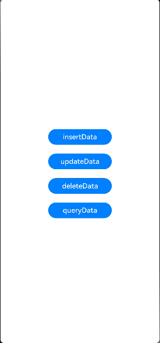

# 标准化数据指南文档示例

### 介绍

本示例以PlainText、HTML、PixelMap三种数据进行多对多数据共享的过程为例说明开发步骤，数据提供方可以通过UMDF提供的insertData接口将数据写入公共数据通路，获取到的返回值（生成的数据的唯一标识符），可用于对其插入的数据进行更新和删除操作。数据访问方则可以通过UDMF提供的查询接口获取当前公共数据通路的全量数据。

### 效果预览

| 桌面                                |
|-----------------------------------|
|  |

### 使用说明

1. 在主界面，点击insertData接口按钮插入数据，在控制台打印成功日志。

2. 在主界面，点击updateData接口按钮插入数据，在控制台打印失败日志（传入无效key值）。

3. 在主界面，点击deleteData接口按钮插入数据，在控制台打印成功日志。

4. 在主界面，点击queryData接口按钮插入数据，在控制台打印成功日志。

### 工程目录
```
entry/src/
|   |--- main/
|       |---ets/
|           |---entryability/EntryAbility.ets   // 应用启动加载的入口ability
|           |---entrybackupability/EntryBackupAbility.ets  // extensionAbility。
|           |---pages/index.ets                 // entry主应用入口页面及接口调用实现
```

### 具体实现

* 主UI界面，功能包括数据记录的增、删、更新、查询，源码参考：[Index.ets](entry/src/main/ets/pages/Index.ets)。
    * 数据提供方通过UDMF提供的insertData()接口添加数据记录。
    * 使用updateData()更新上一步插入的统一数据对象。
    * 使用deleteData()删除存储在UDMF公共数据通路中的统一数据对象。
    * 使用queryData()查询存储在UDMF公共数据通路中的全量统一数据对象。

### 相关权限

不涉及。

### 依赖

不涉及。

### 约束与限制

1.本示例仅支持标准系统上运行, 支持设备：RK3568。

2.本示例为Stage模型，支持API20版本SDK，版本号：6.0.0.53，镜像版本号：OpenHarmony_6.0.0.53。

3.本示例需要使用DevEco Studio 6.0.0 Release (Build Version: 6.0.0.858, built on September 5, 2025)及以上版本才可编译运行。

### 下载

如需单独下载本工程，执行如下命令：

````
git init
git config core.sparsecheckout true
echo code/DocsSample/ArkData/Udmf/UnifiedDataChannels > .git/info/sparse-checkout
git remote add origin https://gitcode.com/openharmony/applications_app_samples.git
git pull origin master
````