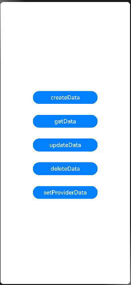

# 标准化数据通路实现数据共享 (C/C++)指南文档示例

### 介绍

标准化数据通路通过UDMF提供的系统服务实现。应用（数据提供方）需要共享公共数据时，可以通过UDMF提供的插入接口将数据写入UDMF的数据通路中，并且可以通过UDMF提供的更新和删除接口对已存入的数据进行更新和删除操作。目标应用（数据访问方）可以通过UDMF提供的读取接口访问数据。本示例以更新超链接OH_UdsHyperlink类型数据场景为例，说明如何使用UDS与UDMF。

### 效果预览

| 桌面                                |
|-----------------------------------|
|  |

### 使用说明

1. 在主界面，点击createData接口按钮插入数据，在控制台打印key值。

2. 在主界面，点击getData接口按钮插入数据，在控制台打印数据个数及内容。

3. 在主界面，点击updateData接口按钮插入数据，在控制台打印失败日志（示例传入无效key值）。

4. 在主界面，点击deleteData接口按钮插入数据，在控制台打印成功日志并删除数据。

5. 在主界面，点击setProviderData接口按钮插入数据，在控制台打印key值。

### 工程目录
```
entry/src/
|   |--- main/
|       |---ets/
|           |---entryability/EntryAbility.ets   // 应用启动加载的入口ability
|           |---entrybackupability/EntryBackupAbility.ets  // extensionAbility。
|           |---pages/index.ets                 // entry主应用入口页面
|           |---pages/UdmfInterface.ets                 // 标准化数据通路相关接口封装
|       |---cpp/
|           |---CMakeLists.txt                            // CMake配置文件
|           |---napi_init.cpp                             // Napi模块注册及接口调用实现
```

### 具体实现

* 主UI界面，功能包括数据记录的增、删、更新、获取及设置延迟数据，源码参考：[Index.ets](entry/src/main/cpp/napi_init.cpp)。
    * 数据提供方通过UDMF提供的createData()接口添加数据记录。
    * 使用getData()查询存储在UDMF公共数据通路中的统一数据对象。
    * 数据提供方通过UDMF提供的updateData()接口更新数据记录。
    * 数据提供方通过UDMF提供的deleteData()接口删除数据记录。
    * 数据提供方通过UDMF提供的setProviderData()接口设置延迟数据记录。

### 相关权限

不涉及。

### 依赖

不涉及。

### 约束与限制

1.本示例仅支持标准系统上运行, 支持设备：RK3568。

2.本示例为Stage模型，支持API22版本SDK，版本号：6.0.0.55，镜像版本号：OpenHarmony_6.0.0.55。

3.本示例需要使用DevEco Studio 6.0.0 Release (Build Version: 6.0.0.858, built on September 5, 2025)及以上版本才可编译运行。

### 下载

如需单独下载本工程，执行如下命令：

````
git init
git config core.sparsecheckout true
echo code/DocsSample/ArkData/Udmf/UnifiedDataChannels_C > .git/info/sparse-checkout
git remote add origin https://gitcode.com/openharmony/applications_app_samples.git
git pull origin master
````