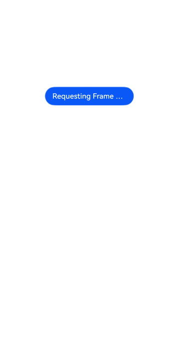
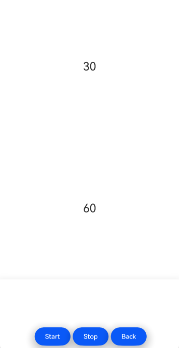

# DisplaySyncSta

### 介绍

本示例通过 DisplaySyncSta 系列功能，对请求动画绘制帧率、请求 UI 绘制帧率和请求自绘制内容绘制帧率设置开发者所期望的帧率。

本示例主要展示了 DisplaySyncSta 系列能力，利用 [@ohos.graphics.displaySync](https://docs.openharmony.cn/pages/v5.0/zh-cn/application-dev/reference/apis-arkgraphics2d/js-apis-graphics-displaySync.md) 方法来为独立的帧率绘制、更新操作UI界面。

### 效果预览

|                           初始页                            |                      请求 UI 绘制帧率                      |
|:--------------------------------------------------------:|:----------------------------------------------------:|
|  |  |

使用说明

1.在初始页面点击“**Requesting Frame Rates for UI Components**”，进入请求 UI 绘制帧率页面，点击“**Start**”，数字“**30**”按照30Hz帧率放大缩小，数字“**60**”按照60Hz帧率放大缩小；点击“**Stop**”绘制停止；点击“**Back**”返回初始页面。

### 工程目录	

```
├──entry/src/main
│  ├──cpp                                       // C++代码区
│  │  ├──CMakeLists.txt                         // CMake配置文件
│  │  ├──napi_init.cpp                          // Napi模块注册
│  │  ├──common
│  │  │  └──log_common.h                        // 日志封装定义文件
│  │  ├──plugin                                 // 生命周期管理模块
│  │  │  ├──plugin_manager.cpp
│  │  │  └──plugin_manager.h
│  │  ├──samples                                // samples渲染模块
│  │  │  ├──sample_xcomponent.cpp
│  │  │  └──sample_xcomponent.h
│  ├──ets                                       // ets代码区
│  │  ├──entryability
│  │  │  ├──EntryAbility.ts                     // 程序入口类
|  |  |  └──EntryAbility.ets
|  |  ├──interface
│  │  │  └──XComponentContext.ts                // XComponentContext
│  │  ├──DispalySync                            // 业务页面目录
│  │  |  ├──CustomDrawDisplaySync.ets           // 自绘制页面
│  │  ├──pages                                  // 页面文件
│  │  |  ├──Index.ets                           // 初始页面
│  │  ├──utils                                  // 工具类
|  ├──resources         			// 资源文件目录
```

### 具体实现

* 请求 UI 绘制帧率：通过调用 [@ohos.graphics.displaySync ](https://docs.openharmony.cn/pages/v4.1/zh-cn/application-dev/reference/apis-arkgraphics2d/js-apis-graphics-displaySync.md)接口，来注册回调和设置刷新区间并控制回调周期。

    * 涉及到的相关接口：

      通过 `import displaySync from '@ohos.graphics.displaySync` 表达式引入，

      | 接口名                                                                | 描述                         |
      |--------------------------------------------------------------------|----------------------------|
      | Create(): DisplaySync                                              | 创建一个DisplaySync实例          |
      | setExpectedFrameRateRange(rateRange: ExpectedFrameRateRange): void | 设置期望帧率                     |
      | on(type: 'frame', callback: Callback<IntervalInfo>): void          | 设置自定义绘制内容回调函数(ArkTs-Dyn接口) |
      | onFrame(callback: Callback<IntervalInfo>): void                    | 设置自定义绘制内容回调函数(ArkTs-Sta接口) |
      | off(type: 'frame', callback?: Callback<IntervalInfo>): void        | 清除自定义绘制内容回调函数(ArkTs-Dyn接口) |
      | offFrame(type: 'frame', callback?: Callback<IntervalInfo>): void   | 清除自定义绘制内容回调函数(ArkTs-Sta接口) |
      | start(): void                                                      | DisplaySync使能              |
      | stop(): void                                                       | DisplaySync失能              |

### 相关权限

不涉及。

### 依赖

不涉及。

### 约束与限制

1.本示例仅支持在标准系统上运行；

2.本示例为 Stage 模型，已适配 API version 14 版本 SDK，SDK 版本号（API Version 14 5.0.2.57）；

3.本示例需要使用 DevEco Studio 版本号（5.0.5.306）及以上版本才可编译运行。

### 下载

如需单独下载本工程，执行如下命令：

```
git init
git config core.sparsecheckout true
echo code/DocsSample/ArkGraphics2D/DisplaySync/ > .git/info/sparse-checkout
git remote add origin https://gitcode.com/openharmony/applications_app_samples.git
git pull origin master
```