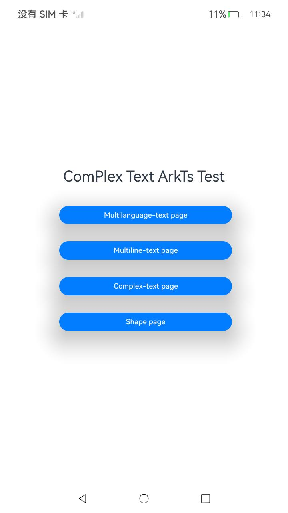
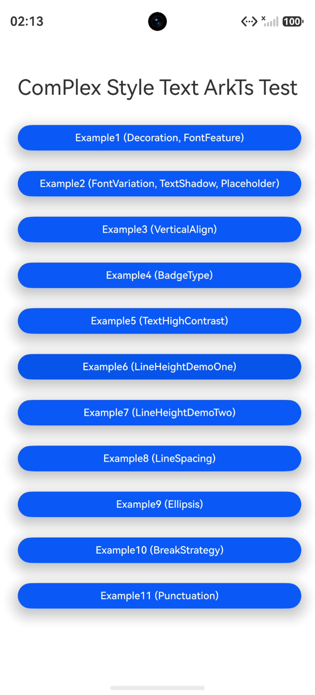
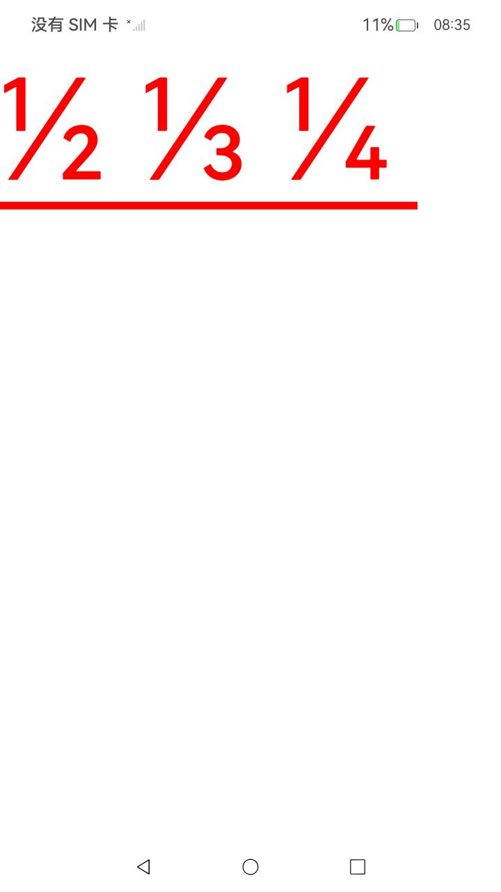
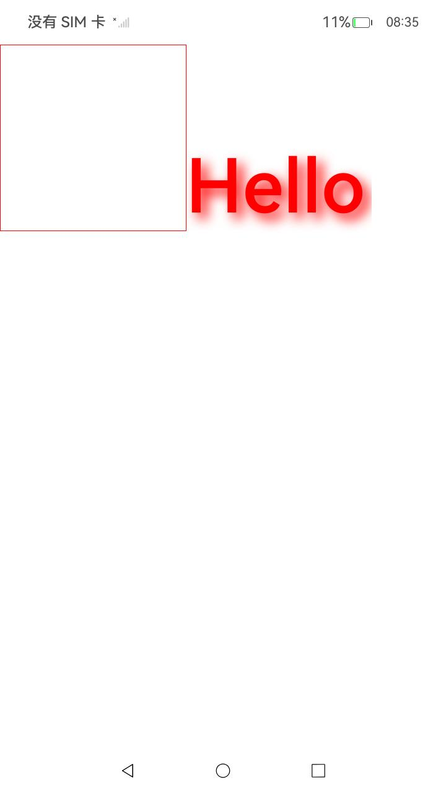
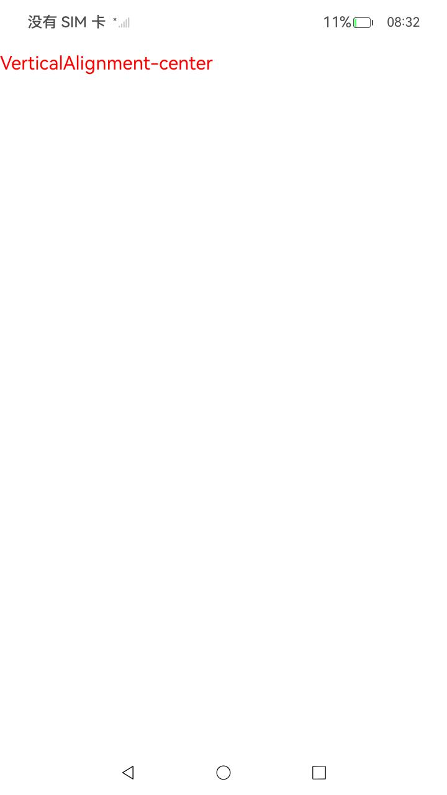
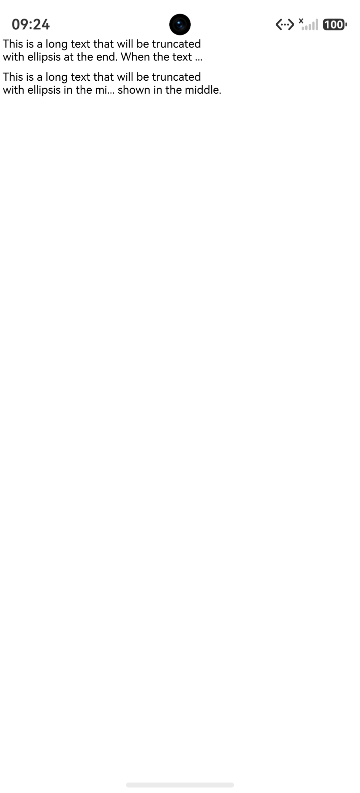
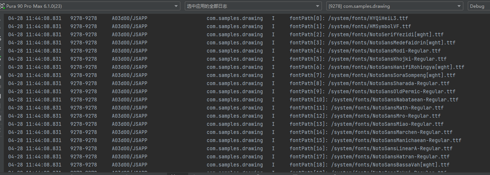

# 文本绘制与显示中多样式文本绘制与显示接口使用说明（ArkTS）

## 介绍

本工程主要实现了对以下指南文档中 [复杂文本绘制与显示](https://docs.openharmony.cn/pages/v6.0/zh-cn/application-dev/graphics/complex-text-arkts.md) 示例代码片段的工程化，主要目标是实现指南中示例代码需要与sample工程文件同源，以及除基本文字、排版属性之外，针对应用中不同文本的设计，开发者可能需要设置使用不同的绘制样式或能力，以凸显对应文本的独特表现或风格，此时可以结合使用多种绘制样式进行文本的渲染。

## 效果预览

|  |  |    |  |  |  |  |  |  |  |  |  |  |  |  |  |  |
|--------|--------|--------|--------|--------|--------|--------|--------|--------|--------|--------|--------|--------|--------|--------|--------|

**使用方法：**

1. 该工程可以选择在模拟器和开发板上运行。
2. 点击构建，即可在生成的应用中点击对应的按钮进行图案的绘制。
3. 进入“DocsSample/ArkGraphics2D/TextEngine/ComplexTextDrawing/entry/src/ohosTest/ets/test/Ability.test.ets”文件，可以对本项目进行UI的自动化测试。

## 工程目录

```
ArkTSDrawing
├──entry/src/main
│  ├──ets  // ets代码区
│  │  ├──entryability
|  |  |  └──EntryAbility.ets        // 程序入口类
|  |  ├──entrybackupability
│  │  │  └──EntryBackupAbility.ets   
│  │  └──pages                      // 页面文件
│  │     ├─ complexStyle
│  │     │  ├─ ComplexStyleExample1.ets
│  │     │  ├─ ComplexStyleExample2.ets
│  │     │  ├─ ComplexStyleExample3.ets
│  │     │  ├─ ComplexStyleExample4.ets
│  │     │  ├─ ComplexStyleExample5.ets
│  │     │  ├─ ComplexStyleExample6.ets
│  │     │  ├─ ComplexStyleExample7.ets
│  │     │  ├─ ComplexStyleExample8.ets
│  │     │  ├─ ComplexStyleExample9.ets
│  │     │  ├─ ComplexStyleExample10.ets
│  │     │  ├─ ComplexStyleExample11.ets
│  │     │  ├─ ComplexStyleExample12.ets
│  │     │  └─ ComplexStyleText.ets
│  │     ├─ Index.ets               // 主界面
│  │     ├─ multilanguage
│  │     │  └─ MultilanguageText.ets
│  │     ├─ multiline
│  │     │  └─ MultilineText.ets
│  │     └─ shape
│  │        └─ IndependentShaping.ets
|  ├──resources                     // 资源文件目录
└─ ohosTest
   └──ets
      └─ test
         └─ Ability.test.ets        // 自动化测试入口

```

## 具体实现

1. 利用Native XComponent来获取NativeWindow实例、获取布局/事件信息、注册事件回调并通过Drawing API实现在页面上绘制形状。
2. 通过在IDE中创建Native ArkTS工程，该工程复杂文本绘制主要包含以下几个场景：多语言文本绘制与显示、多行文本绘制与显示、省略号样式设置、文字换行方式设置、行首标点挤压、查询各类型字体资源路径、多样式文本绘制与显示，针对每个场景实现了具体demo的编写。
3. 在XComponent的OnSurfaceCreated回调中获取NativeWindow实例并初始化NativeWindow环境。支持的能力包括：
- **省略号样式设置：** 在文本内容超出显示区域时，可以使用省略号截断文本，支持头部、中部、尾部以及多行省略模式。
- **文字换行方式设置：** 文本排版时支持不同的断行策略（贪婪、高质量、均衡），可根据场景选择合适的换行方式。
- **行首标点挤压：** 在排版中，通过开启行首标点挤压功能，将行首标点符号进行挤压处理，避免标点占用行首空间，提升排版紧凑度。
- **查询各类型字体资源路径：** 按字体类型查询系统字体资源路径。
## 相关权限

不涉及。

## 依赖

不涉及。

## 约束与限制

1. 本示例支持标准系统上运行，支持设备：RK3568。
2. 本示例支持API24版本SDK，版本号：6.0.2.55。
3. 本示例已支持DevEco Studio 6.0.0 Release (构建版本：6.0.0.858，构建 2025年9月25日)编译运行。

## 下载

如需单独下载本工程，执行如下命令：

```
git init
git config core.sparsecheckout true
echo code/DocsSample/ArkGraphics2D/TextEngine/ComplexTextDrawing/ > .git/info/sparse-checkout
git remote add origin https://gitcode.com/openharmony/applications_app_samples.git
git pull origin master
```
