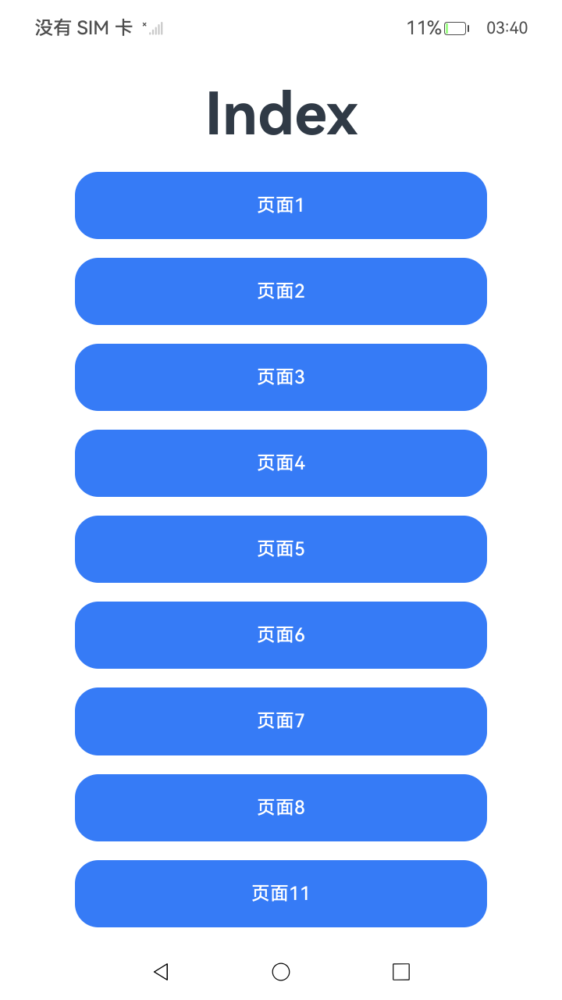

# 模块加载副作用及优化

## 介绍

当使用ArkTS模块化时，模块的加载和执行可能会引发副作用。副作用是指在模块导入时除了导出功能或对象之外，额外的行为或状态变化，这些行为可能影响程序的其他部分，并导致产生非预期的顶层代码执行、全局状态变化、原型链修改、导入内容未定义等问题。

## 效果预览

| 初始页面                            | 初始页面                            | 初始页面                               |
|---------------------------------|---------------------------------------|------------------------------------|
|  |  |  |

## 使用说明

1. 点击“页面1”按钮进入页面1，再点击“测试页面1”按钮，将引用从ModulePartOne.ets文件引入的data对象，并显示“测试页面1完成”。

2. 点击“页面2”按钮进入页面2，再点击“测试页面2”按钮，将引用从ModulePartTwo.ets文件引入的data对象，并显示“测试页面2完成”。

3. 点击“页面3”按钮进入页面3，再点击“测试页面3”按钮，将引用从ModulePartThree.ets文件引入的data对象，并显示“测试页面3完成”。

4. 点击“页面4”按钮进入页面4，再点击“测试页面4”按钮，将引用从ModulePartFour.ets、SideEffectModuleFour.ets文件引入的data对象，并显示“测试页面4完成”。

5. 点击“页面5”按钮进入页面5，再点击“测试页面5”按钮，将引用从ModulePartFive.ets、SideEffectModuleFive.ets文件引入的data对象，并显示“测试页面5完成”。

6. 点击“页面6”按钮进入结果页面，将引用从ModulePartSix.ets文件引入的data对象，并显示结果“test200”。

7. 点击“页面7”按钮进入结果页面，将引用从ModulePartSeven.ets文件引入的data对象，并显示结果“test200”。

8. 点击“页面8”按钮进入页面8，再点击“测试页面8”按钮，将引用从ModifyPrototype.ts文件引入的data对象，并显示“测试页面8完成”。

9. 点击“页面11”按钮进入页面11，再点击“测试页面11”按钮，将引用从har模块引入的One对象，并显示“测试页面11完成”。

10. 点击“页面12”按钮进入页面12，再点击“测试页面12”按钮，将引用har模块引入的serviceManager对象，并显示“测试页面12完成”。

11. 点击“页面13”按钮进入页面13，再点击“测试页面13”按钮，将引用从har模块引入的serviceManager对象，并显示“测试页面13完成”。

12. 点击“页面14”按钮进入页面14，再点击“测试页面14”按钮，将引用从har模块引入的serviceManager对象，并显示“测试页面14完成”。

## 工程目录

```
entry/src/main/ets/
└── pages
    └── ExportA.ets // 导出对象a。
    └── ExportB.ets // 导出对象b。
    └── Index.ets // 主页面。
    └── ModifyPrototype.ts // 导出data。
    └── ModulePartFive.ets // 导出data。
    └── ModulePartFour.ets // 导出data。
    └── ModulePartNine.ets // 导出data。
    └── ModulePartOne.ets // 导出data。
    └── ModulePartSeven.ets // 导出data。
    └── ModulePartSix.ets // 导出data。
    └── ModulePartTen.ets // 导出data。
    └── ModulePartThree.ets // 导出data。
    └── ModulePartTwo.ets // 导出data。
    └── ModuleUseGlobalVarFive.ets // 导出data。
    └── ModuleUseGlobalVarFour.ets // 导出data。
    └── ModuleUseGlobalVarNine.ets // 导出data。
    └── ModuleUseGlobalVarTen.ets // 导出data。
    └── PageEight.ets // 导入data。
    └── PageEleven.ets // 导入data。
    └── PageFive.ets // 导入data。
    └── PageFour.ets // 导入data。
    └── PageFourteen.ets // 导入data。
    └── PageOne.ets // 导入data。
    └── PageSeven.ets // 导入data。
    └── PageSix.ets // 导入data。
    └── PageThirteen.ets // 导入data。
    └── PageThree.ets // 导入data。
    └── PageTwelve.ets // 导入data。
    └── PageTwo.ets // 导入data。
    └── SideEffectModuleFive.ets // 导出data。
    └── SideEffectModuleFour.ets // 导出data。
har/src/main/ets/
└── ServiceManagerPartOne.ets // 导出对象ServiceManager。
└── ServiceManagerPartThree.ets // 导出对象ServiceManager。
└── ServiceManagerPartTwo.ets // 导出对象ServiceManager。
└── components
    └── NumberString.ets // 导出对象One。
entry/src/ohosTest/
└── ets
    └── test
        └── Ability.test.ets // UI自动化用例。
```

## 具体实现

* 函数调用
    * 调用从ModulePart*.ets中引用的data对象，源码参考：[PageOne.ets](./entry/src/main/ets/pages/PageOne.ets)

## 依赖

无。

## 相关权限

无。

## 约束与限制

1.  本示例支持标准系统上运行，支持设备：RK3568。

2.  本示例支持API23版本的SDK，版本号：6.1.0.25。

3.  本示例已支持使用Build Version: 6.0.1.251, built on November 22, 2025。

4.  高等级APL特殊签名说明：无。

## 下载

如需单独下载本工程，执行如下命令：

```git
git init
git config core.sparsecheckout true
echo code/DocsSample/ArkTS/ArkTSModule/ArkModuleSideEffects > .git/info/sparse-checkout
git remote add origin OpenHarmony/applications_app_samples
git pull origin master
```
