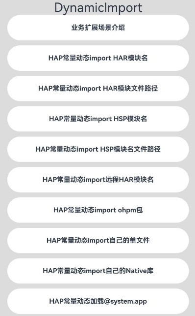

# ArkTS动态加载

### 介绍

动态import支持条件延迟加载，支持部分反射功能，可以提升页面的加载速度；动态import支持加载HSP模块/HAR模块/OHPM包/Native库等，并且HAR模块间只有变量动态import时还可以进行模块解耦

本示例主要展示了动态加载的业务拓展场景介绍、动态加载常量表达式、动态加载变量表达式以及HAR模块间动态加载依赖解耦这些场景。该工程中展示的代码详细描述可查如下链接中业务扩展场景介绍部分。

- [动态加载](https://docs.openharmony.cn/pages/v5.0/zh-cn/application-dev/arkts-utils/arkts-dynamic-import.md)

### 效果预览

| 执行结果图                                                       |
| ---------------------------------------------------------------- |
|  |

### 使用说明

1. 运行Index主界面。
2. 页面呈现上述执行结果图效果，分别点击ListItem组件可以执行对应文本内容的操作，然后在控制台中打印出对应日志。
3. 运行测试用例DynamicImport.test.ets文件对页面代码进行测试可以全部通过。

### 工程目录

```
entry/src/
 ├── main
 │   ├── cpp
 │   │   ├── types
 │   │   │   ├── libentry
 │   │   │   │   ├── Index.d.ts          // 提供JS侧的接口方法
 │   │   │   │   ├── oh-package.json5 	 // 将index.d.ts与cpp文件关联
 │   │   ├── CMakeLists.txt              // 配置CMake打包参数
 │   │   ├── napi_init.cpp
 │   ├── ets
 │   │   ├── entryability
 │   │   ├── entrybackupability
 │   │   ├── pages
 │   │   │   ├── Index.ets               // 动态加载示例代码
 │   │   │   └── Calc.ets
 │   │   ├── utils
 │   │       └── Calc.ets
 │   │   ├── Calc.ets
 │   ├── module.json5
 │   └── resources
 ├── ohosTest
 │   ├── ets
 │   │   └── test
 │   │       ├── Ability.test.ets
 │   │       ├── DynamicImport.test.ets  // 自动化测试代码
 │   │       └── List.test.ets
 har1                                    // har1模块函数实现
 ├── src
 │   ├── main
 │   │   ├── ets
 │   │   │   ├── utils
 │   │   │   │   └── Calc.ets
 │   │   │   └── components
 │   │   │   │   └── MainPage.ets
 ├── Index.ets
 har2                                    // har2模块函数实现
 ├── src
 │   ├── main
 │   │   ├── ets
 │   │   │   ├── utils
 │   │   │   │   └── Calc.ets
 │   │   │   └── components
 │   │   │   │   └── MainPage.ets
 ├── Index.ets
 harlibrary                              // harlibrary模块函数实现
 ├── src
 │   ├── main
 │   │   ├── ets
 │   │   │   ├── utils
 │   │   │   │   └── Calc.ets
 │   │   │   └── components
 │   │   │   │   └── MainPage.ets
 ├── Index.ets
 myHar                                    // myHar模块函数实现
 ├── src
 │   ├── main
 │   │   ├── ets
 │   │   │   └── components
 │   │   │   │   └── MainPage.ets
 ├── Index.ets
 myHsp                                    // myHsp模块函数实现
 ├── src
 │   ├── main
 │   │   ├── ets
 │   │   │   ├── pages
 │   │   │   │   └── Index.ets
 │   │   │   └── utils
 │   │   │   │   └── Calc.ets
 ├── Index.ets
```

### 相关权限

不涉及。

### 依赖

不涉及。

### 约束与限制

1.本示例仅支持标准系统上运行, 支持设备：RK3568。

2.本示例为Stage模型，支持API20版本SDK，版本号：6.0.0.34，镜像版本号：OpenHarmony_6.0.0.34。

3.本示例需要使用DevEco Studio 6.0.0及以上版本才可编译运行。

### 下载

如需单独下载本工程，执行如下命令：

```
git init
git config core.sparsecheckout true
echo code/DocsSample/ArkTs/ArkTSRuntime/ArkTSModule/DynamicImport > .git/info/sparse-checkout
git remote add origin https://gitee.com/openharmony/applications_app_samples.git
git pull origin master
```
