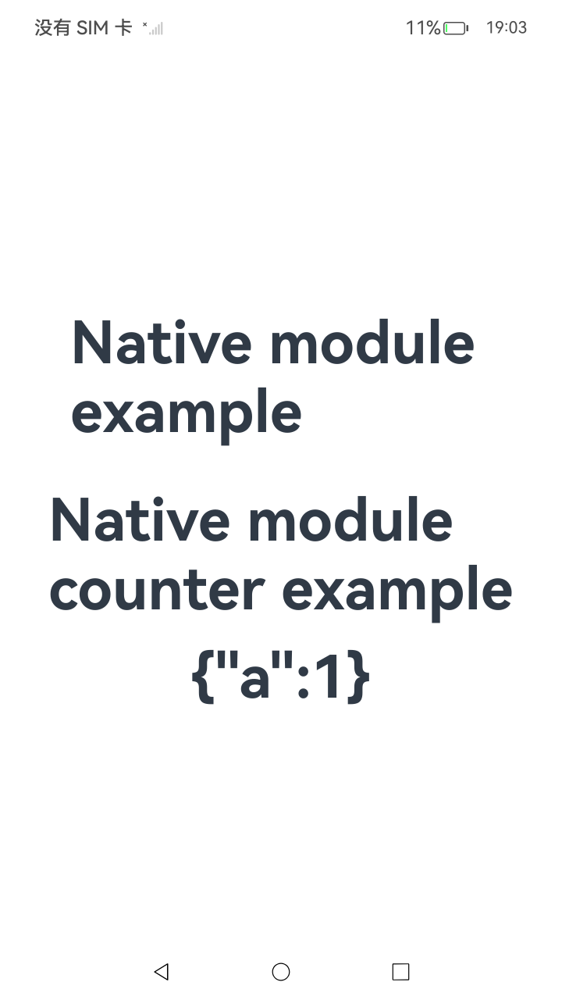

# ArkTS模块化运行简介

### 介绍

为了解决大型、复杂应用开发过程中，部分代码编译时被多次拷贝导致包体积增大、文件依赖、代码与资源共享困难以及单例和全局变量污染等问题，同时为了简化开发者代码编写与功能维护，ArkTS支持应用模块化编译、打包和运行，方便开发者编写和维护代码。

该工程中展示的代码详细描述可查如下链接：

- [模块化运行简介](https://gitcode.com/openharmony/docs/blob/master/zh-cn/application-dev/arkts-utils/module-principle.md)

### 效果预览

| 首页                                                                       |
| -------------------------------------------------------------------------- |
|  |

### 使用说明

1. 运行Index主界面。
2. 执行结果会即时反馈在屏幕中央,并在控制台打印log。
3. 运行测试用例ModulePrinciple.test.ets文件对页面代码进行测试可以全部通过。

### 工程目录

```
entry/src/
 ├── main
 │   ├── cpp
 │   │   ├── types
 │   │   │   ├── libentry
 │   │   │   │   ├── Index.d.ts                        // 提供JS侧的接口方法
 │   │   │   │   ├── oh-package.json5 	               // 将index.d.ts与cpp文件关联
 │   │   ├── CMakeLists.txt                            // 配置CMake打包参数
 │   │   ├── napi_init.cpp                             // 实现Native侧的add接口
 │   ├── ets
 │   │   ├── entryability
 │   │   ├── entrybackupability
 │   │   ├── pages
 │   │   |   ├── CounterExample                        // 反例
 |   │   │   |   ├── test1.ets                         // 使用命名空间导出
 |   │   │   |   ├── test2.ets                         // 使用命名空间导入
 │   │   |   ├── example.json                          // json文件
 │   │   |   ├── test.ets                              // 导入native模块
 │   │   |   └── Index.ets                             // 首页
 │   ├── module.json5
 │   └── resources
 ├── ohosTest
 │   ├── ets
 │   │   └── test
 │   │       ├── Ability.test.ets
 │   │       ├── ModulePrinciple.test.ets              // 自动化测试代码
 │   │       └── List.test
```

### 相关权限

不涉及。

### 依赖

不涉及。

### 约束与限制

1.本示例仅支持标准系统上运行, 支持设备：RK3568。

2.本示例为Stage模型，支持API20版本SDK，版本号：6.0.0.34，镜像版本号：OpenHarmony_6.0.0.34。

3.本示例需要使用DevEco Studio 6.0.0及以上版本才可编译运行。

### 下载

如需单独下载本工程，执行如下命令：

```
git init
git config core.sparsecheckout true
echo code/DocsSample/ArkTS/ArkTSRuntime/ArkTSModule/ModulePrinciple > .git/info/sparse-checkout
git remote add origin https://gitcode.com/openharmony/applications_app_samples.git
git pull origin master
```
