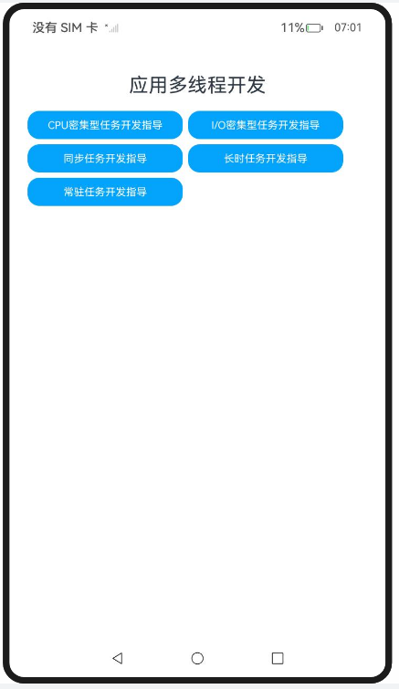

# ArkTS 应用多线程开发

### 介绍

ArkTS应用开发过程中，需要用到并发能力的业务场景很多，不同业务场景需要使用的并发能力不同，对应的主要任务类型也不同。

针对常见的业务场景，主要可以对应分为三种并发任务：

[耗时任务](https://docs.openharmony.cn/pages/v5.0/zh-cn/application-dev/arkts-utils/time-consuming-task-overview.md)：业务逻辑包含较大计算量或多次I/O读写等需要长时间执行的任务。

[长时任务](https://docs.openharmony.cn/pages/v5.0/zh-cn/application-dev/arkts-utils/long-time-task-overview.md)：业务逻辑包含监听或定期采集数据等需要长时间保持运行的任务。

[常驻任务](https://docs.openharmony.cn/pages/v5.0/zh-cn/application-dev/arkts-utils/resident-task-overview.md)：业务逻辑跟随主线程生命周期或与主线程绑定的任务。

不同任务类型下可再细划分，比如典型的耗时任务有CPU密集型任务、I/O密集型任务以及同步任务，分别对应的典型业务场景也不相同。请开发者根据场景任务类型对应选择并发能力。

该工程中展示的代码详细描述可查如下链接：

- [CPU密集型任务开发指导 (TaskPool和Worker)](https://docs.openharmony.cn/pages/v5.0/zh-cn/application-dev/arkts-utils/cpu-intensive-task-development.md)
- [I/O密集型任务开发指导 (TaskPool)](https://docs.openharmony.cn/pages/v5.0/zh-cn/application-dev/arkts-utils/io-intensive-task-development.md)
- [同步任务开发指导 (TaskPool和Worker)](https://docs.openharmony.cn/pages/v5.0/zh-cn/application-dev/arkts-utils/sync-task-development.md)
- [长时任务开发指导（TaskPool）](https://docs.openharmony.cn/pages/v5.0/zh-cn/application-dev/arkts-utils/long-time-task-guide.md)
- [常驻任务开发指导（Worker）](https://docs.openharmony.cn/pages/v5.0/zh-cn/application-dev/arkts-utils/resident-task-guide.md)

### 效果预览

|                             首页                             |                       执行及结果即时反                       |
| :----------------------------------------------------------: | :----------------------------------------------------------: |
|  |  |

### 使用说明

1. 在主界面，点击任意按钮进行跳转，点击Hello World执行程序
2. 执行结果会即时反馈在屏幕中央,并在控制台打印log。

### 工程目录

```
entry/src/
 ├── main
 │   ├── ets
 │   │   ├── entryability
 │   │   ├── entrybackupability
 │   │   ├── managers
 │   │       ├── CpuIntensiveTaskDevelopment.ets     // CPU密集型任务开发指导
 │   │       ├── IoIntensiveTaskDevelopment.ets      // I/O密集型任务开发指导
 │   │       ├── LongTimeTaskGuide.ets               // 长时任务开发指导
 │   │       ├── ResidentTaskGuide.ets               // 常驻任务开发指导
 │   │       ├── SyncTaskDevelopment.ets		     // 同步任务开发指导
 │   │       ├── write.ets                           // I/O密集型任务开发指导
 │   │   ├── pages
 │   │       ├── Index.ets                           // 首页
 │   │   ├── util
 │   │       ├── CommonButton.ets 		             // 首页跳转UI
 │   │       ├── resource.ets 		                 // 资源引用转换
 │   │   ├── workers
 │   │       ├── handle.ts 		                     // 同步任务开发指导
 │   │       ├── MyWorker1.ts 		                 // CPU密集型任务开发指导
 │   │       ├── MyWorker2.ts 		                 // 同步任务开发指导
 │   │       ├── Worker.ets 		                 // 常驻任务开发指导
 │   ├── module.json5
 │   └── resources
 ├── ohosTest
 │   ├── ets
 │   │   ├── test
 │   │       ├── Ability.test.ets                     // 自动化测试代码
```

### 相关权限

不涉及。

### 依赖

不涉及。

### 约束与限制

1.本示例仅支持标准系统上运行, 支持设备：RK3568。

2.本示例为Stage模型，支持API14版本SDK，版本号：5.0.2.57，镜像版本号：OpenHarmony_5.0.2.58。

3.本示例需要使用DevEco Studio 5.0.1 Release (Build Version: 5.0.5.306, built on December 6, 2024)及以上版本才可编译运行。

### 下载

如需单独下载本工程，执行如下命令：

````
git init
git config core.sparsecheckout true
echo code/DocsSample/ArkTS/ArkTsConcurrent/ApplicationMultithreadingDevelopment/ApplicationMultithreading > .git/info/sparse-checkout
git remote add origin https://gitee.com/openharmony/applications_app_samples.git
git pull origin master
````