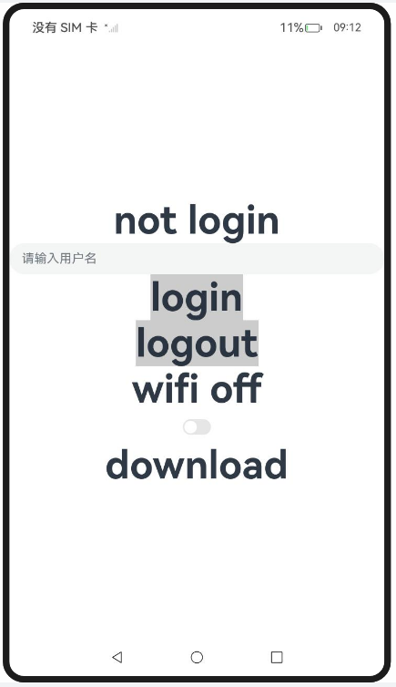

# ArkTS 应用多线程开发实践案例

### 介绍

#### 使用TaskPool进行频繁数据库操作

对于需要频繁数据库操作的场景，由于读写数据库存在耗时，因此推荐在子线程中操作，避免阻塞UI线程。

通过ArkTS提供的TaskPool能力，可以将数据库操作任务移到子线程中。

#### 业务模块并发加载场景

在应用启动过程中，会有多个业务模块需要加载，例如应用的定位、打车、导航等不同的模块，如果全部在UI主线程初始化，则会严重影响冷启动耗时。此时需要在不同子线程并行化加载这些模块功能，降低启动耗时。

通过使用ArkTS提供的TaskPool能力，可以将不同业务初始化任务移到子线程中，业务模块通过下沉C++实现成[NativeBinding对象](https://docs.openharmony.cn/pages/v5.0/zh-cn/application-dev/arkts-utils/transferabled-object.md)、或者在ArkTS层定义[Sendable对象](https://docs.openharmony.cn/pages/v5.0/zh-cn/application-dev/arkts-utils/arkts-sendable.md)，就可以将初始化的模块返回UI主线程调用，实现如下。

#### 全局配置项功能场景

对于需要使用进程单例的场景，例如不同并发实例间需要数据保持一致的全局配置项业务，可以采用共享模块来实现。

#### ArkUI数据更新场景

当需要网络下载或者本地生成的数据需要发送到UI线程进行展示时，因为ArkUI的标注和[@Sendable装饰器](https://docs.openharmony.cn/pages/v5.0/zh-cn/application-dev/arkts-utils/arkts-sendable.md#sendable装饰器)不能同时修饰变量和对象，所以对于此类场景，需要使用[makeObserved](https://docs.openharmony.cn/pages/v5.0/zh-cn/application-dev/quick-start/arkts-new-makeObserved.md)在ArkUI中导入可观察的Sendable共享数据。

#### ArkUI瀑布流渲染场景

此处提供使用任务池[TaskPool](https://docs.openharmony.cn/pages/v5.0/zh-cn/application-dev/reference/apis-arkts/js-apis-taskpool.md)提升[WaterFlow瀑布流](https://docs.openharmony.cn/pages/v5.0/zh-cn/application-dev/reference/apis-arkui/arkui-ts/ts-container-waterflow.md)渲染性能的开发指导。UI线程查询数据库数据，并将数据渲染到瀑布流组件，数据过大时会导致UI线程长时间等待，影响用户体验。因此，可以将数据查询操作放到子线程中，并通过TaskPool的接口返回数据给UI线程。

该工程中展示的代码详细描述可查如下链接：

- [批量数据写数据库场景](https://docs.openharmony.cn/pages/v5.0/zh-cn/application-dev/arkts-utils/batch-database-operations-guide.md)
- [业务模块并发加载场景](https://docs.openharmony.cn/pages/v5.0/zh-cn/application-dev/arkts-utils/concurrent-loading-modules-guide.md)
- [全局配置项功能场景](https://docs.openharmony.cn/pages/v5.0/zh-cn/application-dev/arkts-utils/global-configuration-guide.md)
- [ArkUI数据更新场景](https://docs.openharmony.cn/pages/v5.0/zh-cn/application-dev/arkts-utils/makeobserved-sendable.md)
- [ArkUI瀑布流渲染场景](https://docs.openharmony.cn/pages/v5.0/zh-cn/application-dev/arkts-utils/taskpool-waterflow.md)

### 效果预览

|                             首页                             |                          执行及结果                          |
| :----------------------------------------------------------: | :----------------------------------------------------------: |
|  |  |

### 使用说明

1. 在主界面，点击任意按钮进行跳转，点击Hello World执行程序
2. 执行结果会即时反馈在屏幕中央,并在控制台打印log。

### 工程目录

```
entry/src/
 ├── main
 │   ├── ets
 │   │   ├── entryability
 │   │   ├── entrybackupability
 │   │   ├── managers
 │   │       ├── ConcurrentLoadingModulesGuide.ets   // 业务模块并发加载场景示例代码
 │   │       ├── Config.ets                          // 全局配置项功能场景资源代码
 │   │       ├── GlobalConfigurationGuide.ets        // 全局配置项功能场景示例代码
 │   │       ├── MakeobservedSendable.ets            // ArkUI数据更新场景示例代码
 │   │       ├── Mock.ets		                     // ArkUI瀑布流渲染场景资源代码
 │   │       ├── SendableData.ets                    // ArkUI数据更新场景资源代码
 │   │       ├── SharedValuesBucket.ets              // 使用Sendable进行大容量数据库操作
 │   │       ├── UsingSendable.ets                   // 使用Sendable进行大容量数据库操作示例代码
 │   │       ├── UsingTaskPool.ets                   // 使用TaskPool进行频繁数据库操作示例代码
 │   │       ├── WaterfallRendering.ets              // ArkUI瀑布流渲染场景示例代码资源代码
 │   │       ├── WaterFlowDataSource.ets             // ArkUI瀑布流渲染场景资源代码
 │   │   ├── pages
 │   │       ├── Index.ets                           // 首页
 │   │   ├── sdk
 │   │       ├── Calculator.ets 		             // 业务模块并发加载场景资源代码
 │   │       ├── TimerSdk.ets 		                 // 业务模块并发加载场景资源代码
 │   │   ├── util
 │   │       ├── CommonButton.ets 		             // 首页跳转UI
 │   │       ├── resource.ets 		                 // 资源引用转换
 │   ├── module.json5
 │   └── resources
 ├── ohosTest
 │   ├── ets
 │   │   ├── test
 │   │       ├── Ability.test.ets                    // 自动化测试代码
```

### 相关权限

不涉及。

### 依赖

不涉及。

### 约束与限制

1.本示例仅支持标准系统上运行, 支持设备：RK3568。

2.本示例为Stage模型，支持API14版本SDK，版本号：5.0.2.57，镜像版本号：OpenHarmony_5.0.2.58。

3.本示例需要使用DevEco Studio 5.0.1 Release (Build Version: 5.0.5.306, built on December 6, 2024)及以上版本才可编译运行。

### 下载

如需单独下载本工程，执行如下命令：

````
git init
git config core.sparsecheckout true
echo code/DocsSample/ArkTS/ArkTsConcurrent/ApplicationMultithreadingDevelopment/PracticalCases > .git/info/sparse-checkout
git remote add origin https://gitee.com/openharmony/applications_app_samples.git
git pull origin master
````