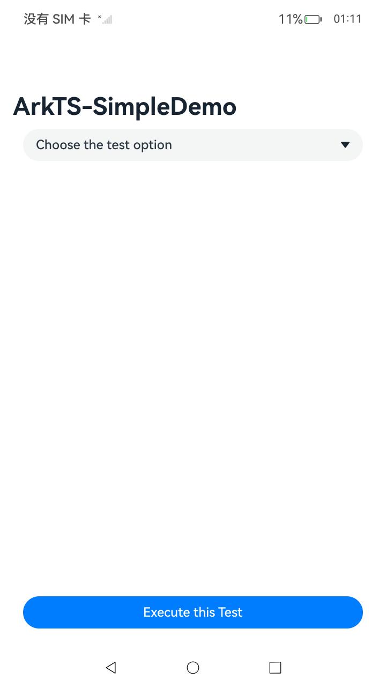
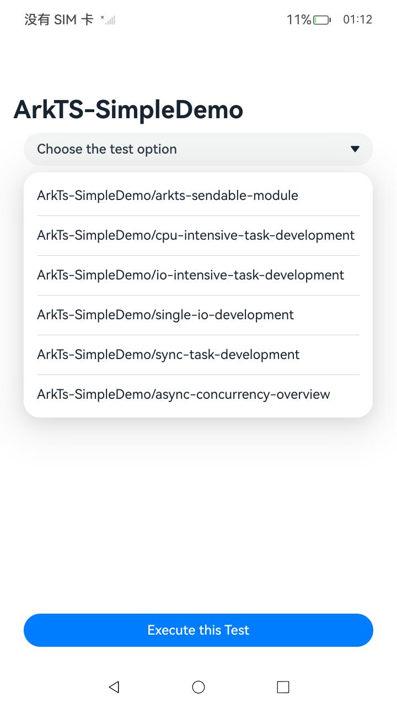
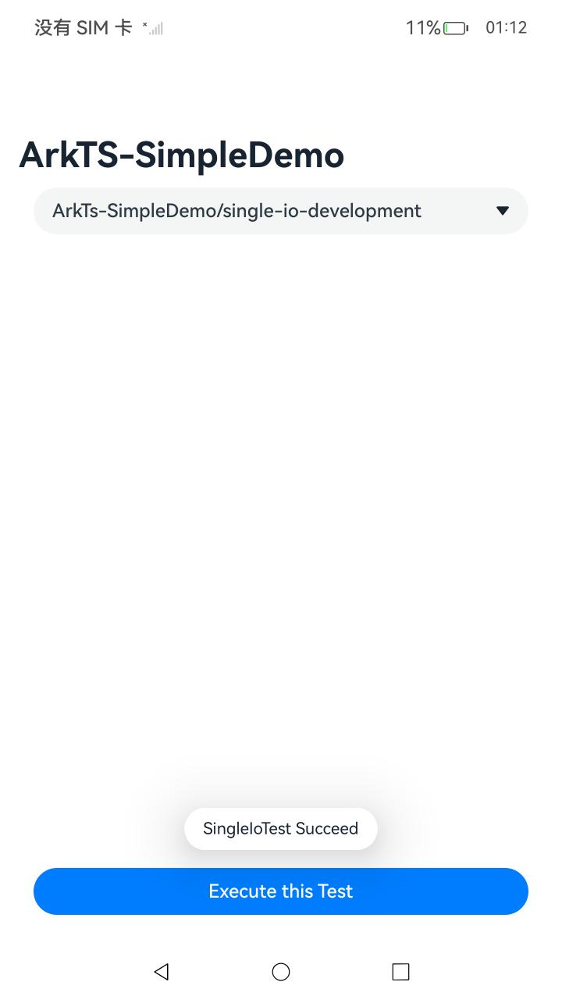

# Example ArkTS Guide Document

### Introduction

This example uses the [ArkTS Guide Document]（ https://gitcode.com/openharmony/docs/tree/master/en/application-dev/arkts-utils ）The development examples of various scenarios in the project are presented to help developers better understand the various capabilities provided by ArkTS and make reasonable use of them. The detailed description of the code displayed in this project can be found in the following link:

1. [Shared module development guidance](https://gitcode.com/openharmony/docs/blob/master/en/application-dev/arkts-utils/arkts-sendable-module.md)
2. [CPU intensive task development guidance(TaskPool and Worker)](https://gitcode.com/openharmony/docs/blob/master/en/application-dev/arkts-utils/cpu-intensive-task-development.md)
3. [I/O intensive task development guide(TaskPool)](https://gitcode.com/openharmony/docs/blob/master/en/application-dev/arkts-utils/io-intensive-task-development.md)
4. [Single I/O task development guidance(Promise and async/await)](https://gitcode.com/openharmony/docs/blob/OpenHarmony-4.1-Release/en/application-dev/arkts-utils/single-io-development.md)
5. [Synchronous task development guidance(TaskPool and Worker)](https://gitcode.com/openharmony/docs/blob/master/en/application-dev/arkts-utils/sync-task-development.md)
6. [Overview of Asynchronous Concurrency(Promise and async/await)](https://gitcode.com/openharmony/docs/blob/master/en/application-dev/arkts-utils/async-concurrency-overview.md)

### Effect preview

|Homepage | Dropdown options for selecting various scenarios | Immediate feedback on execution and results|
|-------------------------------------|-------------------------------------|-----------------------|
|  |  |  |

### Instructions for use

1. On the main interface, you can click on the dropdown option and select the scene that needs to be executed.

2. Select the scenario that needs to be executed and click the * * Execute this Test * * button below to start executing.

3. The execution result will be immediately feedback above the button.

### Engineering Catalog

```
entry/src/main/ets/
|---entryability
|---managers
|   |---arkts-sendable-module.ets                       // sample code for shared modules
|   |---async-concurrency-overview.ets                  // asynchronous example code
|   |---cpu-intensive-task.ets                       // example code for intensive tasks
|   |---file-write.ets                       // sample code for file read and write implementation
|   |---Handle.ets                       // sample code for synchronizing task data definition
|   |---io-intensive-task.ets                // IO intensive example code
|   |---manager.ets                       // summarize and call the functions of each module
|   |---sharedModule.ets                       // sample code for defining shared module data
|   |---single-io-development.ets              // single IO Example Code
|   |---sync-task-development.ets                       // sample code for synchronization task
|---pages
|   |---Index.ets                       // 应用页面
```

### Related permissions

Not involved.

### Dependency

Not involved.

### Constraints and limitations
1. This example only supports running on standard systems and supports devices such as RK3568.

2. This example is a Stage model that supports API12 version SDK, version number: 5.0.0.26, and image version number: OpenHarmony_5.0.0.27.

3. This example requires DevEco Studio NEXT Developer Preview2 (Build Version: 4.1.3.700, build on March 19, 2024) and above to compile and run.

### Download

To download this project separately, execute the following command:

````
git init
git config core.sparsecheckout true
echo code/DocsSample/ArkTS/ArkTsConcurrent/ArkTsSimpleDemo/ > .git/info/sparse-checkout
git remote add origin https://gitee.com/openharmony/applications_app_samples.git
git pull origin master
````