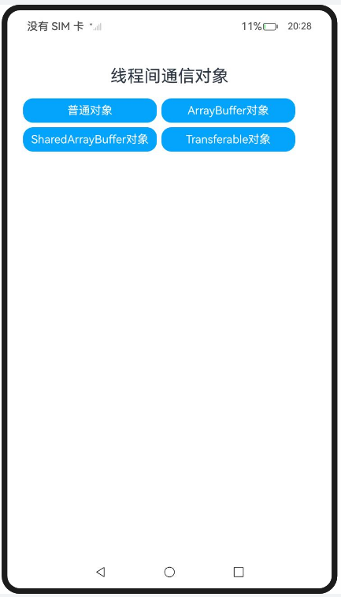

# ArkTS 线程间通信对象

### 介绍

#### 普通对象

普通对象跨线程时通过拷贝形式传递，两个线程的对象内容一致，但是指向各自线程的隔离内存区间，被分配在各自线程的虚拟机本地堆（LocalHeap）。例如Ecmascript262规范定义的Object、Array、Map等对象是通过这种方式实现跨并发实例通信的。

#### ArrayBuffer对象

ArrayBuffer内部包含一块Native内存，该ArrayBuffer的JS对象壳被分配在虚拟机本地堆（LocalHeap）。与普通对象一样，需要经过序列化与反序列化拷贝传递，但是Native内存有两种传输方式：拷贝和转移。

#### SharedArrayBuffer对象

SharedArrayBuffer内部包含一块Native内存，其JS对象壳被分配在虚拟机本地堆（LocalHeap）。支持跨并发实例间共享，但是访问及修改需要采用Atomics类，防止数据竞争。SharedArrayBuffer可以用于多个并发实例间的状态共享或者数据共享。

#### Transferable对象（NativeBinding对象）

Transferable对象（也称为NativeBinding对象）指的是一个JS对象，绑定了一个C++对象，且主体功能由C++提供，其JS对象壳被分配在虚拟机本地堆（LocalHeap）。跨线程传输时可以直接复用同一个C++对象，相比于JS对象的拷贝模式，传输效率较高。因此，可共享或转移的NativeBinding对象也被称为Transferable对象。

该工程中展示的代码详细描述可查如下链接：

- [普通对象](https://docs.openharmony.cn/pages/v5.0/zh-cn/application-dev/arkts-utils/normal-object.md)
- [ArrayBuffer对象](https://docs.openharmony.cn/pages/v5.0/zh-cn/application-dev/arkts-utils/arraybuffer-object.md)
- [SharedArrayBuffer对象](https://docs.openharmony.cn/pages/v5.0/zh-cn/application-dev/arkts-utils/shared-arraybuffer-object.md)
- [Transferable对象（NativeBinding对象）](https://docs.openharmony.cn/pages/v5.0/zh-cn/application-dev/arkts-utils/transferabled-object.md)

### 效果预览

|                                   首页                                    |                            执行及结果即时反馈                             |
| :-----------------------------------------------------------------------: | :-----------------------------------------------------------------------: |
|  |  |

### 使用说明

1. 在主界面，点击任意按钮进行跳转，点击Hello World执行程序
2. 执行结果会即时反馈在屏幕中央,并在控制台打印log。

### 工程目录

```
entry/src/
 ├── main
 │   ├── ets
 │   │   ├── entryability
 │   │   ├── entrybackupability
 │   │   ├── managers
 │   │       ├── ArrayBufferObject.ets       // ArrayBuffer对象示例代码
 │   │       ├── NormalObject.ets            // 普通对象示例代码
 │   │       ├── pixelMapTest.ets            // Transferable对象示例代码
 │   │       ├── SharedArrayBufferObject.ets // SharedArrayBuffer对象示例代码
 │   │       ├── Test.ets					 // 普通对象示例代码
 │   │       ├── TransferabledObject.ets     // Transferable对象示例代码
 │   │   ├── pages
 │   │       ├── Index.ets                   // 首页
 │   │   ├── util
 │   │       ├── CommonButton.ets 		     // 首页跳转UI
 │   │       ├── resource.ets 		         // 资源引用转换
 │   ├── module.json5
 │   └── resources
 ├── ohosTest
 │   ├── ets
 │   │   ├── test
 │   │       ├── Ability.test.ets            // 自动化测试代码
```

### 相关权限

不涉及。

### 依赖

不涉及。

### 约束与限制

1.本示例仅支持标准系统上运行, 支持设备：RK3568。

2.本示例为Stage模型，支持API14版本SDK，版本号：5.0.2.57，镜像版本号：OpenHarmony_5.0.2.58。

3.本示例需要使用DevEco Studio 5.0.1 Release (Build Version: 5.0.5.306, built on December 6, 2024)及以上版本才可编译运行。

### 下载

如需单独下载本工程，执行如下命令：

```
git init
git config core.sparsecheckout true
echo code/DocsSample/ArkTS/ArkTsConcurrent/ConcurrentThreadCommunication/InterThreadCommunicationObjects/CommunicationObjects > .git/info/sparse-checkout
git remote add origin https://gitee.com/openharmony/applications_app_samples.git
git pull origin master
```
