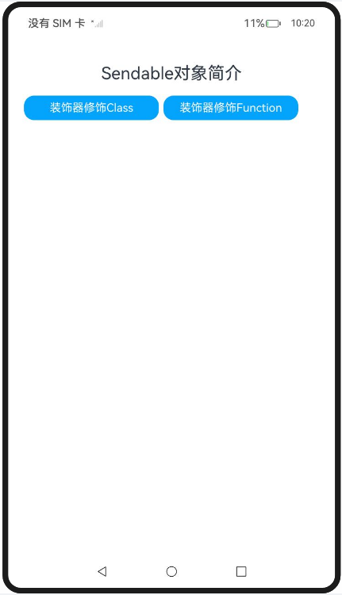

# ArkTS Sendable对象简介

### 介绍

在传统JS引擎上，对象的并发通信开销的优化方式只有一种，就是把实现下沉到Native侧，通过[Transferable对象](https://docs.openharmony.cn/pages/v5.0/zh-cn/application-dev/arkts-utils/transferabled-object.md)的转移或共享方式降低并发通信开销。而开发者仍然还有大量对象并发通信的诉求，这个问题在业界的JS引擎实现上并没有得到解决。

该工程中展示的代码详细描述可查如下链接：

- [Sendable对象简介](https://docs.openharmony.cn/pages/v5.0/zh-cn/application-dev/arkts-utils/arkts-sendable.md)

### 效果预览

|                                      首页                                       |                               执行及结果即时反馈                                |
| :-----------------------------------------------------------------------------: | :-----------------------------------------------------------------------------: |
|  |  |

### 使用说明

1. 在主界面，点击任意按钮进行跳转，点击Hello World执行程序。
2. 执行结果会即时反馈在屏幕中央,并在控制台打印log。

### 工程目录

```
class/src/
 ├── main
 │   ├── ets
 │   │   ├── components
 │   │       ├── MainPage.ets          // 装饰器修饰Class使用示例
entry/src/
 ├── main
 │   ├── ets
 │   │   ├── entryability
 │   │   ├── entrybackupability
 │   │   ├── managers
 │   │       ├── classusage.ets        // 装饰器修饰Class使用示例
 │   │       ├── functionusage.ets     // 装饰器修饰Function使用示例
 │   │   ├── pages
 │   │       ├── Index.ets             // 首页
 │   │   ├── util
 │   │       ├── CommonButton.ets 	   // 首页跳转UI
 │   │       ├── resource.ets 		   // 资源引用转换
 │   ├── module.json5
 │   └── resources
 ├── ohosTest
 │   ├── ets
 │   │   ├── test
 │   │       ├── Ability.test.ets      // 自动化测试代码
```

### 相关权限

不涉及。

### 依赖

不涉及。

### 约束与限制

1.本示例仅支持标准系统上运行, 支持设备：RK3568。

2.本示例为Stage模型，支持API14版本SDK，版本号：5.0.2.57，镜像版本号：OpenHarmony_5.0.2.58。

3.本示例需要使用DevEco Studio 5.0.1 Release (Build Version: 5.0.5.306, built on December 6, 2024)及以上版本才可编译运行。

### 下载

如需单独下载本工程，执行如下命令：

```
git init
git config core.sparsecheckout true
echo code/DocsSample/ArkTS/ArkTsConcurrent/ConcurrentThreadCommunication/InterThreadCommunicationObjects/SendableObject/SendableObjectIntroduction > .git/info/sparse-checkout
git remote add origin https://gitee.com/openharmony/applications_app_samples.git
git pull origin master
```
