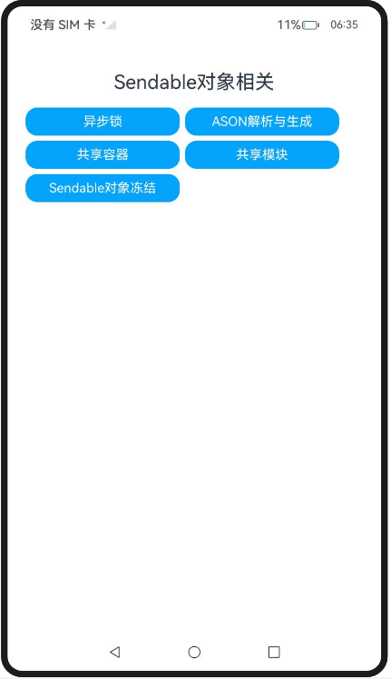

# ArkTS Sendable对象相关

### 介绍

#### 异步锁

为了解决多线程并发任务间的数据竞争问题，ArkTS引入了异步锁能力。异步锁可能会被类对象持有，因此为了更方便地在并发实例间获取同一个异步锁对象，[AsyncLock对象](https://docs.openharmony.cn/pages/v5.0/zh-cn/application-dev/reference/apis-arkts/js-apis-arkts-utils.md#asynclock)支持跨线程引用传递。

由于ArkTS语言支持异步操作，阻塞锁容易产生死锁问题，因此在ArkTS中仅支持异步锁（非阻塞式锁）。同时，异步锁还可以用于保证单线程内的异步任务时序一致性，防止异步任务时序不确定导致的同步问题。

#### ASON解析与生成

[ASON工具](https://docs.openharmony.cn/pages/v5.0/zh-cn/application-dev/reference/apis-arkts/js-apis-arkts-utils.md#arktsutilsason)与JS提供的JSON工具类似，JSON用于进行JS对象的序列化（stringify）、反序列化（parse）。ASON则提供了[Sendable对象](https://docs.openharmony.cn/pages/v5.0/zh-cn/application-dev/arkts-utils/arkts-sendable.md)的序列化、反序列化能力。可以通过ASON.stringify方法将对象转换成字符串，也可以通过ASON.parse方法将字符串转成Sendable对象，以便此对象在并发任务间进行高性能引用传递。

#### 共享容器

ArkTS共享容器（[@arkts.collections (ArkTS容器集)](https://docs.openharmony.cn/pages/v5.0/zh-cn/application-dev/reference/apis-arkts/js-apis-arkts-collections.md)）是一种在并发任务间共享传输的容器类，可以用于并发场景下的高性能数据传递。功能与Ecmascript262规范定义的容器类似，但仍然有部分差异，具体可见[共享容器与原生API方法的行为差异对比](https://docs.openharmony.cn/pages/v5.0/zh-cn/application-dev/arkts-utils/arkts-collections-introduction.md#共享容器与原生api方法的行为差异对比)。

ArkTS共享容器在多个并发任务间传递时，其默认行为是引用传递，支持多个并发任务可以操作同一个容器实例。另外，也支持拷贝传递，即每个并发任务持有一个ArkTS容器实例。

ArkTS共享容器并不是线程安全的，内部使用了fail-fast（快速失败）机制，即当检测多个并发实例同时对容器进行结构性改变时，会触发异常。因此，在容器内修改属性的场景下，开发者需要使用ArkTS提供的[异步锁](https://docs.openharmony.cn/pages/v5.0/zh-cn/application-dev/arkts-utils/arkts-async-lock-introduction.md)机制保证ArkTS容器的安全访问。

ArkTS共享容器包含如下几种：[Array](https://docs.openharmony.cn/pages/v5.0/zh-cn/application-dev/reference/apis-arkts/js-apis-arkts-collections.md#collectionsarray)、[Map](https://docs.openharmony.cn/pages/v5.0/zh-cn/application-dev/reference/apis-arkts/js-apis-arkts-collections.md#collectionsmap)、[Set](https://docs.openharmony.cn/pages/v5.0/zh-cn/application-dev/reference/apis-arkts/js-apis-arkts-collections.md#collectionsset)、[TypedArray](https://docs.openharmony.cn/pages/v5.0/zh-cn/application-dev/reference/apis-arkts/js-apis-arkts-collections.md#collectionstypedarray)（Int8Array、Uint8Array、Int16Array、Uint16Array、Int32Array、Uint32Array、Uint8ClampedArray、Float32Array）、[ArrayBuffer](https://docs.openharmony.cn/pages/v5.0/zh-cn/application-dev/reference/apis-arkts/js-apis-arkts-collections.md#collectionsarraybuffer)等，具体可见[@arkts.collections (ArkTS容器集)](https://docs.openharmony.cn/pages/v5.0/zh-cn/application-dev/reference/apis-arkts/js-apis-arkts-collections.md)。

#### 共享模块

共享模块是进程内只会加载一次的模块，使用"use shared"这一指令来标记一个模块是否为共享模块。

非共享模块在同一线程内只加载一次，在不同线程间会加载多次，在不同的线程内都会产生新的模块对象。因此可以使用共享模块来实现进程单例。

#### Sendable对象冻结

Sendable对象支持冻结操作，冻结后的对象变成只读对象，不能增删改属性，因此在多个并发实例间访问均不需要加锁，可以通过调用[Object.freeze](https://developer.mozilla.org/zh-CN/docs/Web/JavaScript/Reference/Global_Objects/Object/freeze)接口冻结对象。

该工程中展示的代码详细描述可查如下链接：

- [异步锁](https://docs.openharmony.cn/pages/v5.0/zh-cn/application-dev/arkts-utils/arkts-async-lock-introduction.md)
- [ASON解析与生成](https://docs.openharmony.cn/pages/v5.0/zh-cn/application-dev/arkts-utils/ason-parsing-generation.md)
- [共享容器](https://docs.openharmony.cn/pages/v5.0/zh-cn/application-dev/arkts-utils/arkts-collections-introduction.md)
- [共享模块](https://docs.openharmony.cn/pages/v5.0/zh-cn/application-dev/arkts-utils/arkts-sendable-module.md)
- [Sendable对象冻结](https://docs.openharmony.cn/pages/v5.0/zh-cn/application-dev/arkts-utils/sendable-freeze.md)

### 效果预览

|                                    首页                                    |                             执行及结果即时反馈                             |
| :------------------------------------------------------------------------: | :------------------------------------------------------------------------: |
|  |  |

### 使用说明

1. 在主界面，点击任意按钮进行跳转，点击Hello World执行程序
2. 执行结果会即时反馈在屏幕中央,并在控制台打印log。

### 工程目录

```
entry/src/
 ├── main
 │   ├── ets
 │   │   ├── entryability
 │   │   ├── entrybackupability
 │   │   ├── managers
 │   │       ├── ArktsAsyncLockIntroduction.ets      // 异步锁示例代码
 │   │       ├── ArktsCollectionsIntroduction.ets    // 共享容器示例代码
 │   │       ├── ArktsSendableModule.ets             // 共享模块示例代码
 │   │       ├── AsonParsingGeneration.ets           // ASON解析与生成示例代码
 │   │       ├── helper.ts					         // Sendable对象冻结示例代码
 │   │       ├── SendableFreeze.ets					 // Sendable对象冻结示例代码
 │   │       ├── sharedModule.ets					 // 共享模块示例代码
 │   │       ├── test.ets					         // 共享模块示例代码
 │   │   ├── pages
 │   │       ├── Index.ets                           // 首页
 │   │   ├── util
 │   │       ├── CommonButton.ets 		             // 首页跳转UI
 │   │       ├── resource.ets 		                 // 资源引用转换
 │   │   ├── workers
 │   │       ├── Worker.ets                          // Sendable对象冻结示例代码
 │   ├── module.json5
 │   └── resources
 ├── ohosTest
 │   ├── ets
 │   │   ├── test
 │   │       ├── Ability.test.ets                    // 自动化测试代码
```

### 相关权限

不涉及。

### 依赖

不涉及。

### 约束与限制

1.本示例仅支持标准系统上运行, 支持设备：RK3568。

2.本示例为Stage模型，支持API14版本SDK，版本号：5.0.2.57，镜像版本号：OpenHarmony_5.0.2.58。

3.本示例需要使用DevEco Studio 5.0.1 Release (Build Version: 5.0.5.306, built on December 6, 2024)及以上版本才可编译运行。

### 下载

如需单独下载本工程，执行如下命令：

```
git init
git config core.sparsecheckout true
echo code/DocsSample/ArkTS/ArkTsConcurrent/ConcurrentThreadCommunication/InterThreadCommunicationObjects/SendableObject/SendableObjectRelated > .git/info/sparse-checkout
git remote add origin https://gitee.com/openharmony/applications_app_samples.git
git pull origin master
```
