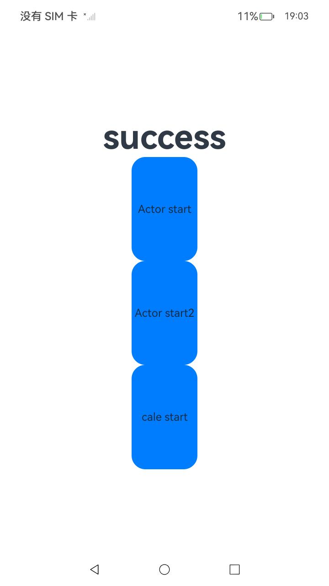

# ArkTS 多线程并发概述

### 介绍

并发模型是用来实现不同应用场景中并发任务的编程模型，常见的并发模型分为基于内存共享的并发模型和基于消息通信的并发模型。

Actor并发模型作为基于消息通信并发模型的典型代表，不需要开发者去面对锁带来的一系列复杂偶发的问题，同时并发度也相对较高，因此得到了广泛的支持和使用。

当前ArkTS提供了TaskPool和Worker两种并发能力，TaskPool和Worker都基于Actor并发模型实现。

Actor并发模型和内存共享并发模型的具体对比请见[多线程并发模型](https://gitcode.com/openharmony/docs/blob/master/zh-cn/application-dev/arkts-utils/multi-thread-concurrency-overview.md#多线程并发模型)。

该工程中展示的代码详细描述可查如下链接：

- [多线程并发概述](https://gitcode.com/openharmony/docs/blob/master/zh-cn/application-dev/arkts-utils/multi-thread-concurrency-overview.md)

### 效果预览

|                             首页                              |                          执行及结果即时反馈                          |
|:-----------------------------------------------------------:|:-----------------------------------------------------------:|
|  |  |

### 使用说明

1. 在主界面，可以点击start，开始执行。
2. 执行结果会即时反馈在屏幕中央,并在控制台打印log。

### 工程目录

```
entry/src/
 ├── main
 │   ├── ets
 │   │   ├── entryability
 │   │   ├── entrybackupability
 │   │   ├── pages
 │   │       ├── Cale.ets                // 多线程并发概述示例代码(内存共享模型)
 │   │       ├── Index.ets               // 多线程并发概述示例代码
 │   ├── module.json5
 │   └── resources
 ├── ohosTest
 │   ├── ets
 │   │   ├── test
 │   │       ├── Ability.test.ets        // 自动化测试代码
```

### 相关权限

不涉及。

### 依赖

不涉及。

### 约束与限制

1.本示例仅支持标准系统上运行, 支持设备：RK3568。

2.本示例为Stage模型，支持API20版本SDK，版本号：6.0.0.40，镜像版本号：OpenHarmony_6.0.0.40。

3.本示例需要使用DevEco Studio 5.1.1 Release (Build Version: 5.1.1.820, built on June 28, 2025)及以上版本才可编译运行。

### 下载

如需单独下载本工程，执行如下命令：

```
git init
git config core.sparsecheckout true
echo code/DocsSample/ArkTS/ArkTsConcurrent/MultithreadedConcurrency/MultiThreadConcurrencyOverview > .git/info/sparse-checkout
git remote add origin https://gitcode.com/openharmony/applications_app_samples.git
git pull origin master
```
