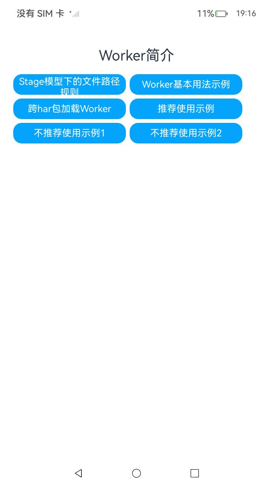

# ArkTS Worker简介

### 介绍

Worker主要作用是为应用程序提供一个多线程的运行环境，可满足应用程序在执行过程中与宿主线程分离，在后台线程中运行一个脚本进行耗时操作，极大避免类似于计算密集型或高延迟的任务阻塞宿主线程的运行。具体接口信息及使用方法详情请见[Worker](https://gitcode.com/openharmony/docs/blob/master/zh-cn/application-dev/reference/apis-arkts/js-apis-worker.md)。

该工程中展示的代码详细描述可查如下链接：

- [Worker简介](https://gitcode.com/openharmony/docs/blob/master/zh-cn/application-dev/arkts-utils/worker-introduction.md)

### 效果预览

|                                    首页                                    |                           执行及结果即时反馈                            |
|:------------------------------------------------------------------------:| :---------------------------------------------------------------------: |
|  |  |

### 使用说明

1. 在主界面，点击任意按钮进行跳转，点击Hello World执行程序。
2. 执行结果会即时反馈在屏幕中央,并在控制台打印log。

### 工程目录

```
entry/src/
 ├── main
 │   ├── ets
 │   │   ├── entryability
 │   │   ├── entrybackupability
 │   │   ├── managers
 │   │       ├── basicusage.ets            // Worker基本用法示例
 │   │       ├── crosshar.ets              // 跨har包加载Worker
 │   │       ├── notrecommendedone.ets     // 不推荐使用示例1
 │   │       ├── notrecommendedtwo.ets     // 不推荐使用示例2
 │   │       ├── recommend.ets		       // 推荐使用示例
 │   │       ├── stageRules.ets		       // Stage模型下的文件路径规则
 │   │   ├── notrecommendedoneworker
 │   │       ├── childworker.ets		   // 不推荐使用示例1
 │   │       ├── parentworker.ets		   // 不推荐使用示例1
 │   │   ├── notrecommendedtwoworker
 │   │       ├── childworker.ets		   // 不推荐使用示例2
 │   │       ├── parentworker.ets		   // 不推荐使用示例2
 │   │   ├── pages
 │   │       ├── Index.ets                 // 首页
 │   │   ├── recommendworkers
 │   │       ├── childworker.ets		   // 推荐使用示例
 │   │       ├── parentworker.ets		   // 推荐使用示例
 │   │   ├── util
 │   │       ├── CommonButton.ets 		   // 首页跳转UI
 │   │       ├── resource.ets 		       // 资源引用转换
 │   │   ├── workers
 │   │       ├── worker.ets				   // Worker基本用法示例
 │   ├── module.json5
 │   └── resources
 ├── ohosTest
 │   ├── ets
 │   │   ├── test
 │   │       ├── Ability.test.ets           // 自动化测试代码
```

### 相关权限

不涉及。

### 依赖

不涉及。

### 约束与限制

1.本示例仅支持标准系统上运行, 支持设备：RK3568。

2.本示例为Stage模型，支持API20版本SDK，版本号：6.0.0.40，镜像版本号：OpenHarmony_6.0.0.40。

3.本示例需要使用DevEco Studio 5.1.1 Release (Build Version: 5.1.1.820, built on June 28, 2025)及以上版本才可编译运行。

### 下载

如需单独下载本工程，执行如下命令：

```
git init
git config core.sparsecheckout true
echo code/DocsSample/ArkTS/ArkTsConcurrent/MultithreadedConcurrency/WorkerIntroduction > .git/info/sparse-checkout
git remote add origin https://gitcode.com/openharmony/applications_app_samples.git
git pull origin master
```
