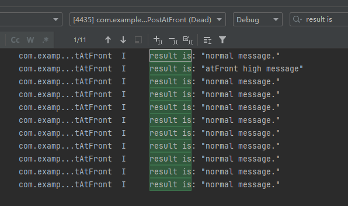

# ArkTs Worker向宿主线程进行消息插队通信

### 介绍

本示例主要演示了Worker向宿主线程发送插队消息的基本用法。
具体接口信息及使用方法详情请见[postMessageAtFront](https://gitcode.com/openharmony/docs/blob/master/zh-cn/application-dev/reference/apis-arkts/js-apis-worker.md#postmessageatfront)。

该工程中展示的代码详细描述可查如下链接：

- [Worker向宿主线程进行消息插队通信](https://gitcode.com/openharmony/docs/blob/master/zh-cn/application-dev/arkts-utils/worker-postMessageAtFront.md)

### 效果预览

|                                         首页                                          |                                      执行及结果即时反馈                                      |
|:-----------------------------------------------------------------------------------:|:-----------------------------------------------------------------------------------:|
|  |  |

### 使用说明

1. 在主界面，点击<触发消息发送>按钮。
2. 会在控制台打印执行结果的log。

### 工程目录

```
entry/src/
 ├── main
 │   ├── ets
 │   │   ├── entryability
 │   │   │   └── EntryAbility.ets          // 应用入口能力
 │   │   ├── entrybackupability
 │   │   │   └── EntryBackupAbility.ets    // 备份恢复能力
 │   │   ├── pages
 │   │   │   ├── Index.ets                 // 首页, 宿主线程和Worker线程通信
 │   │   ├── workers
 │   │   │   ├── Worker.ets                // Worker向宿主线程进行消息插队通信
 │   ├── module.json5
 │   └── resources
 ├── mock
 │   └── mock-config.json5                 // Mock配置文件
 ├── ohosTest
 │   └── ets
 │       └── test
 │           ├── Ability.test.ets          // 自动化测试代码
 │           └── List.test.ets             // 列表测试代码
 └── test
     ├── List.test.ets                     // 列表单元测试
     └── LocalUnit.test.ets                // 本地单元测试
```

## 具体实现

* 宿主线程创建Worker线程，然后调用[postMessage](https://gitcode.com/openharmony/docs/blob/master/zh-cn/application-dev/reference/apis-arkts/js-apis-worker.md#postmessage9)接口往Worker线程发送消息。源码参考：[Index.ets](./entry/src/main/ets/pages/Index.ets)
* Worker线程在接收到消息之后，使用[postMessage](https://gitcode.com/openharmony/docs/blob/master/zh-cn/application-dev/reference/apis-arkts/js-apis-worker.md#postmessage9-2)接口往宿主线程发送多条消息，最后再使用[postMessageAtFront](https://gitcode.com/openharmony/docs/blob/master/zh-cn/application-dev/reference/apis-arkts/js-apis-worker.md#postmessageatfront)接口发送排队消息。源码参考：[Worker.ets](./entry/src/main/ets/workers/Worker.ets)

### 相关权限

不涉及。

### 依赖

不涉及。

### 约束与限制

1.本示例仅支持标准系统上运行, 支持设备：RK3568。

2.本示例为Stage模型，支持API26版本SDK，版本号：26.0.0.25，镜像版本号：OpenHarmony_7.0.0.27。

3.本示例需要使用DevEco Studio 6.0.0 Canary1 (Build Version: 26.0.0.2, built on May 5, 2026)及以上版本才可编译运行。

### 下载

如需单独下载本工程，执行如下命令：

```
git init
git config core.sparsecheckout true
echo code/DocsSample/ArkTS/ArkTsConcurrent/MultithreadedConcurrency/WorkerPostAtFront > .git/info/sparse-checkout
git remote add origin https://gitcode.com/openharmony/applications_app_samples.git
git pull origin master
```
