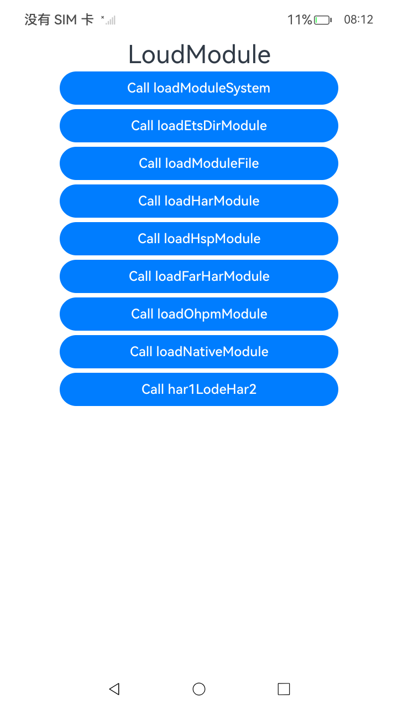
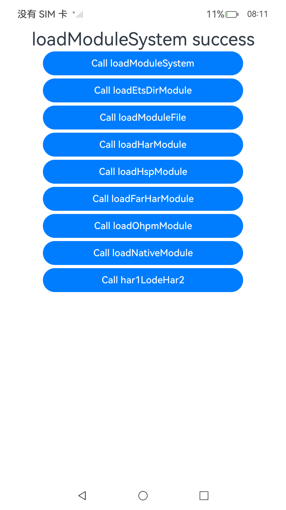

# ArkTS使用Node-API接口在主线程中进行模块加载

### 介绍

本工程展示了使用Node-API接口在主线程中进行系统模块加载与ArkTS单文件加载。详细描述可查如下链接中。

- [使用Node-API接口在主线程中进行模块加载](https://gitcode.com/openharmony/docs/blob/master/zh-cn/application-dev/napi/use-napi-load-module.md)

### 效果预览

| 首页                                                                  | 执行结果图                                                            |
| --------------------------------------------------------------------- | --------------------------------------------------------------------- |
|  |  |

### 使用说明

1. 运行Index主界面。
2. 页面呈现如上图效果和按钮，依次点击按钮后可以加载系统模块和单文件模块，并将成功结果呈现到text文本中。
3. 运行测试用例NodeApiLoadModule.test.ets文件对页面代码进行测试可以全部通过。

### 工程目录

```
entry/
   ├── src
   │   ├── main
   │   │   ├── cpp
   │   │   │   ├── types
   │   │   │   │   ├── libentry
   │   │   │   │   ├── libentry1
   │   │   │   │   ├── ... (several libentry directories)
   │   │   │   ├── CMakeLists.txt
   │   │   │   ├── file.cpp
   │   │   │   ├── ... (other .cpp files)
   │   │   ├── ets
   │   │   │   ├── entryability
   │   │   │   ├── entrybackupability
   │   │   │   ├── pages
   │   │   │   │   └── Index.ets
   │   │   │   ├── Test.ets
   │   │   │   └── components
   │   │   │       └── MainPage.ets
   │   │   ├── resources
   │   │   └── module.json5
   │   └── ohosTest
   │       ├── ets
   │       │   └── test
   │       │       ├── Ability.test.ets
   │       │       ├── List.test.ets
   │       │       └── NodeApiLoadModule.test.ets
   │       └── module.json5
har1/
└── src/
    ├── main/
    │   ├── cpp/
    │   │   ├── types/
    │   │   ├── CMakeLists.txt
    │   │   └── napi_init.cpp
    │   ├── ets/
    │   │   └── components/
    │   │       └── MainPage.ets
    │   ├── resources/
    │   └── module.json5
    └── ohosTest/
        ├── ets/
        │   └── test/
        │       ├── Ability.test.ets
        │       └── List.test.ets
        └── module.json5
har2/
├── src/
│   ├── main/
│   │   ├── ets/
│   │   │   └── components/
│   │   │       └── MainPage.ets
│   │   ├── resources/
│   │   └── module.json5
│   └── ohosTest/
│       └── ets/
│           └── module.json5
library/
├── src/
│   ├── main/
│   │   ├── ets/
│   │   │   └── components/
│   │   │       └── MainPage.ets
│   │   ├── resources/
│   │   └── module.json5
│   └── ohosTest/
│       └── ets/
│           └── module.json5
library2/
├── src/
│   ├── main/
│   │   ├── ets/
│   │   │   └── components/
│   │   │       └── MainPage.ets
│   │   ├── resources/
│   │   └── module.json5
│   └── ohosTest/
│       ├── ets/
│       │   └── test/
│       │       ├── Ability.test.ets
│       │       └── List.test.ets
│       └── module.json5
native/
├── src/
│   ├── main/
│   │   ├── cpp/
│   │   │   ├── types/
│   │   │   ├── CMakeLists.txt
│   │   │   └── napi_init.cpp
│   │   ├── ets/
│   │   │   ├── nativeability/
│   │   │   └── pages/
│   │   ├── resources/
│   │   ├── module.json5
│   │   └── mock/
│   └── ohosTest/
│       ├── ets/
│       │   └── test/
│       │       ├── Ability.test.ets
│       │       ├── List.test.ets
│       │       └── LocalUnit.test.ets
│       └── module.json5
└── test/
    ├── List.test.ets
    └── LocalUnit.test.ets
sharedlibrary/
├── src/
│   ├── main/
│   │   ├── ets/
│   │   │   ├── pages/
│   │   │   │   └── index.ets
│   │   │   └── utils/
│   │   ├── resources/
│   │   └── module.json5
│   └── ohosTest/
│       ├── ets/
│       │   └── test/
│       │       ├── Ability.test.ets
│       │       └── List.test.ets
│       └── module.json5
```

### 相关权限

不涉及。

### 依赖

不涉及。

### 约束与限制

1.本示例仅支持标准系统上运行, 支持设备：RK3568。

2.本示例为Stage模型，支持API20版本SDK，版本号：6.0.0.40，镜像版本号：OpenHarmony_6.0.0.40。

3.本示例需要使用DevEco Studio 5.1.1 Release (Build Version: 5.1.1.820, built on June 28, 2025)及以上版本才可编译运行。

### 下载

如需单独下载本工程，执行如下命令：

```
git init
git config core.sparsecheckout true
echo code/DocsSample/ArkTS/NodeAPI/NodeAPIClassicUseCases/NodeAPILoadModule > .git/info/sparse-checkout
git remote add origin https://gitcode.com/openharmony/applications_app_samples.git
git pull origin master
```
