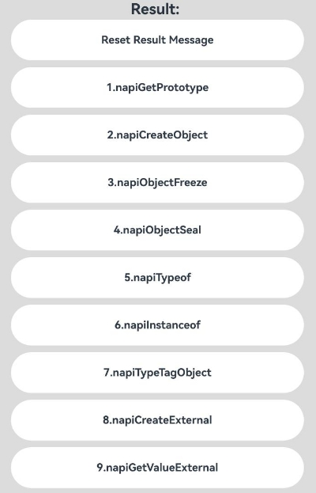
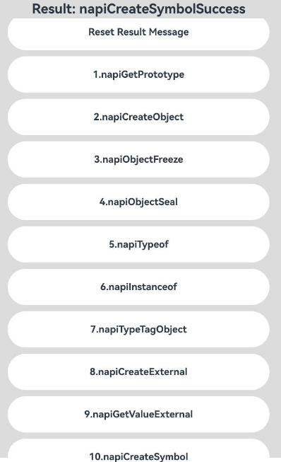

# ArkTS使用Node-API进行object相关开发

### 介绍

使用Node-API接口进行object相关开发，处理ArkTS对象的基本操作的功能，例如创建对象、获取原型、冻结和密封对象，检查对象的类型等。这些操作是在处理ArkTS对象时非常常见的，提供了一种与ArkTS对象交互的方式，本工程中展示的代码详细描述可查如下链接。

- [使用Node-API进行object相关开发](https://docs.openharmony.cn/pages/v5.0/zh-cn/application-dev/napi/use-napi-about-object.md)

### 效果预览

| 首页                                                              | 执行结果图                                                        |
| ----------------------------------------------------------------- | ----------------------------------------------------------------- |
|  |  |

### 使用说明

1. 运行Index主界面。
2. 页面呈现上述首页效果，分别点击ListItem组件可以执行对应文本内容的Node-API接口并将文本Result:改为执行成功结果，然后在控制台中打印出对应日志。
3. 运行测试用例NodeAPIObject.test.ets文件对页面代码进行测试可以全部通过。

### 工程目录

```
entry/src/
 ├── main
 │   ├── cpp
 │   │   ├── types
 │   │       ├── Index.d.ts
 │   │       ├── oh-package.json5
 │   │   ├── CMakeLists.txt
 │   │   ├── napi_init.cpp
 │   ├── ets
 │   │   ├── entryability
 │   │   ├── entrybackupability
 │   │   ├── pages
 │   │       ├── Index.ets               // 使用Node-API进行object相关开发示例代码
 │   ├── module.json5
 │   └── resources
 ├── ohosTest
 │   ├── ets
 │   │   └── test
 │   │       ├── Ability.test.ets
 │   │       ├── NodeAPIObject.test.ets  // 自动化测试代码
 │   │       └── List.test.ets
```

### 相关权限

不涉及。

### 依赖

不涉及。

### 约束与限制

1.本示例仅支持标准系统上运行, 支持设备：RK3568。

2.本示例为Stage模型，支持API14版本SDK，版本号：5.0.2.57，镜像版本号：OpenHarmony_5.0.2.58。

3.本示例需要使用DevEco Studio 5.0.1 Release (Build Version: 5.0.5.306, built on December 6, 2024)及以上版本才可编译运行。

### 下载

如需单独下载本工程，执行如下命令：

```
git init
git config core.sparsecheckout true
echo code/DocsSample/ArkTS/NodeAPI/NodeAPIUse/NodeAPIObject > .git/info/sparse-checkout
git remote add origin https://gitee.com/openharmony/applications_app_samples.git
git pull origin master
```
