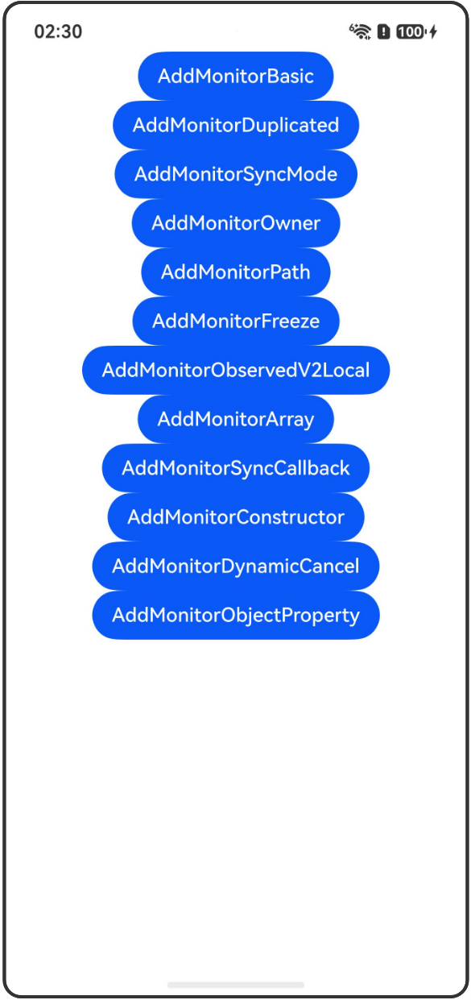

# addMonitor/clearMonitor接口：动态添加/取消监听

## 介绍

本工程帮助开发者更好地理解addMonitor/clearMonitor接口的使用场景。该工程中展示的代码详细描述可查如下链接：

[addMonitor/clearMonitor接口：动态添加/取消监听](https://gitcode.com/openharmony/docs/blob/OpenHarmony_feature_sta_20260331/zh-cn/application-dev/ui/state-management-static/arkts-static-new-addmonitor-clearmonitor.md)

## 使用说明

执行测试用例会先打开相应界面，然后点击按钮或图标，演示接口的使用效果。

## 效果预览

|首页                                   |
|----------------------------------------------|
||

## 工程目录
```
entry/src/
├── main
│   ├── ets
│   │   ├── entryability
│   │   ├── pages
│   │   │   ├── Index.ets
│   │   │   ├── AddMonitorBasic.ets
│   │   │   ├── AddMonitorDuplicated.ets
│   │   │   ├── AddMonitorSyncMode.ets
│   │   │   ├── AddMonitorOwner.ets
│   │   │   ├── AddMonitorPath.ets
│   │   │   ├── AddMonitorFreeze.ets
│   │   │   ├── AddMonitorObservedV2Local.ets
│   │   │   ├── AddMonitorArray.ets
│   │   │   ├── AddMonitorSyncCallback.ets
│   │   │   ├── AddMonitorConstructor.ets
│   │   │   ├── AddMonitorDynamicCancel.ets
│   │   │   └── AddMonitorObjectProperty.ets
│   └── resources
│       ├── ...
├─── ... 
```

## 具体实现

1. 监听单个和多个状态变量：使用addMonitor监听单个状态变量或多个状态变量（以数组形式）。

2. 重复监听示例：addMonitor支持重复监听，每次调用返回唯一的句柄。

3. 同步监听模式：同步模式在状态变量修改时立即触发回调函数。

4. 组件作为owner：监听组件的状态变量时，建议将组件作为owner传递给addMonitor。

5. 配置path参数：开发者可以传递MonitorOptions.path配置监听路径。

6. 组件冻结功能：通过owner参数启用组件冻结功能，inactive状态的回调推迟触发。

7. 监听@ObservedV2/@Trace与@ComponentV2/@Local：展示两种监听场景的使用方式。

8. 监听数组元素和长度：对数组元素和数组长度的监听方法。

9. 配置同步监听回调：同步模式每次变量改变时都会立即触发回调函数。

10. 监听构造函数中同步修改：addMonitor是同步构造的，构造函数中的修改可触发回调。

11. 动态取消监听：使用clearMonitor动态取消addMonitor添加的监听函数。

12. 观察对象属性：使用新addMonitor方法观察对象属性变化，等效于通配符能力。

## 相关权限

不涉及。

## 依赖

不涉及。

## 约束与限制

1.本示例已适配API version 23及以上版本SDK。

## 下载

如需单独下载本工程，执行如下命令：

```
git init
git config core.sparsecheckout true
echo code/DocsSample/ArkUISample-Sta/AddMonitorDecorator/ > .git/info/sparse-checkout
git remote add origin https://gitcode.com/openharmony/applications_app_samples.git
git pull origin master
```