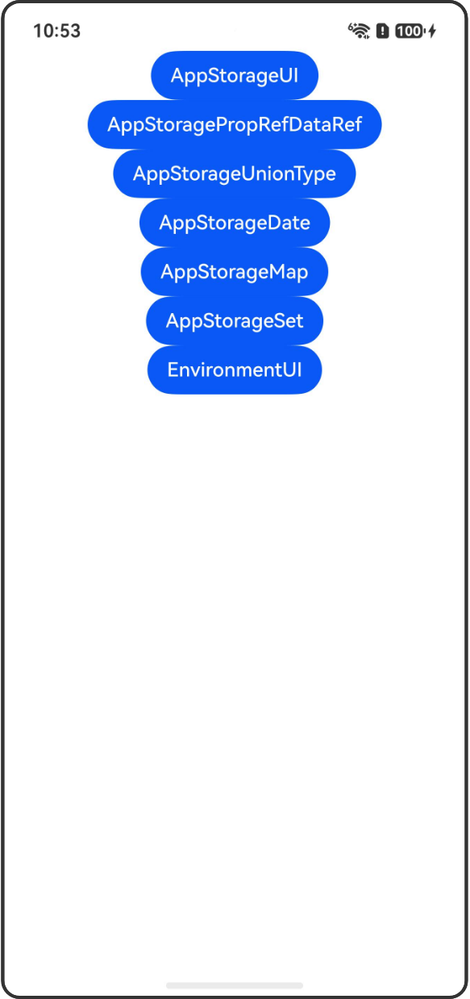

# AppStorage：应用全局的UI状态存储（含Environment）

## 介绍

本工程帮助开发者更好地理解AppStorage和Environment装饰器的使用场景。该工程中展示的代码详细描述可查如下链接：

[AppStorage：应用全局的UI状态存储](https://gitcode.com/openharmony/docs/blob/OpenHarmony_feature_sta_20260331/zh-cn/application-dev/ui/state-management-static/arkts-static-appstorage.md)

[Environment：设备环境查询](https://gitcode.com/openharmony/docs/blob/OpenHarmony_feature_sta_20260331/zh-cn/application-dev/ui/state-management-static/arkts-static-environment.md)

## 使用说明

执行测试用例会先打开相应界面，然后点击按钮或图标，演示接口的使用效果。

## 效果预览

|首页                                   |
|----------------------------------------------|
||

## 工程目录
```
entry/src/
├── main
│   ├── ets
│   │   ├── entryability
│   ├── pages
│   │   ├── Index.ets
│   │   ├── AppStorageUI.ets
│   │   ├── AppStoragePropRefDataRef.ets
│   │   ├── AppStorageUnionType.ets
│   │   ├── AppStorageDate.ets
│   │   ├── AppStorageMap.ets
│   │   ├── AppStorageSet.ets
│   │   ├── EnvironmentUI.ets
│   └── resources
│       ├── ...
├─── ... 
```

## 具体实现

1. 从UI内部使用AppStorage和LocalStorage：使用@StorageLink与AppStorage配合，通过AppStorage中的属性创建双向数据同步。

2. @StoragePropRef获得AppStorage中数据源的引用：@StoragePropRef会获得数据源的引用，对于复杂类型，修改属性将在AppStorage中体现。

3. AppStorage支持联合类型：支持null、undefined以及联合类型。

4. 装饰Date类型变量：可以观察到Date的赋值，以及通过调用Date的接口来更新Date的值。

5. 装饰Map类型变量：可以观察到Map整体的赋值，以及通过调用Map的接口set、clear、delete来更新Map的值。

6. 装饰Set类型变量：可以观察到Set整体的赋值，以及通过调用Set的接口add、clear、delete来更新Set的值。

7. 从UI中访问Environment参数：使用Environment.envProp将设备环境变量存入AppStorage中，通过@StoragePropRef链接到Component中获取设备环境参数。

## 相关权限

不涉及。

## 依赖

不涉及。

## 约束与限制

1.本示例已适配API version 23及以上版本SDK。

## 下载

如需单独下载本工程，执行如下命令：

```
git init
git config core.sparsecheckout true
echo code/DocsSample/ArkUISample-Sta/AppStorageDecorator/ > .git/info/sparse-checkout
git remote add origin https://gitcode.com/openharmony/applications_app_samples.git
git pull origin master
```