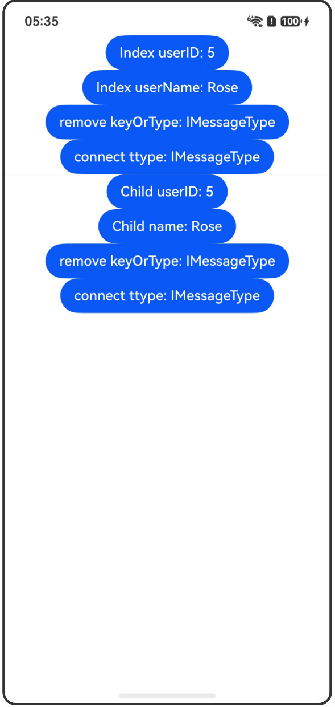

# AppStorageV2: 应用全局的UI状态存储

## 介绍

本工程帮助开发者更好地理解AppStorageV2的使用场景。该工程中展示的代码详细描述可查如下链接：

[AppStorageV2: 应用全局的UI状态存储](https://gitcode.com/openharmony/docs/blob/OpenHarmony_feature_sta_20260331/zh-cn/application-dev/ui/state-management-static/arkts-static-appstoragev2.md)

## 使用说明

执行测试用例会先打开相应界面，然后点击按钮或图标，演示接口的使用效果。

## 效果预览

|首页                                   |
|----------------------------------------------|
||

## 工程目录
```
entry/src/
├── main
│   ├── ets
│   │   ├── entryability
│   │   ├── pages
│   │   │   ├── Index.ets
│   │   │   ├── AppStorageV2Basic.ets
│   │   │   ├── AppStorageV2TwoPages.ets
│   │   │   ├── Sample.ets
│   └── resources
│       ├── ...
├─── ... 
```

## 具体实现

1. 使用AppStorageV2：通过connect在AppStorageV2中创建或获取数据，修改@Trace装饰的类属性可以同步更新UI，父组件和子组件共享同一数据。

2. AppStorageV2应用于两页面场景：使用Navigation组件在两个页面间共享AppStorageV2中的数据，演示跨页面的数据同步。

## 相关权限

不涉及。

## 依赖

不涉及。

## 约束与限制

1.本示例已适配API version 23及以上版本SDK。

## 下载

如需单独下载本工程，执行如下命令：

```
git init
git config core.sparsecheckout true
echo code/DocsSample/ArkUISample-Sta/AppStorageV2/ > .git/info/sparse-checkout
git remote add origin https://gitcode.com/openharmony/applications_app_samples.git
git pull origin master
```