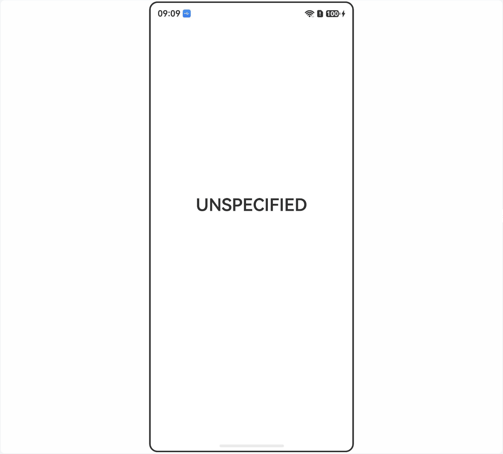

# 旋转策略应用

## 介绍

本工程主要实现了对以下指南文档[旋转体验实例](https://gitcode.com/openharmony/docs/blob/master/zh-cn/application-dev/windowmanager/window-rotation.md)
中示例代码片段的工程化，通过该工程在单一策略（如：follow_desktop）无法满足需求时，根据断点机制设置旋转策略，消除设备差异化。

## 效果预览

|  |
|----------------------------------|

使用说明：

1. 安装编译生成的hap包,打开应用。
2. 应用启动时，根据断点机制设置旋转策略。

## 工程目录

```
DeviceDifferentiationSample
├──entry/src/main/ets
│  │  ├──entryability
│  │  │  ├──EntryAbility.ets
│  │  ├──pages
│  │     ├──Index.ets               // 主界面
```

## 具体实现

本示例核心实现集中在`Index.ets`：

1. 页面通过`getUIContext().getHostContext()`获取当前`UIAbilityContext`，再取得`windowStage`，用于设置主窗口旋转策略。
2. 在`aboutToAppear()`中判断当前设备是否为折叠设备；如果是折叠设备，注册折叠显示模式变化回调，在形态变化时重新计算旋转策略；如果不是折叠设备，则直接执行策略设置。
3. 在`getBreakPointAndSetOrientation()`中通过`display.getDefaultDisplaySync()`获取屏幕宽高，结合宽度断点和高宽比判断当前显示形态。
4. 当屏幕宽度满足断点且高宽比较小时，将主窗口设置为`window.Orientation.LANDSCAPE`；否则设置为`window.Orientation.PORTRAIT`，同时更新页面显示的当前方向。

## 相关权限

不涉及。

## 依赖

不涉及。

## 约束和限制

1. 本示例支持标准系统上运行，支持设备：华为手机、平板。
2. 本示例API Version 23及以上版本SDK。
3. 本示例已支持使DevEco Studio 6.0.2 Release (构建版本：6.0.2.650)编译运行。

## 下载

如需单独下载本工程，执行如下命令：

```
git init
git config core.sparsecheckout true
echo code/DocsSample/ArkUISample-Sta/ArkUIWindowSamples/DeviceDifferentiationSample > .git/info/sparse-checkout
git remote add origin https://gitcode.com/openharmony/applications_app_samples.git
git pull origin master
```

