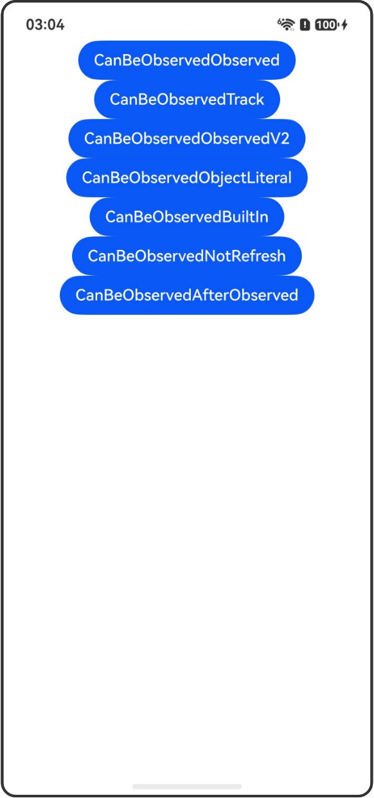

# @CanBeObserved装饰器：可观察对象判断

## 介绍

本工程帮助开发者更好地理解@CanBeObserved装饰器的使用场景。该工程中展示的代码详细描述可查如下链接：

[@CanBeObserved装饰器：可观察对象判断](https://gitcode.com/openharmony/docs/blob/OpenHarmony_feature_sta_20260331/zh-cn/application-dev/ui/state-management-static/arkts-static-new-canBeObserved.md)

## 使用说明

执行测试用例会先打开相应界面，然后点击按钮或图标，演示接口的使用效果。

## 效果预览

|首页                                   |
|----------------------------------------------|
||

## 工程目录
```
entry/src/
├── main
│   ├── ets
│   │   ├── entryability
│   ├── pages
│   │   ├── Index.ets
│   │   ├── CanBeObservedObserved.ets
│   │   ├── CanBeObservedTrack.ets
│   │   ├── CanBeObservedObservedV2.ets
│   │   ├── CanBeObservedObjectLiteral.ets
│   │   ├── CanBeObservedBuiltIn.ets
│   │   ├── CanBeObservedNotRefresh.ets
│   │   ├── CanBeObservedAfterObserved.ets
│   └── resources
│       ├── ...
├─── ... 
```

## 具体实现

1. 被@Observed装饰的类：使用@CanBeObserved判断被@Observed装饰的类是否可观察。

2. 被@Trace装饰的属性：使用@CanBeObserved判断被@Trace装饰的属性是否可观察。

3. 被@ObservedV2装饰的类：使用@CanBeObserved判断被@ObservedV2装饰的类是否可观察。

4. 对象字面量：使用@CanBeObserved判断对象字面量是否可观察。

5. 内置类型：使用@CanBeObserved判断内置类型（Array、Map、Set、Date）是否可观察。

6. 不能触发UI刷新的情况：展示@CanBeObserved返回true但不能触发UI刷新的场景。

7. 被@Observed装饰后的嵌套属性：使用@CanBeObserved判断嵌套属性是否可观察。

## 相关权限

不涉及。

## 依赖

不涉及。

## 约束与限制

1.本示例已适配API version 24及以上版本SDK。

## 下载

如需单独下载本工程，执行如下命令：

```
git init
git config core.sparsecheckout true
echo code/DocsSample/ArkUISample-Sta/CanBeObserved/ > .git/info/sparse-checkout
git remote add origin https://gitcode.com/openharmony/applications_app_samples.git
git pull origin master
```