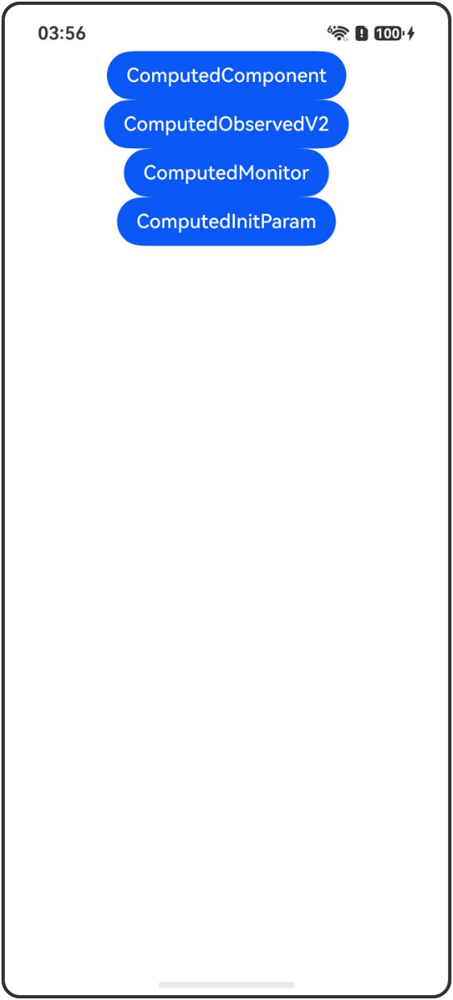

# @Computed装饰器：计算属性

## 介绍

本工程帮助开发者更好地理解@Computed装饰器的使用场景。该工程中展示的代码详细描述可查如下链接：

[@Computed装饰器：计算属性](https://gitcode.com/openharmony/docs/blob/master/zh-cn/application-dev/ui/state-management-static/arkts-static-new-computed.md)

## 使用说明

执行测试用例会先打开相应界面，然后点击按钮或图标，演示接口的使用效果。

## 效果预览

|首页                                   |
|----------------------------------------------|
||

## 工程目录
```
entry/src/
├── main
│   ├── ets
│   │   ├── entryability
│   │   ├── pages
│   │   │   ├── Index.ets
│   │   │   ├── ComputedComponent.ets
│   │   │   ├── ComputedObservedV2.ets
│   │   │   ├── ComputedMonitor.ets
│   │   │   └── ComputedInitParam.ets
│   └── resources
│       ├── ...
├─── ... 
```

## 具体实现

1. 在自定义组件中使用计算属性：点击第一个Button改变lastName，触发@Computed fullName重新计算，计算只发生一次。

2. 在@ObservedV2装饰的类中使用计算属性：点击Button改变lastName，触发@Computed fullName重新计算，且只被计算一次。

3. @Computed装饰的属性可以被@Monitor监听变化：使用计算属性求解fahrenheit和kelvin，点击+/-按钮改变celsius，触发计算和监听。

4. @Computed装饰的属性可以初始化@Param：改变商品数量，触发total和qualifiesForDiscount重新计算，子组件Text组件刷新。

## 相关权限

不涉及。

## 依赖

不涉及。

## 约束与限制

1.本示例已适配API version 23及以上版本SDK。

## 下载

如需单独下载本工程，执行如下命令：

```
git init
git config core.sparsecheckout true
echo code/DocsSample/ArkUISample-Sta/ComputedDecorator/ > .git/info/sparse-checkout
git remote add origin https://gitcode.com/openharmony/applications_app_samples.git
git pull origin master
```