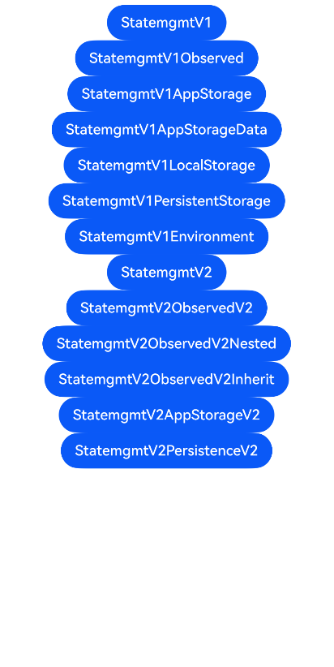

# ArkTS-Dyn使用ArkTS-Sta的状态管理示例

## 介绍

本工程帮助开发者更好地理解ArkTS-Dyn使用ArkTS-Sta状态管理的使用场景。该工程中展示的代码详细描述可查如下链接：

[在ArkTS-Dyn中使用ArkTS-Sta管理组件拥有的状态](https://gitcode.com/openharmony/docs/blob/OpenHarmony_feature_sta_20260331/zh-cn/application-dev/ui/arkts-dyn-interop-sta-statemanagement-v1.md)
[在ArkTS-Dyn中使用ArkTS-Sta的@Observed和@ObjectLink（嵌套类对象属性变化）](https://gitcode.com/openharmony/docs/blob/OpenHarmony_feature_sta_20260331/zh-cn/application-dev/ui/arkts-dyn-interop-sta-observed.md)
[在ArkTS-Dyn中使用ArkTS-Sta管理应用拥有的状态](https://gitcode.com/openharmony/docs/blob/OpenHarmony_feature_sta_20260331/zh-cn/application-dev/ui/arkts-dyn-interop-sta-storages.md)
[在ArkTS-Dyn中使用ArkTS-Sta管理组件拥有的状态](https://gitcode.com/openharmony/docs/blob/OpenHarmony_feature_sta_20260331/zh-cn/application-dev/ui/arkts-dyn-interop-sta-statemanagement-v2.md)
[在ArkTS-Dyn中使用ArkTS-Sta的@ObservedV2和@Trace（类属性变化观测）](https://gitcode.com/openharmony/docs/blob/OpenHarmony_feature_sta_20260331/zh-cn/application-dev/ui/arkts-dyn-interop-sta-observedv2.md)
[在ArkTS-Dyn中使用ArkTS-Sta管理应用拥有的状态](https://gitcode.com/openharmony/docs/blob/OpenHarmony_feature_sta_20260331/zh-cn/application-dev/ui/arkts-dyn-interop-sta-storages-v2.md)

## 使用说明

执行测试用例会先打开相应界面，然后点击按钮或图标，演示接口的使用效果。

## 效果预览

|首页                                   |
|----------------------------------------------|
||

## 工程目录
```
entry/src/
├── main
│   ├── ets
│   │   ├── entryability
│   │   ├── pages
│   │   │   ├── Index.ets
│   │   │   ├── StatemgmtV1.ets
│   │   │   ├── StatemgmtV1AppStorage.ets
│   │   │   ├── StatemgmtV1AppStorageData.ets
│   │   │   ├── StatemgmtV1Environment.ets
│   │   │   ├── StatemgmtV1LocalStorage.ets
│   │   │   ├── StatemgmtV1Observed.ets
│   │   │   ├── StatemgmtV1PersistentStorage.ets
│   │   │   ├── StatemgmtV2.ets
│   │   │   ├── StatemgmtV2AppStorageV2.ets
│   │   │   ├── StatemgmtV2ObservedV2.ets
│   │   │   ├── StatemgmtV2ObservedV2Inherit.ets
│   │   │   ├── StatemgmtV2ObservedV2Nested.ets
│   │   │   └── StatemgmtV2PersistenceV2.ets
│   └── resources
│       ├── ...
├─── ... 
```

## 具体实现

1. ArkTS-Dyn使用ArkTS-Sta的状态管理V1 @State、@PropRef、@Link、@Provide、@Consume管理组件拥有的状态。

2. ArkTS-Dyn使用ArkTS-Sta的状态管理V1 @Observed和@ObjectLink管理类属性的状态。

3. ArkTS-Dyn使用ArkTS-Sta的AppStorage、LocalStorage、PersistentStorage、Environment管理应用间的状态。

4. ArkTS-Dyn使用ArkTS-Sta的状态管理V2 @Local、@Param、@Event、@Provider、@Consumer等管理组件拥有的状态。

5. ArkTS-Dyn使用ArkTS-Sta的状态管理V2 @ObservedV2和@Trace管理类属性的状态。

6. ArkTS-Dyn使用ArkTS-Sta的状态管理V2 AppStorageV2和PersistenceV2管理应用间的状态。

## 相关权限

不涉及。

## 依赖

不涉及。

## 约束与限制

1.本示例已适配API version 23及以上版本SDK。

## 下载

如需单独下载本工程，执行如下命令：

```
git init
git config core.sparsecheckout true
echo code/DocsSample/ArkUISample-Sta/DynInteropStaState/ > .git/info/sparse-checkout
git remote add origin https://gitcode.com/openharmony/applications_app_samples.git
git pull origin master
```
